```{r, include = FALSE}
current_file <- knitr::current_input()
basename <- gsub(".Rmd$", "", current_file)
```

```{r, include = FALSE}
knitr::opts_chunk$set(
  fig.path = sprintf("images/%s/", basename),
  fig.width = 6,
  fig.height = 4,
  fig.align = "center",
  out.width = "100%",
  fig.retina = 5,
  echo = FALSE,
  warning = FALSE,
  message = FALSE,
  cache = FALSE
)
```

```{r}
library(tidyverse)
library(gt)
library(forcats)
library(gridExtra)
library(datasauRus)

theme_set(ggthemes::theme_gdocs(base_size = 14) +
  theme(
    plot.background = element_rect(fill = "transparent", colour = NA), axis.line.y = element_line(color = "black", linetype = "solid"),
    plot.title.position = "plot",
    plot.title = element_text(size = 18),
    panel.background = element_rect(fill = "transparent", colour = NA),
    legend.background = element_rect(fill = "transparent", colour = NA),
    legend.key = element_rect(fill = "transparent", colour = NA)
  ))
```

```{r titleslide, child="assets/titleslide.Rmd"}
```

---
class: transition middle

.blockquote[The world is full of obvious things which nobody by any chance observes.
.pull-right[&mdash;  Quote from Sherlock Holmes] 
]

<br><br>
Some parts of this lecture are based on Chapter 5  of Unwin (2015) Graphical Data Analysis with R


---
# The story of the galloping horse


Galloping horses throughout history were drawn with all four legs out.
<br>
<br>
<br>
<br>

<table> 
<tr style="background-color:white;text-align:center;"> <td style="background-color:white;text-align:center;">
 
</td> <td style="background-color:white;text-align:center;">

</td></tr>
<tr style="background-color:white;text-align:center;"> <td> Baronet, 1794 </td><td> Derby D'Epsom 1821</td></tr>
</table>


.footnote[[Lankester: The Problem of the Galloping Horse](https://ejmuybridge.wordpress.com/2010/07/20/lankester-the-problem-of-the-galloping-horse/)s]

---
# The story of the galloping horse

<br>With the birth of photography, and particular motion photography, Muybridge was able to illustrate that this leg position was impossible.
--

<br><br> 
--


---
# My painting stories

.panelset[
.panel[.panel-name[hills first try]
.blockquote.w-90[Hills are more interesting than that

.pull-right[&mdash; Mrs Robinson, my high school art teacher]
]

<br>
<br>

<center>
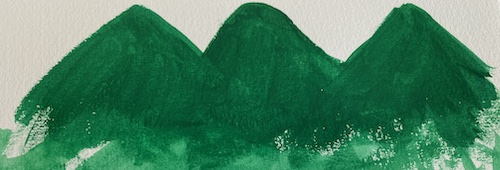
</center>

]
.panel[.panel-name[hills second try]

.blockquote.w-90[Hills need to have shadows in them]

so I put some shadows on. 

<br>
<br>

<center>
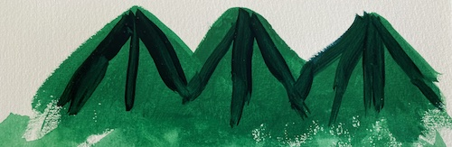
</center>

]
.panel[.panel-name[hill photo]


Mrs Robinson looks horrified!

.blockquote.w-50[Go and take another look at the hills]

<br>
<br>

<center>
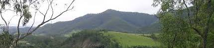
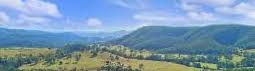
</center>

]

.panel[.panel-name[lemons]
.flex[
.w-30[
<center>
<br><br>
 
</center>

<br>
<center>
Something is missing
</center>

]
.w-30[
<center>
<br>
<br>
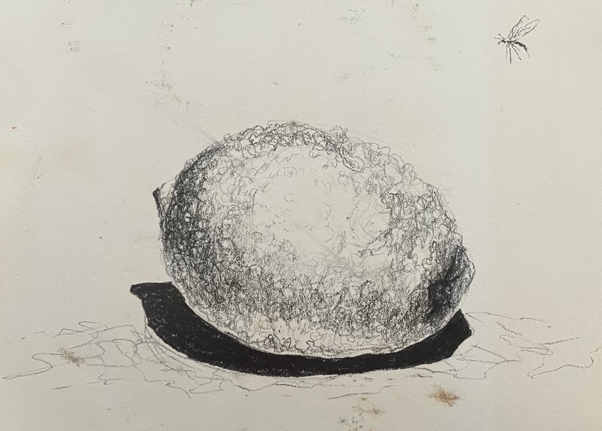 
<br>
<br>
My sketch
</center>
]
.w-30[
<center>
<br>
<br>
 

<br>
<br>
<br>
<center>
Notice the yellow reflection?
</center>

]
]
]
.panel[.panel-name[trees]
.flex[
.w-50[
<center>
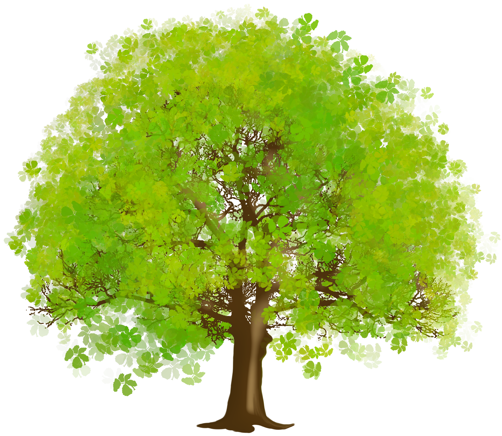 

<br><br>
Does it look like a tree?

</center>
]
.w-50[

<br>
<br>

<center>

Trees actually have lots of different colours in them

<br>
<br>

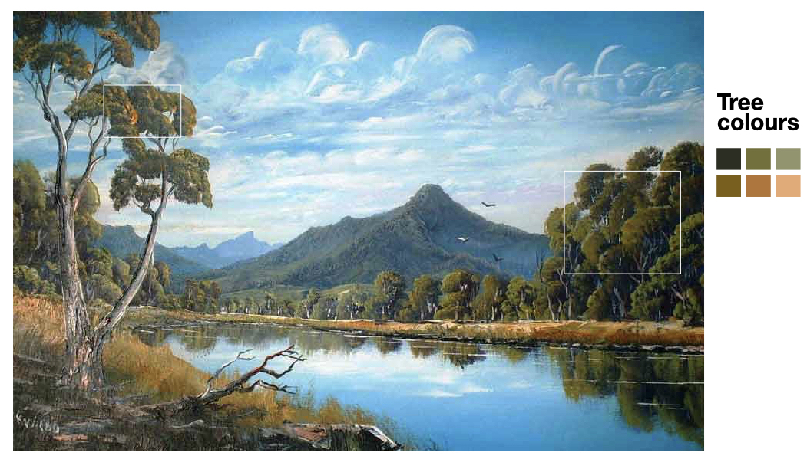 
</center>
]

]
]
]

---
class: middle

## Take-away message

We have a tendency to 

- only see what other people have done or say, not what we can see, e.g. paint based on what other people have painted. 
- Or impose beliefs, like trees are green.

You might discover that there is a different story. 

---
class: transition middle 

# Try to see with fresh eyes

---
# The scatterplot

.info-box[Scatterplots are the natural plot to make to explore .monash-blue2[association] between two .monash-blue2[**continuous** (quantitative or numeric) variables].]

They are not just for .monash-orange2[linear] relationships but are useful for examining .monash-orange2[nonlinear] patterns, .monash-orange2[clustering] and .monash-orange2[outliers]. 

We also can think about scatterplots in terms of statistical distributions: if a histogram shows a marginal distribution, a .monash-blue2[scatterplot] allows us to examine the .monash-blue2[bivariate distribution] of a sample.

---
# History

<br>
<br>

> *Scatter plots are glorious. Of all the major chart types, they are by far the most powerful. They allow us to .monash-orange2[quickly understand relationships] that would be nearly impossible to recognize in a table or a different type of chart. ... Michael Friendly and Daniel Denis, psychologists and historians of graphics, call the scatter plot the most "generally useful invention in the history of statistical graphics."* 

> [Dan Kopf](https://qz.com/1235712/the-origins-of-the-scatter-plot-data-visualizations-greatest-invention/)

---
# History

- Descartes provided the Cartesian coordinate system in the 17th century, with perpendicular lines indicating two axes.
--

- It wasn't until .monash-orange2[**1832**] that the scatterplot appeared, when [John Frederick Herschel](http://www.datavis.ca/milestones/index.php?group=1800%2B) plotted position and time of double stars.
--

- This is 200 years after the Cartesian coordinate system, and [50 years after bar charts and line charts](http://www.datavis.ca/milestones/index.php?group=1700s) appeared, used in the work of William Playfair to examine economic data.
--

- Kopf argues that .monash-orange2[*The scatter plot, by contrast, proved more useful for scientists*, but it clearly is useful for economics today].


.footnote[http://www.datavis.ca/milestones/]

---
class: informative middle
## Language and terminology

Are the words "correlation" and "association" interchangeable?

> .monash-gray10[In the broadest sense] **correlation** .monash-gray10[is any statistical association, though it commonly refers to the degree to which a pair of variables are] **linearly** .monash-gray10[related]. [Wikipedia](https://en.wikipedia.org/wiki/Correlation_and_dependence)

<br>
<br>
.info-box[If the .monash-orange2[relationship is not linear], call it .monash-orange2[association], and avoid correlated.]


---

# Possible features of a pair of continuous variables 1/3

```{r scatterplots, include = FALSE, fig.width = 2, fig.height = 2}
set.seed(55555)
d_trend <- tibble(x = runif(100) - 0.5) %>%
  mutate(
    positive = 4 * x + rnorm(100) * 0.5,
    none = rnorm(100) * 0.5,
    negative = -4 * x + rnorm(100) * 0.5
  ) %>%
  pivot_longer(cols = positive:negative, names_to = "trend", values_to = "y") %>%
  mutate(trend = factor(trend,
    levels = c("positive", "none", "negative")
  )) %>%
  select(trend, x, y)

d_trend %>%
  filter(trend == "positive") %>%
  ggplot(aes(x = x, y = y)) +
  geom_point() +
  theme_void() +
  theme(
    aspect.ratio = 1,
    axis.line.x = element_line(color = "black", size = 2),
    axis.line.y = element_line(color = "black", size = 2)
  )

d_trend %>%
  filter(trend == "negative") %>%
  ggplot(aes(x = x, y = y)) +
  geom_point() +
  theme_void() +
  theme(
    aspect.ratio = 1,
    axis.line.x = element_line(color = "black", size = 2),
    axis.line.y = element_line(color = "black", size = 2)
  )

d_trend %>%
  filter(trend == "none") %>%
  ggplot(aes(x = x, y = y)) +
  geom_point() +
  theme_void() +
  theme(
    aspect.ratio = 1,
    axis.line.x = element_line(color = "black", size = 2),
    axis.line.y = element_line(color = "black", size = 2)
  )

d_strength <- tibble(x = runif(100) - 0.5) %>%
  mutate(
    strong = 4 * x + rnorm(100) * 0.5,
    moderate = 4 * x + rnorm(100),
    weak = -4 * x + rnorm(100) * 3
  ) %>%
  pivot_longer(
    cols = strong:weak,
    names_to = "strength", values_to = "y"
  ) %>%
  mutate(strength = factor(strength,
    levels = c("strong", "moderate", "weak")
  )) %>%
  select(strength, x, y)

d_strength %>%
  filter(strength == "strong") %>%
  ggplot(aes(x = x, y = y)) +
  geom_point() +
  theme_void() +
  theme(
    aspect.ratio = 1,
    axis.line.x = element_line(color = "black", size = 2),
    axis.line.y = element_line(color = "black", size = 2)
  )

d_strength %>%
  filter(strength == "moderate") %>%
  ggplot(aes(x = x, y = y)) +
  geom_point() +
  theme_void() +
  theme(
    aspect.ratio = 1,
    axis.line.x = element_line(color = "black", size = 2),
    axis.line.y = element_line(color = "black", size = 2)
  )

d_strength %>%
  filter(strength == "weak") %>%
  ggplot(aes(x = x, y = y)) +
  geom_point() +
  theme_void() +
  theme(
    aspect.ratio = 1,
    axis.line.x = element_line(color = "black", size = 2),
    axis.line.y = element_line(color = "black", size = 2)
  )
```

```{r feature-table}
tribble(
  ~Feature, ~Example, ~Description,
  "positive trend", '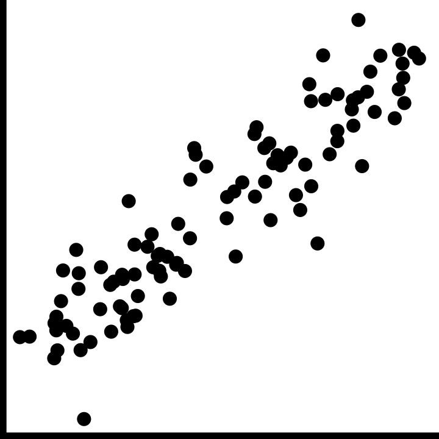', "Low value corresponds to low value, and high to high.",
  "negative trend", '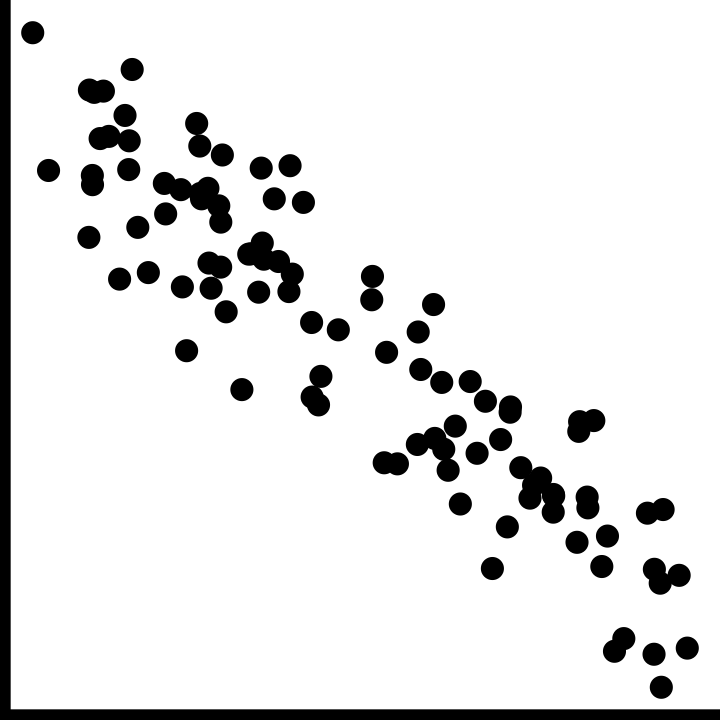', "Low value corresponds to high value, and high to low.",
  "no trend", '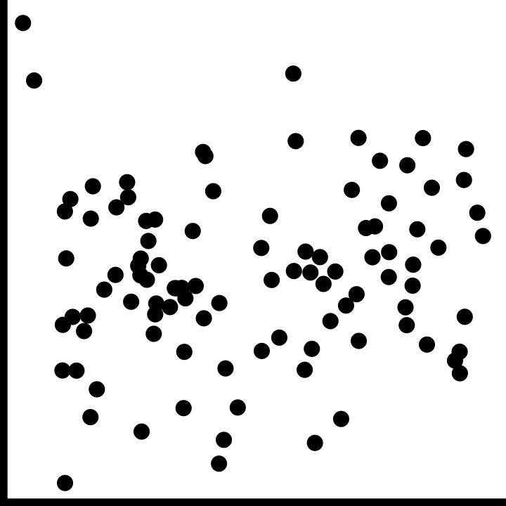', "No relationship",
  "strong", '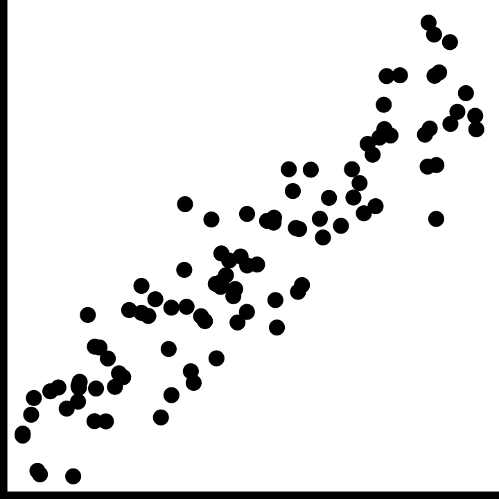', "Very little variation around the trend",
  "moderate", '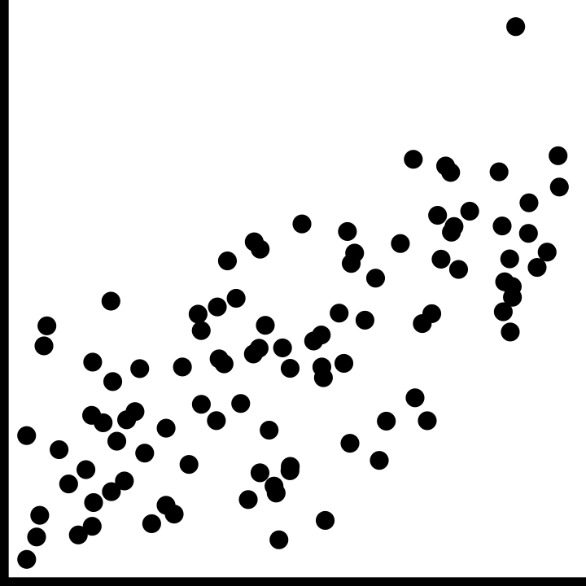', "Variation around the trend is almost as much as the trend",
  "weak", '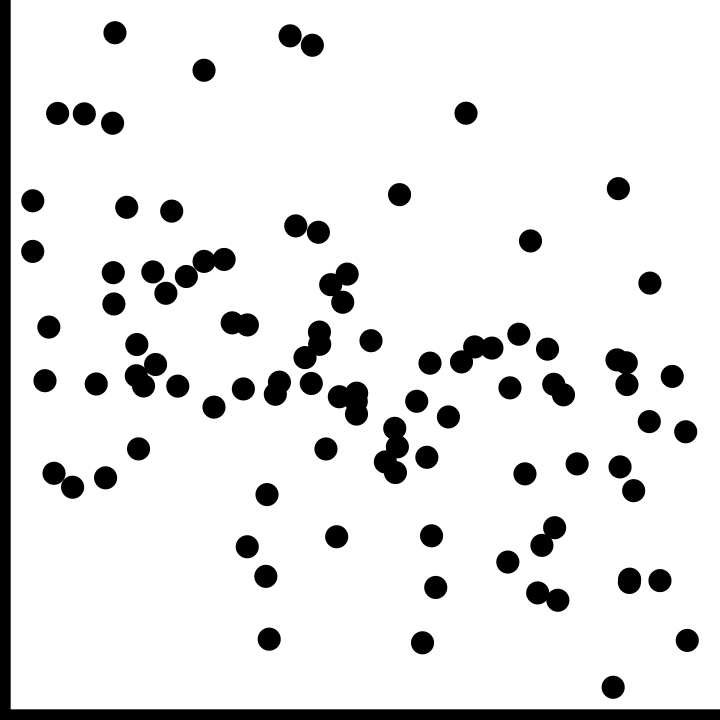', "A lot of variation making it hard to see any trend"
) %>%
  knitr::kable(escape = FALSE) %>%
  kableExtra::kable_classic()
```


---

# Possible features of a pair of continuous variables 2/3

```{r scatterplots2, include = FALSE, fig.width = 2, fig.height = 2}
d_form <- tibble(x = runif(100) - 0.5) %>%
  mutate(
    linear = 4 * x + rnorm(100) * 0.5,
    nonlinear1 = 12 * x^2 + rnorm(100) * 0.5,
    nonlinear2 = 2 * x - 5 * x^2 + rnorm(100) * 0.1
  ) %>%
  pivot_longer(
    cols = linear:nonlinear2, names_to = "form",
    values_to = "y"
  ) %>%
  select(form, x, y)

d_form %>%
  filter(form == "linear") %>%
  ggplot(aes(x = x, y = y)) +
  geom_point() +
  theme_void() +
  theme(
    aspect.ratio = 1,
    axis.line.x = element_line(color = "black", size = 2),
    axis.line.y = element_line(color = "black", size = 2)
  )

d_form %>%
  filter(form == "nonlinear1") %>%
  ggplot(aes(x = x, y = y)) +
  geom_point() +
  theme_void() +
  theme(
    aspect.ratio = 1,
    axis.line.x = element_line(color = "black", size = 2),
    axis.line.y = element_line(color = "black", size = 2)
  )

d_form %>%
  filter(form == "nonlinear2") %>%
  ggplot(aes(x = x, y = y)) +
  geom_point() +
  theme_void() +
  theme(
    aspect.ratio = 1,
    axis.line.x = element_line(color = "black", size = 2),
    axis.line.y = element_line(color = "black", size = 2)
  )

d_outliers <- tibble(x = runif(100) - 0.5) %>%
  mutate(y = 4 * x + rnorm(100) * 0.5)
d_outliers <- d_outliers %>%
  bind_rows(tibble(x = runif(5) / 10 - 0.45, y = 2 + rnorm(5) * 0.5))

d_outliers %>%
  ggplot(aes(x = x, y = y)) +
  geom_point() +
  theme_void() +
  theme(
    aspect.ratio = 1,
    axis.line.x = element_line(color = "black", size = 2),
    axis.line.y = element_line(color = "black", size = 2)
  )

d_clusters <- tibble(x = c(
  rnorm(50) / 6 - 0.5,
  rnorm(50) / 6,
  rnorm(50) / 6 + 0.5
)) %>%
  mutate(y = c(
    rnorm(50) / 6,
    rnorm(50) / 6 + 1, rnorm(50) / 6
  ))

d_clusters %>%
  ggplot(aes(x = x, y = y)) +
  geom_point() +
  theme_void() +
  theme(
    aspect.ratio = 1,
    axis.line.x = element_line(color = "black", size = 2),
    axis.line.y = element_line(color = "black", size = 2)
  )

d_gaps <- tibble(x = runif(150)) %>%
  mutate(y = runif(150))
d_gaps <- d_gaps %>%
  filter(!(between(x + 2 * y, 1.2, 1.6)))

d_gaps %>%
  ggplot(aes(x = x, y = y)) +
  geom_polygon(
    data = tibble(x = c(0, 1, 1, 0), y = c(1.2 / 2, 0.2 / 2, 0.6 / 2, 1.6 / 2)),
    fill = "red", alpha = 0.3
  ) +
  geom_point() +
  theme_void() +
  theme(
    aspect.ratio = 1,
    axis.line.x = element_line(color = "black", size = 2),
    axis.line.y = element_line(color = "black", size = 2)
  )
```

```{r feature-table2}
tribble(
  ~Feature, ~Example, ~Description,
  "linear form", '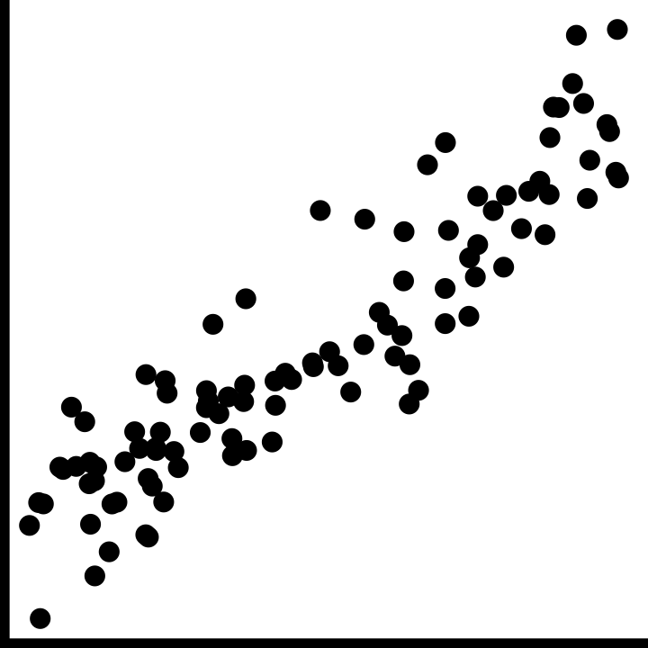', "The shape is linear",
  "nonlinear form", '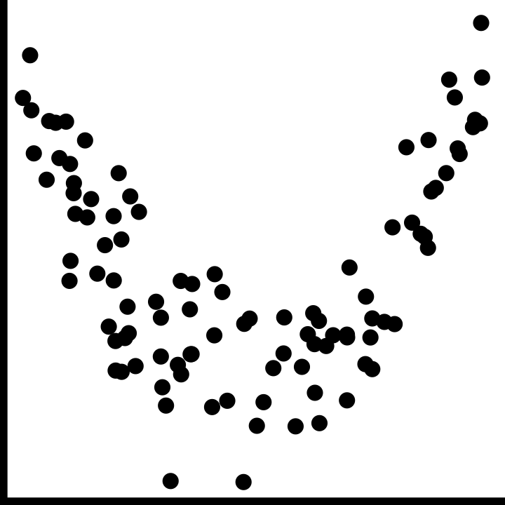', "The shape is more of a curve",
  "nonlinear form", '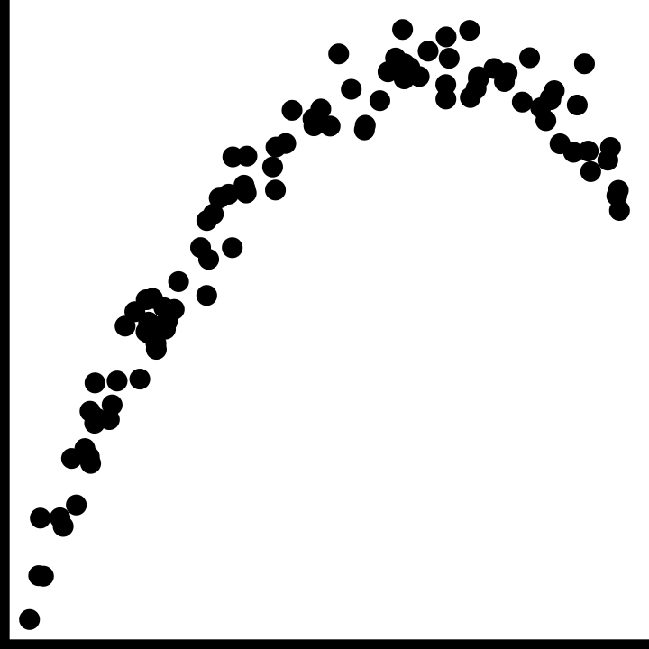', "The shape is more of a curve",
  "outliers", '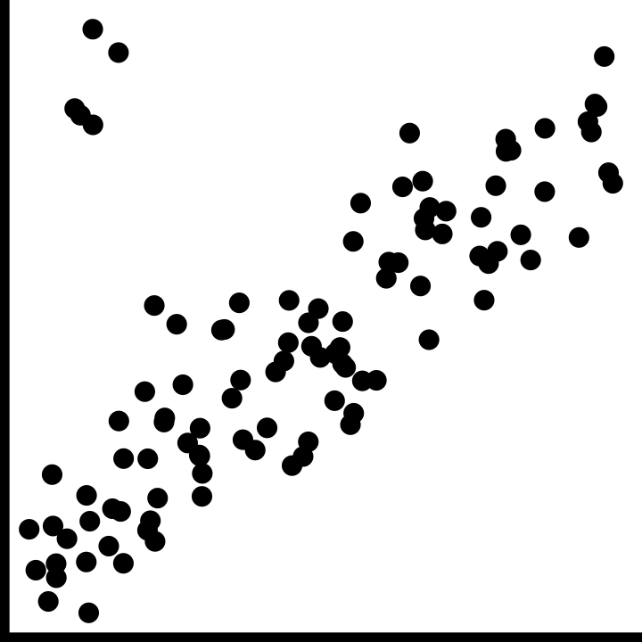', "There are one or more points that do not fit the pattern on the others",
  "clusters", '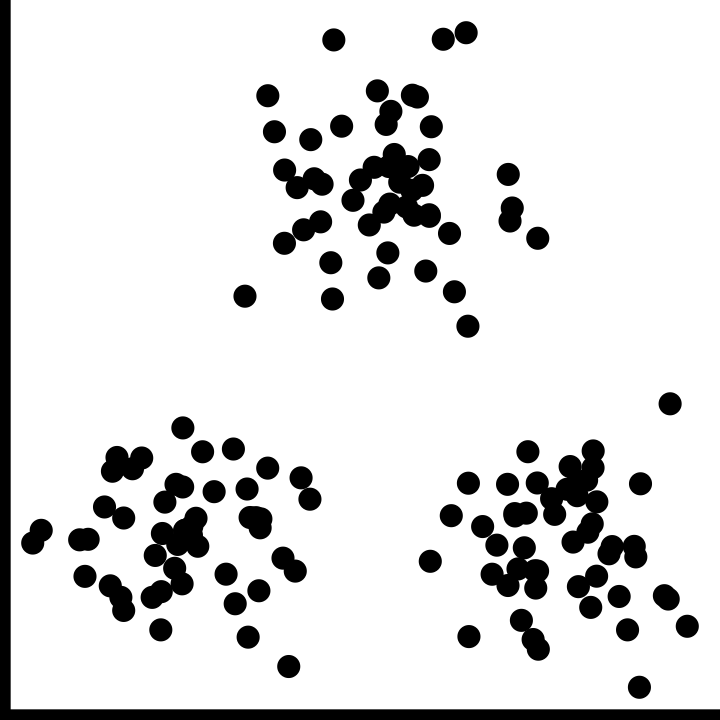', "The observations group into multiple clumps",
  "gaps", '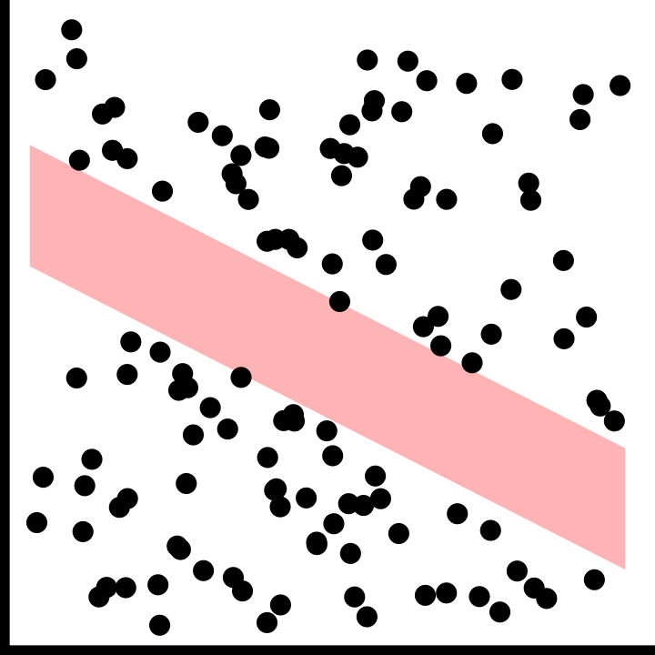', "There is a gap, or gaps, but its not clumped"
) %>%
  knitr::kable(escape = FALSE) %>%
  kableExtra::kable_classic()
```

---

# Possible features of a pair of continuous variables 3/3

```{r scatterplots3, include = FALSE, fig.width = 2, fig.height = 2}
d_barrier <- tibble(x = runif(200)) %>%
  mutate(y = runif(200))
d_barrier <- d_barrier %>%
  filter(-x + 3 * y < 1.2)

d_barrier %>%
  ggplot(aes(x = x, y = y)) +
  geom_polygon(
    data = tibble(x = c(0, 1, 1, 0), y = c(1.2 / 3, 2.2 / 3, 1, 1)),
    fill = "red", alpha = 0.3
  ) +
  geom_point() +
  theme_void() +
  theme(
    aspect.ratio = 1,
    axis.line.x = element_line(color = "black", size = 2),
    axis.line.y = element_line(color = "black", size = 2)
  )

l_shape <- tibble(
  x = c(rexp(50, 0.01), runif(50) * 20),
  y = c(runif(50) * 20, rexp(50, 0.01))
)

l_shape %>%
  ggplot(aes(x = x, y = y)) +
  geom_point() +
  theme_void() +
  theme(
    aspect.ratio = 1,
    axis.line.x = element_line(color = "black", size = 2),
    axis.line.y = element_line(color = "black", size = 2)
  )

discrete <- tibble(x = rnorm(200)) %>%
  mutate(y = -x + rnorm(25) * 0.1 + rep(0:7, 25)) %>%
  filter((scale(x)^2 + scale(y)^2) < 2)

discrete %>%
  ggplot(aes(x = x, y = y)) +
  geom_point() +
  theme_void() +
  theme(
    aspect.ratio = 1,
    axis.line.x = element_line(color = "black", size = 2),
    axis.line.y = element_line(color = "black", size = 2)
  )

hetero <- tibble(x = runif(200) - 0.5) %>%
  mutate(y = -2 * x + rnorm(200) * (x + 0.5))

hetero %>%
  ggplot(aes(x = x, y = y)) +
  geom_point() +
  theme_void() +
  theme(
    aspect.ratio = 1,
    axis.line.x = element_line(color = "black", size = 2),
    axis.line.y = element_line(color = "black", size = 2)
  )

weighted <- tibble(x = runif(50) - 0.5) %>%
  mutate(
    y = -2 * x + rnorm(50) * 0.8,
    w = runif(50) * (x + 0.5)
  )

weighted %>%
  ggplot(aes(x = x, y = y, size = w + 0.1)) +
  geom_point(alpha = 0.7) +
  scale_size_area(max_size = 6) +
  theme_void() +
  theme(
    aspect.ratio = 1, legend.position = "none",
    axis.line.x = element_line(color = "black", size = 2),
    axis.line.y = element_line(color = "black", size = 2)
  )
```


```{r feature-table3}
tribble(
  ~Feature, ~Example, ~Description,
  "barrier", '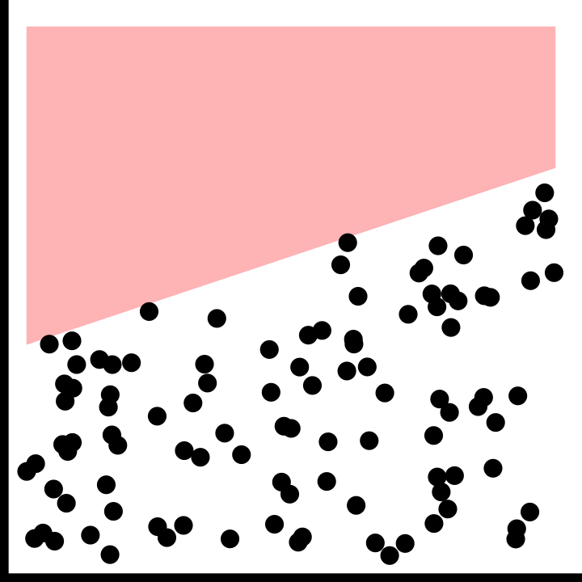', "There is combination of the variables which appears impossible",
  "l-shape", '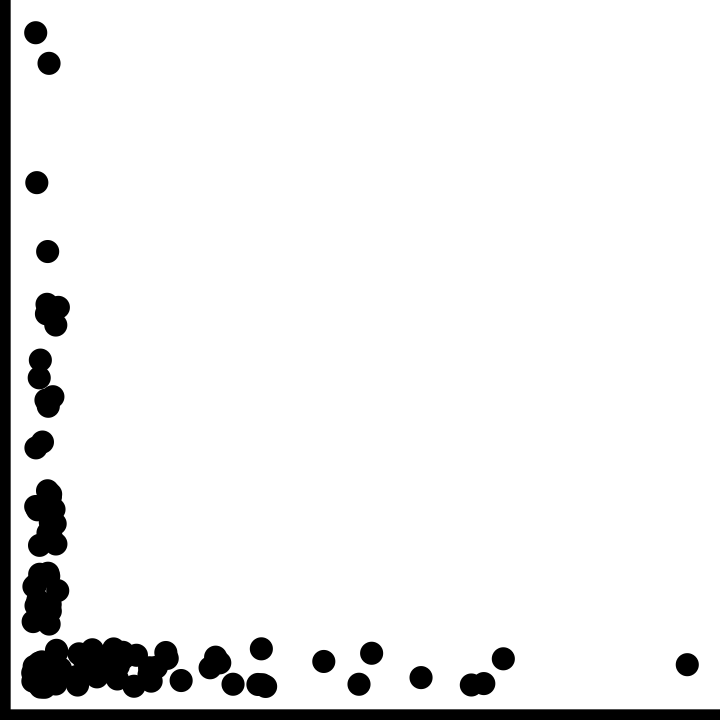', "When one variable changes the other is approximately constant",
  "discreteness", '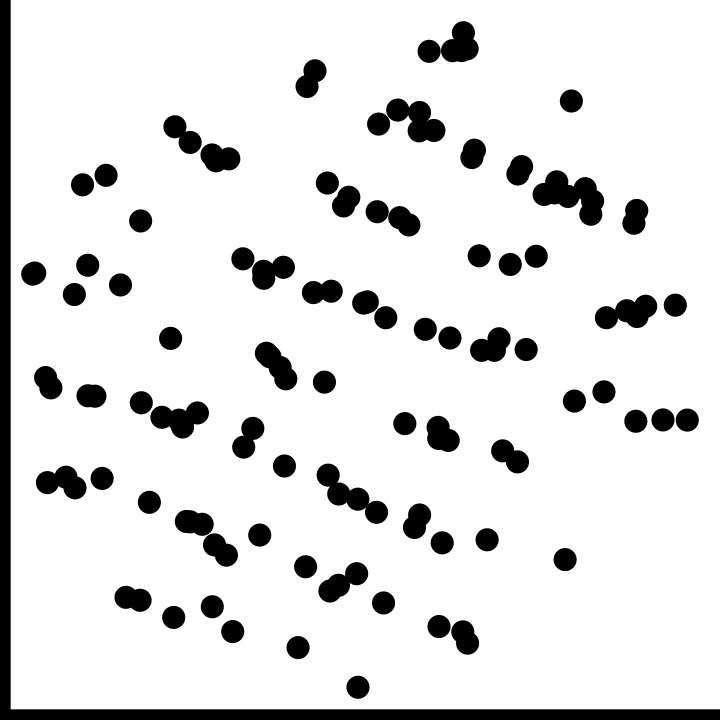', "Relationship between two variables is different from the overall, and observations are in a striped pattern",
  "heteroskedastic", '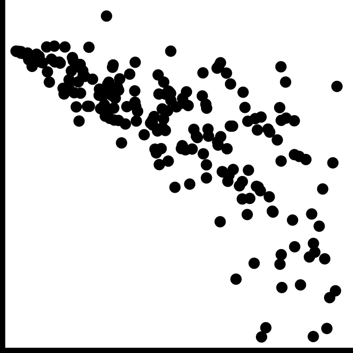', "Variation is different in different areas, maybe depends on value of x variable",
  "weighted", '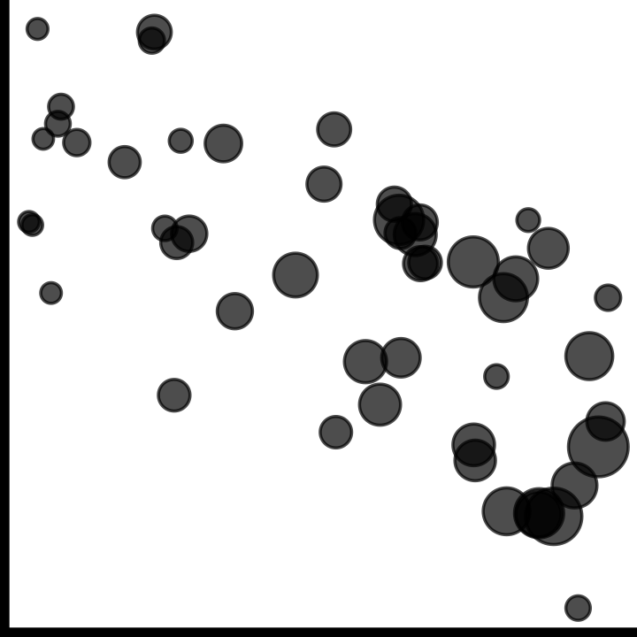', "If observations have an associated weight,  reflect in scatterplot, e.g. bubble chart"
) %>%
  knitr::kable(escape = FALSE) %>%
  kableExtra::kable_classic()
```

---

# Additional considerations (Unwin, 2015):

- **causation**: one variable has a direct influence on the other variable, in some way. For example, people who are taller tend to weigh more. The dependent variable is conventionally on the y axis. *It's not generally possible to tell from the plot that the relationship is causal, which typically needs to be argued from other sources of information.*
- **association**: variables may be related to one another, but through a different variable, eg ice cream sales are positively correlated with beach drownings, is most likely a temperature relationship.
- **conditional relationships**: the relationship between variables is conditionally dependent on another, such as income against age likely has a different relationship depending on retired or not.

---
class: transition middle

# Famous data examples

---
# Famous scatterplot examples

.flex[
.w-50[

### Anscombe's quartet

```{r anscombe, fig.width=6, fig.height=2, out.width="100%"}
anscombe_tidy <- anscombe %>%
  pivot_longer(cols = x1:y4, names_to = "var", values_to = "value") %>%
  mutate(
    group = substr(var, 2, 2),
    var = substr(var, 1, 1),
    id = rep(1:11, rep(8, 11))
  ) %>%
  pivot_wider(
    id_cols = c(id, group), names_from = var,
    values_from = value
  )
anscombe_tidy %>%
  ggplot(aes(x = x, y = y)) +
  geom_point(colour = "orange", size = 3) +
  facet_wrap(~group, ncol = 4, scales = "free") +
  theme(
    aspect.ratio = 1,
    axis.text.x = element_blank(),
    axis.text.y = element_blank()
  )
```

All four sets of Anscombe has .monash-orange2[same means, standard deviations and correlations], $\bar{x}$ = `r mean(anscombe$x1)`, $\bar{y}$ = `r round(mean(anscombe$y1),1)`, $s_x$ = `r round(sd(anscombe$x1),1)`, 
$s_y$ = `r round(sd(anscombe$y1),1)`, $r$ = `r round(cor(anscombe$x1, anscombe$y1), 2)`.

And similarly all 13 sets of the datasaurus dozen have .monash-orange2[same means, standard deviations and correlations], $\bar{x}$ = `r d <- datasaurus_dozen_wide; round(mean(d$dino_x),0)`, $\bar{y}$ = `r round(mean(d$dino_y),0)`, $s_x$ = `r round(sd(d$dino_x),0)`, 
$s_y$ = `r round(sd(d$dino_y),0)`, $r$ = `r round(cor(d$dino_x, d$dino_y),2)`.


]
.w-50[

### Datasaurus dozen

```{r dinosaur, out.width="30%", fig.width=3, fig.height=2.8}
datasaurus_dozen %>%
  filter(dataset == "dino") %>%
  ggplot(aes(x = x, y = y)) +
  geom_point() +
  theme(
    aspect.ratio = 1,
    axis.text.x = element_blank(),
    axis.text.y = element_blank()
  )
```

```{r datasaurus, fig.height = 7, fig.width = 7, out.width="60%"}

datasaurus_dozen %>%
  filter(dataset != "dino") %>%
  ggplot(aes(x = x, y = y)) +
  geom_point() +
  facet_wrap(~dataset, ncol = 4) +
  theme(
    aspect.ratio = 1,
    axis.text.x = element_blank(),
    axis.text.y = element_blank()
  )
```
]
]
---
class: transition middle

# Scatterplot case studies

---
# .orange[Case study] .bg-orange.circle[1] Olympics

```{r 2012-olympics, include = FALSE}
data(oly12, package = "VGAMdata")
skimr::skim(oly12)
```


.panelset[
.panel[.panel-name[🖼️]
.grid[
.item[
```{r 2012-olympics-plot1, fig.width = 6.4}
ggplot(oly12, aes(x = Height, y = Weight, label = Sport)) +
  geom_point()
```

]
.item[

* `Warning message: Removed 1346 rows containing missing values (geom_point)`
* The expected linear relationship between height and weight is visible, although obscured by outliers.
* Some discretization of heights, and higher weight values. 
* Likely to be substantial overplotting (57 athletes 1.7m, 60kg can't tell this from this plot). 
* Note the unusual height-weight combinations. What sport(s) would you expect some of these athletes might be participating in?


]
]
]
.panel[.panel-name[data]
.h400.scroll-sign[
```{r 2012-olympics, echo = TRUE, render = knitr::normal_print}
```
]]
.panel[.panel-name[R]

```{r, ref.label = "2012-olympics-plot1", echo = TRUE, eval = FALSE}
```

]
]

---
class: center

`r anicon::faa("wrench", size=3, animate="wrench", speed="slow", colour="#D93F00", anitype="hover")` Your turn, .monash-blue[cut and paste the code] into your R console, and `r anicon::nia("mouse over", size=2, animate="ring", speed="slow", colour="#D93F00", anitype="hover")` the resulting plot to examine the sport of the athlete. 

<br>
<br>

.font_medium[
```{r fig.width = 12, fig.height=8, out.width="100%", eval=FALSE, echo=TRUE}
library(tidyverse) #<<
library(plotly) #<<
data(oly12, package = "VGAMdata") #<<
p <- ggplot(oly12, aes(x = Height, y = Weight, label = Sport)) + #<<
  geom_point() #<<
ggplotly(p) #<<
```
]

`r countdown::countdown(5, class="clock")`
---
# How many athletes in the different sports? 

.scroll-box-16[
```{r oly_smry}
oly12 %>%
  count(Sport, sort = TRUE) %>%
  gt()
```
]

.scroll-sign[
<br>
<br>
]
---

## Consolidate factor levels

There are several cycling events that are reasonable to combine into one category. Similarly for gymnastics and athletics. 

<br>

```{r oly_cat, echo=TRUE}
oly12 <- oly12 %>%
  mutate(Sport = as.character(Sport)) %>%
  mutate(Sport = ifelse(grepl("Cycling", Sport), #<<
    "Cycling", Sport
  )) %>% #<<
  mutate(Sport = ifelse(grepl("Gymnastics", Sport),
    "Gymnastics", Sport
  )) %>%
  mutate(Sport = ifelse(grepl("Athletics", Sport),
    "Athletics", Sport
  )) %>%
  mutate(Sport = as.factor(Sport))
```


---
# Split the scatterplots by sport

.panelset[
.panel[.panel-name[🖼️]

```{r oly_facet, out.width="70%", fig.width=12, fig.height=7}
ggplot(oly12, aes(x = Height, y = Weight)) +
  geom_point(alpha = 0.5) + #<<
  facet_wrap(~Sport, ncol = 8) +
  theme(aspect.ratio = 1) #<<
```


]
.panel[.panel-name[learn]

.grid[
.item[

- Some sports have no data for height, weight
- The positive association between height and weight is visible across sports
- Nonlinear in wrestling?
- An outlier in judo, and football, and archery
- Maybe flatter among swimmers
- Taller in basketball, volleyball and handball
- Shorter in athletics, weightlifting and wrestling
- Little variance in tennis players
- .monash-blue[*Its still messy, and hard to digest*]

]

.item[

.monash-blue[Things to do to make comparisons easier:]

- Remove sports with missings
- Make regression lines for remaining sports on one plot
- Separately examine male/female athletes
- Compare just one group against the rest
]]]
.panel[.panel-name[R]

```{r, ref.label = "oly_facet", echo = TRUE, eval = FALSE}
```

<br>
<br>
Note: alpha transparency, and aspect ratio

]
]

---
# Remove missings, add colour for sex 

.panelset[
.panel[.panel-name[🖼️]

```{r oly_women, out.width="70%", fig.width=12, fig.height=7}
oly12 %>%
  filter(!(Sport %in% c("Boxing", "Gymnastics", "Synchronised Swimming", "Taekwondo", "Trampoline"))) %>%
  mutate(Sport = fct_drop(Sport)) %>%
  ggplot(aes(x = Height, y = Weight, colour = Sex)) +
  geom_point(alpha = 0.5) +
  facet_wrap(~Sport, ncol = 7, scales = "free") +
  scale_colour_brewer("", palette = "Dark2") +
  theme(aspect.ratio = 1, axis.text.x = element_text(angle = 90, vjust = 0.5, hjust = 1))
```


]
.panel[.panel-name[learn]

.grid[
.item[

.monash-orange2[Note: Because the focus is now on males vs females association shape within sport, make plots scale separately.]

- Athletics category should have been broken into several more categories like track, field: a shot-putter has a very different physique to a sprinter.
- Generally, clustering of male/female athletes
- Outliers: a tall skinny male archer, a medium height very light female athletics athlete, tall light female weightlifter, tall light male volleyballer
- Canoe slalom athletes, divers, cyclists are tiny.


]]]
.panel[.panel-name[R]

```{r, ref.label = "oly_women", echo = TRUE, eval = FALSE}
```

]
]

---
# Comparing association

.panelset[
.panel[.panel-name[🖼️]
.flex[
.w-50[
```{r oly_model, out.width="100%", fig.width=10, fig.height=8}
oly12 %>%
  filter(Sport %in% c(
    "Swimming", "Archery", "Basketball",
    "Handball", "Hockey", "Tennis",
    "Weightlifting", "Wrestling"
  )) %>%
  filter(Sex == "F") %>%
  mutate(Sport = fct_drop(Sport), Sex = fct_drop(Sex)) %>%
  ggplot(aes(x = Height, y = Weight, colour = Sport)) +
  geom_smooth(method = "lm", se = FALSE) + #<<
  scale_colour_brewer("", palette = "Dark2") +
  theme(
    legend.position = "bottom",
    legend.direction = "horizontal"
  )
```
]
.w-50[

<br><br><br>
- Weightlifters are much heavier relative to height
- Swimmers are leaner relative to height
- Tennis players are a bit mixed, shorter tend to be heavier, taller tend to be lighter

]]]
.panel[.panel-name[R]

```{r, ref.label = "oly_model", echo = TRUE, eval = FALSE}
```

]
]

---
# Comparing variability

.panelset[
.panel[.panel-name[🖼️]

.flex[
.w-50[
```{r oly_density, out.width="100%", fig.width=10, fig.height=8}
oly12 %>%
  filter(Sport %in% c("Shooting", "Modern Pentathlon", "Basketball")) %>% #<<
  filter(Sex == "F") %>%
  mutate(Sport = fct_drop(Sport), Sex = fct_drop(Sex)) %>%
  ggplot(aes(x = Height, y = Weight, colour = Sport)) +
  geom_density2d() + #<<
  scale_colour_brewer("", palette = "Dark2") +
  theme(
    legend.position = "bottom",
    legend.direction = "horizontal"
  )
```
]
.w-50[
<br><br><br>

- Modern pentathlon athletes are uniformly height and weight related
- Shooters are quite varied in body type

]]]
.panel[.panel-name[R]

```{r, ref.label = "oly_density", echo = TRUE, eval = FALSE}
```

]
]

---
# .orange[Case study] .bg-orange.circle[1] Olympics

We have seen that the association between height and weight is "contaminated" by different variables, sport, gender, and possibly country and age, too. 

Some of the categories also are "contaminated", for example, "Athletics" is masking many different types of events. This **lurking** variable probably contributes to different relationships depending on the event. There is another variable in the data set called `Event`. Athletics could be further divided based on key words in this variable. 

<br><br>
.question-box[If you were just given the Height and Weight in this data could you have detected the presence of conditional relationships?]

---
# Can you see conditional dependencies?

.panelset[
.panel[.panel-name[🖼️]
.grid[
.item[
```{r oly_canyousee, fig.width=8, fig.height=8, out.width="70%"}
p1 <- ggplot(oly12, aes(x = Height, y = Weight)) +
  geom_point(alpha = 0.2, size = 4) +
  theme_minimal() +
  theme(aspect.ratio = 1)
p2 <- ggplot(oly12, aes(x = Height, y = Weight)) +
  geom_density2d_filled() +
  theme_minimal() +
  theme(legend.position = "none", aspect.ratio = 1)
p3 <- ggplot(oly12, aes(x = Height, y = Weight)) +
  geom_density2d(binwidth = 0.01) +
  theme_minimal() +
  theme(aspect.ratio = 1)
p4 <- ggplot(oly12, aes(x = Height, y = Weight)) +
  geom_density2d(binwidth = 0.001, color = "white", size = 0.2) +
  geom_density2d_filled(binwidth = 0.001) +
  theme_minimal() +
  theme(legend.position = "none", aspect.ratio = 1)
grid.arrange(p1, p3, p2, p4, ncol = 2)
```
]
.item[
<br>
<br>
<br>
<br>
<br>

There is a hint of multimodality, barely a hint.

It's not easy to detect the presence of the additional variable, and thus accurately describe the relationship between height and weight among Olympic athletes.

]
]
]
.panel[.panel-name[R]

```{r, ref.label = "oly_canyousee", echo = TRUE, eval = FALSE}
```

]
]
---
# Focus on just women's tennis

.panelset[
.panel[.panel-name[🖼️]
.flex[
.w-50[
```{r oly_tennis, fig.width=6, fig.height=6, out.width="80%"}
oly12 %>%
  filter(Sport == "Tennis", Sex == "F") %>%
  ggplot(aes(x = Height, y = Weight)) +
  geom_point(alpha = 0.9, size = 3)
```
]
.w-50[
- positive
- linear
- moderate
- relationship could be considered to be causation rather than association
- outliers: one outlier, maybe two: one really short and light, and one tall but skinny

<br><br>

.question-box[What is surprising here?]
]
]
]
.panel[.panel-name[R]

```{r, ref.label = "oly_tennis", echo = TRUE, eval = FALSE}
```

]
]

---
# Focus on just women's wrestling

.panelset[
.panel[.panel-name[🖼️]

.flex[
.w-50[
```{r oly_wrestling, fig.width=6, fig.height=6, out.width="80%"}
oly12 %>%
  filter(Sport == "Wrestling", Sex == "F") %>%
  ggplot(aes(x = Height, y = Weight)) +
  geom_point(alpha = 0.9, size = 3)
```
]
.w-50[
- positive
- non-linear
- moderate
- relationship could be considered to be causation rather than association
- gaps: discreteness

<br><br>

.question-box[What is surprising here?]

]
]
]
.panel[.panel-name[R]

```{r, ref.label = "oly_wrestling", echo = TRUE, eval = FALSE}
```

]
]
---
class: transition middle

# Review: Modifications of scatterplots for particular purposes

---
```{r generate_data}
set.seed(2222)
df <- tibble(x = c(rnorm(500) * 0.2, runif(300) + 1)) %>%
  mutate(
    x2 = c(rnorm(500), runif(300) - 0.5),
    y1 = c(
      -2 * x[1:500] + rnorm(500),
      3 * x[501:800] + rexp(300)
    ),
    y2 = c(rep("A", 500), rep("B", 300)),
    y3 = c(
      -2 * (x2[1:500]) + rnorm(500) * 2,
      2 * (x2[501:800]) + rnorm(300) * 0.5
    )
  )
```

```{r scatmodify, include=FALSE, fig.width=2, fig.height=2, out.width="100%"}
ggplot(df, aes(x = x2, y = y3)) +
  geom_point() +
  xlab("") +
  ylab("") +
  theme_void() +
  theme(
    aspect.ratio = 1,
    axis.line.x = element_line(color = "black", size = 2),
    axis.line.y = element_line(color = "black", size = 2)
  )

ggplot(df, aes(x = x2, y = y3)) +
  geom_point(alpha = 0.1) +
  xlab("") +
  ylab("") +
  theme_void() +
  theme(
    aspect.ratio = 1,
    axis.line.x = element_line(color = "black", size = 2),
    axis.line.y = element_line(color = "black", size = 2)
  )

ggplot(df, aes(x = x2, y = y3)) +
  geom_smooth(colour = "purple", se = F, size = 2, span = 0.2) +
  xlab("") +
  ylab("") +
  theme_void() +
  theme(
    aspect.ratio = 1,
    axis.line.x = element_line(color = "black", size = 2),
    axis.line.y = element_line(color = "black", size = 2)
  )

ggplot(df, aes(x = x2, y = y3)) +
  geom_point(alpha = 0.2) +
  geom_smooth(colour = "purple", se = F, size = 2, span = 0.2) +
  xlab("") +
  ylab("") +
  theme_void() +
  theme(
    aspect.ratio = 1,
    axis.line.x = element_line(color = "black", size = 2),
    axis.line.y = element_line(color = "black", size = 2)
  )

ggplot(df, aes(x = x, y = y1)) +
  geom_density_2d(colour = "black") +
  xlab("") +
  ylab("") +
  theme_void() +
  theme(
    aspect.ratio = 1,
    axis.line.x = element_line(color = "black", size = 2),
    axis.line.y = element_line(color = "black", size = 2)
  )

ggplot(df, aes(x = x, y = y1)) +
  geom_density_2d_filled() +
  xlab("") +
  ylab("") +
  theme_void() +
  theme(
    legend.position = "none", aspect.ratio = 1,
    axis.line.x = element_line(color = "black", size = 2),
    axis.line.y = element_line(color = "black", size = 2)
  )

ggplot(df, aes(x = x, y = y1, colour = y2)) +
  geom_point(alpha = 0.2) +
  xlab("") +
  ylab("") +
  scale_colour_brewer("", palette = "Dark2") +
  theme_void() +
  theme(
    legend.position = "none", aspect.ratio = 1,
    axis.line.x = element_line(color = "black", size = 2),
    axis.line.y = element_line(color = "black", size = 2)
  )

ggplot(df, aes(x = x, y = y1, colour = y2)) +
  geom_density2d() +
  xlab("") +
  ylab("") +
  scale_colour_brewer("", palette = "Dark2") +
  theme_void() +
  theme(
    legend.position = "none", aspect.ratio = 1,
    axis.line.x = element_line(color = "black", size = 2),
    axis.line.y = element_line(color = "black", size = 2)
  )
```

```{r feature-table4}
tribble(
  ~Modification, ~Example, ~Purpose,
  "none", '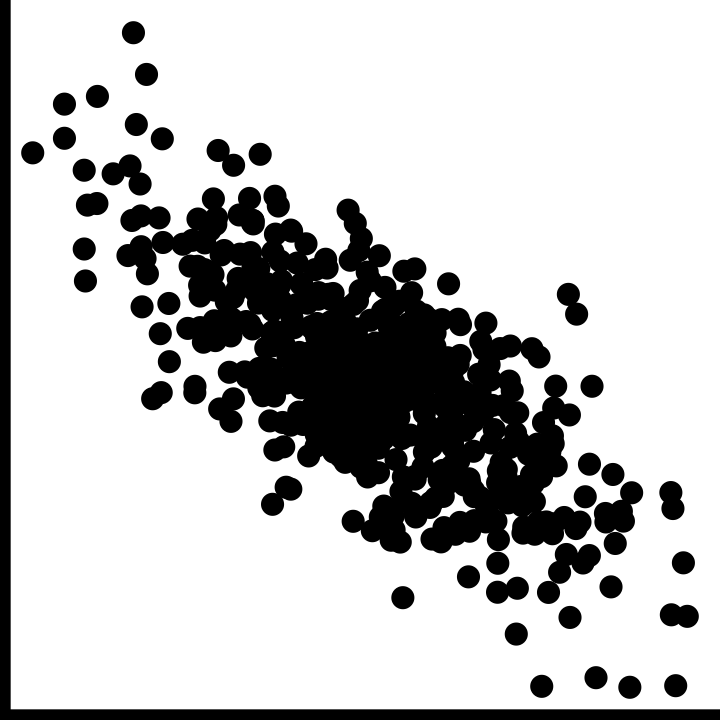', "raw information",
  "alpha-blend", '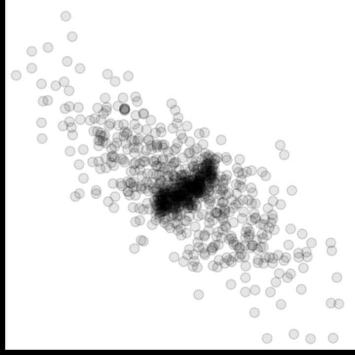', "alleviate overplotting to examine density at centre",
  "model overlay", '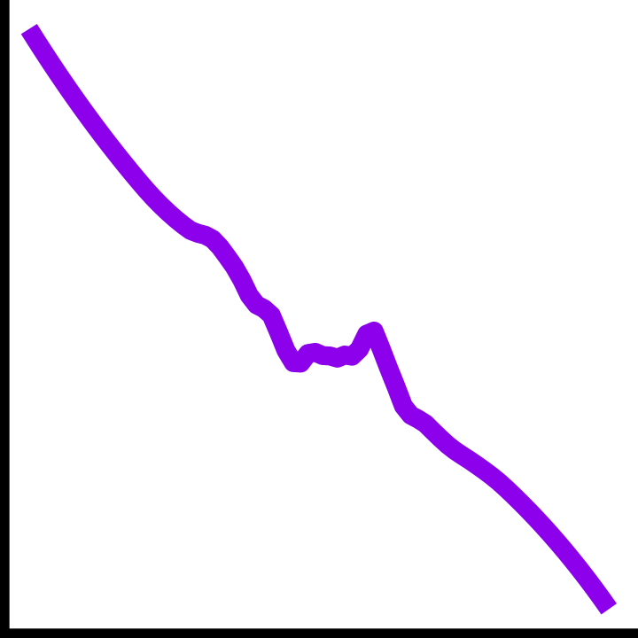', "focus on the trend",
  "model + data", '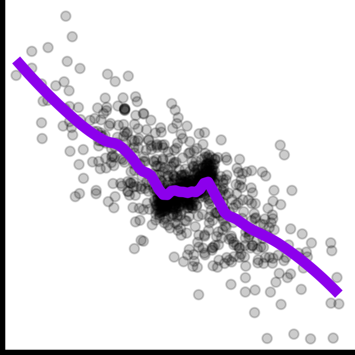', "trend plus variation",
  "density", '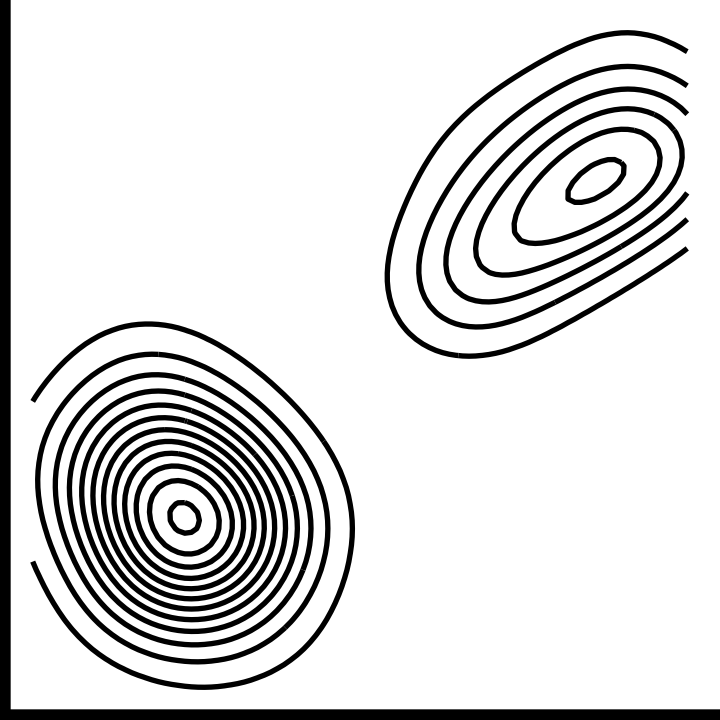', "overall distribution, variation and clustering",
  "filled density", '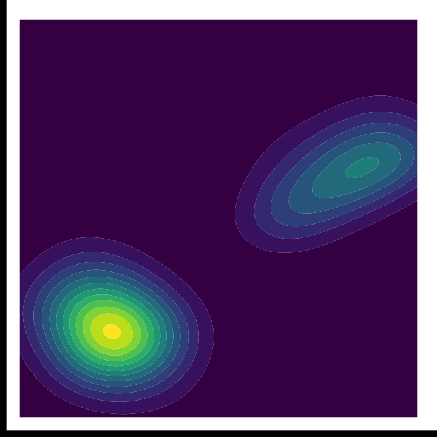', "high density locations in distribution (modes), variation and clustering",
  "colour", '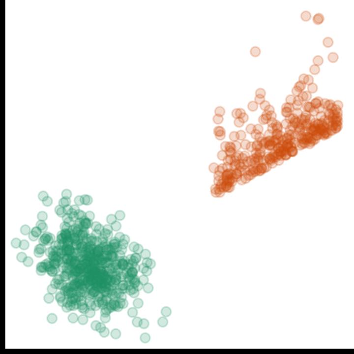', "relationship with conditioning and lurking variables",
  "colour + density", '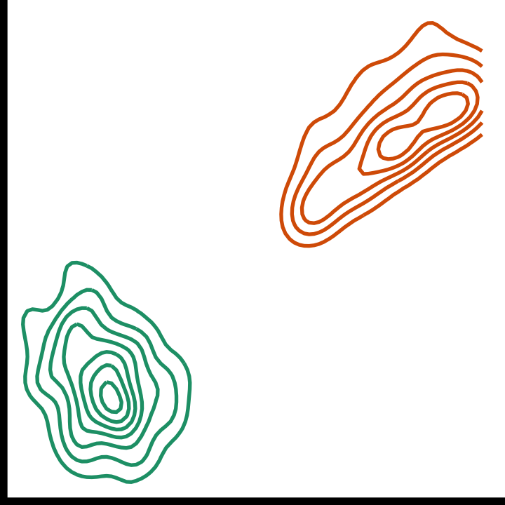', "relationship with conditioning and lurking variables"
) %>%
  knitr::kable(escape = FALSE) %>%
  kableExtra::kable_classic()
```

---
# Resources

- Unwin (2015) [Graphical Data Analysis with R](http://www.gradaanwr.net)
- Graphics using [ggplot2](https://ggplot2.tidyverse.org)
- Wilke (2019) Fundamentals of Data Visualization https://clauswilke.com/dataviz/
- Friendly and Denis "Milestones in History of Thematic Cartography, Statistical Graphics and Data Visualisation" available at http://www.datavis.ca/milestones/

---

```{r endslide, child="assets/endslide.Rmd"}
```
