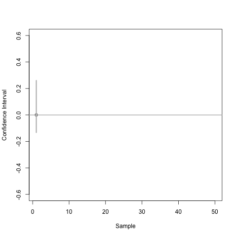

```{r, include = FALSE}
current_file <- knitr::current_input()
basename <- gsub(".Rmd$", "", current_file)
```
```{r, include = FALSE}
library(tidyverse)
library(colorspace)
library(patchwork)
options(width = 200)
knitr::opts_chunk$set(
  fig.path = "images/week7B/",
  fig.width = 6,
  fig.height = 3.5,
  fig.align = "center",
  dev.args = list(bg = "transparent"),
  # out.width = "100%",
  fig.retina = 3,
  echo = FALSE,
  warning = FALSE,
  message = FALSE,
  cache = TRUE,
  cache.path = "cache/week7B/"
)
theme_set(ggthemes::theme_gdocs(base_size = 18) +
  theme(
    plot.background = element_rect(fill = "transparent", colour = NA), axis.line.y = element_line(color = "black", linetype = "solid"),
    plot.title.position = "plot",
    plot.title = element_text(size = 24),
    panel.background = element_rect(fill = "transparent", colour = NA),
    legend.background = element_rect(fill = "transparent", colour = NA),
    legend.key = element_rect(fill = "transparent", colour = NA)
  ))
```


```{r titleslide, child="assets/titleslide.Rmd"}
```

```{css, echo = FALSE}
.font20 {
  font-size: 20pt!important;
}

```


---

class: transition middle

# Modelling and testing for comparisons


---

```{r crop-data, include = FALSE}
data(gathmann.bt, package = "agridat")
df1 <- gathmann.bt %>%
  pivot_longer(-gen,
    values_to = "abundance",
    names_to = "species"
  ) %>%
  mutate(species = case_when(
    species == "thysan" ~ "Thrip",
    TRUE ~ "Spider"
  ))
skimr::skim(df1)
```


# Revisiting .orange[Case study] .circle.bg-orange.white[1] Pest resistance maize 

.flex[
.w-50[
.panelset[
.panel[.panel-name[📊]

```{r pest-plot1, fig.width = 5, fig.height = 6}
ggplot(df1, aes(gen, abundance, color = gen)) +
  ggbeeswarm::geom_quasirandom(size = 3) +
  facet_wrap(~species, scales = "free") +
  scale_color_discrete_qualitative() +
  guides(color = FALSE) +
  labs(x = "", y = "Abundance") +
  theme(axis.text.x = element_text(
    angle = 90,
    vjust = 0.5,
    hjust = 1
  ))
```

]
.panel[.panel-name[data]
.h200.scroll-sign.f5[
```{r crop-data, echo = T, render = knitr::normal_print}
```
]]
.panel[.panel-name[R]
.f5[
```{r pest-plot1, eval = F, echo = T}
```
]]

]

]
.w-50[
* The experiment compared abundance of spiders and thrips on *Bt* variety to the abundance of those on isogenic control variety.
{{content}}
]

]

--
* Would you say that the abundance of spiders and/or thrips are comparable between *Bt* variety and isogenic variety?


---

# Two-sample parametric tests: $t$-test (thrips)

.flex[
.w-50.br[
* Assumes the two samples are independent and from the $N(\mu_x, \sigma^2_x)$ and $N(\mu_y, \sigma^2_y)$, respectively.

$$H_0: \mu_x - \mu_y = 0~\text{ vs. }~H_1: \mu_x - \mu_y \neq 0$$

$$T^* = \frac{\bar{X} - \bar{Y}}{SE(\bar{X} - \bar{Y})}.$$
* Assuming $\sigma^2_x = \sigma^2_y$, then $T^* \sim t_{n_x + n_y - 2}.$
* A $100(1 - \alpha)\%$ confidence interval for $\mu_x - \mu_y$ is given as $(L, U)$ such that:
$$P(L<\mu_x - \mu_y < U) = 1 - \frac{\alpha}{2}.$$
* If $0 \in (L, U)$, consistent with $H_0$. 

]
.w-50[
.panelset[
.panel[.panel-name[thrip]
.f5[
```{r ttest1, echo = TRUE}
with(
  gathmann.bt,
  t.test(thysan[gen == "ISO"],
    thysan[gen == "Bt"],
    alternative = "two.sided",
    var.equal = TRUE,
    conf.level = 0.95
  )
)
```
]

.panel[.panel-name[spider]
.f5[
```{r ttest2, echo = TRUE}
with(
  gathmann.bt,
  t.test(aranei[gen == "ISO"],
    aranei[gen == "Bt"],
    alternative = "two.sided",
    var.equal = TRUE,
    conf.level = 0.95
  )
)
```
]
]
]]
]


]

.footnote.f6[
Note significance test suggested is different in Achim Gathmann et al. (2006) “Impact of Bt Maize Pollen (MON810) on Lepidopteran Larvae Living on Accompanying Weeds.” Molecular Ecology 15: 2677–85.
]

---

# Confidence interval for two sample difference

.grid[
.item[
<center>

</center>

]
.item[

* In the right, a 95% confidence interval for population mean difference is constructed repeatedly, assuming population mean difference is Normally distributed, from 100 samples of the same population.
* The population mean is zero. 
* Each confidence interval is calculated as 
$$\bar{X} - \bar{Y} \pm \color{red}{t_{n-2, 0.975}}\times SE(\bar{X} - \bar{Y})$$
where $t_{n-2, 0.975}$ is $t^*$ such that $$P(t_{n-2} < t^*) =  0.975.$$


]

]


---

# Two sample non-parametric tests

.flex[.w-50.br[
### Wilcoxon rank-sum test

* Suppose that $X$ and $Y$ are randomly selected values from two populations.

$$H_0: P(X > Y) = P(X < Y)$$
.center[
vs.
]
$$H_1: P(X>Y)\neq P(X<Y)$$
* All observations are ranked.
* Test statistic is based on the sum of the ranks of one group.


]
.w-50[
.panelset[
.panel[.panel-name[thrip]
.f5[
```{r wtest1, echo = TRUE}
with(
  gathmann.bt,
  wilcox.test(thysan[gen == "ISO"],
    thysan[gen == "Bt"],
    alternative = "two.sided",
    conf.int = TRUE,
    conf.level = 0.95
  )
)
```
]
.panel[.panel-name[spider]
.f5[
```{r wtest2, echo = TRUE}
with(
  gathmann.bt,
  wilcox.test(aranei[gen == "ISO"],
    aranei[gen == "Bt"],
    alternative = "two.sided",
    conf.int = TRUE,
    conf.level = 0.95
  )
)
```
]]
]
]]
]


---

# Equivalence of tests to testing model parameters

.flex[
.w-30.br[
.f5[
```{r btdata}
gathmann.bt
```

]]
.w-70.pl3[
$$\texttt{thysan}_i = \beta_0 + \beta_1\mathbb{I}(\texttt{gen}_i=\texttt{ISO}) + e_i$$
where $e_i \sim NID(0, \sigma^2)$.

* The least squares estimate for $\widehat{\beta}_1 = \bar{X} - \bar{Y}.$


```{r lmtest, echo = TRUE}
lm(thysan ~ gen, data = gathmann.bt) %>%
  confint("genISO", level = 0.95)
```
{{content}}
]
]


--

* Notice that the above confidence interval is the same confidence interval from the $t$-test!


---

# Revisiting .orange[Case study] .circle.bg-orange.white[4] Weight gain of calves .font_small[Part 1/3]

```{r diet-data, include = FALSE}
data(urquhart.feedlot, package = "agridat")
df4 <- urquhart.feedlot %>%
  pivot_longer(c(weight1, weight2),
    names_to = "when",
    values_to = "weight"
  ) %>%
  mutate(
    when = factor(as.character(when),
      labels = c("initial", "final"),
      levels = c("weight1", "weight2")
    ),
    diet = factor(diet, levels = c("High", "Medium", "Low"))
  )
skimr::skim(df4)
```

* 67 calves born in 1975 across 11 herds are fed of one of three diets with low, medium or high energy with their initial and final weights recorded.
.panelset[
.panel[.panel-name[📊]
```{r diet-plot2, fig.width = 14, fig.height = 6}
ggplot(df4, aes(when, weight, color = diet, group = animal)) +
  geom_point(size = 3) +
  facet_wrap(~herd, nrow = 2) +
  geom_line() +
  labs(x = "", y = "Weight", color = "Diet")
```

]
.panel[.panel-name[data]
.h100.scroll-sign.f4[
```{r diet-data, render=knitr::normal_print, echo = TRUE}
```
]]
.panel[.panel-name[R]
```{r diet-plot2, eval = FALSE, echo = TRUE}
```
]
]

---

# Revisiting .orange[Case study] .circle.bg-orange.white[4] Weight gain of calves .font_small[Part 2/3]

.flex[
.w-50.br[
* Modelling the response as weight gain with diet factor:
.f4[
```{r fit1, echo = TRUE}
coef(lm((weight2 - weight1) ~ diet, data = urquhart.feedlot))
```
]
* The herd is thought to be an important factor contributing to the response. 
* Modelling the response as weight gain with diet and herd factor:
.f4[
```{r fit1A, echo = TRUE}
# herd needs to be factor not integer
dat4 <- mutate(urquhart.feedlot, herdf = factor(herd))
coef(lm((weight2 - weight1) ~ herdf + diet, data = dat4))
```
]


]
.w-50.pl3[
* Last model is the same as modelling the final weight with the initial weight as a covariate with slope fixed to 1:
.f4[
```{r fit1B, echo = TRUE}
coef(lm(weight2 ~ offset(weight1) + herdf + diet,
  data = dat4
))
```
]

* Estimating slope for initial weight from the data:
.f4[
```{r fit1C, echo = TRUE}
coef(lm(weight2 ~ weight1 + herdf + diet,
  data = dat4
))
```
]]
]

---

# Revisiting .orange[Case study] .circle.bg-orange.white[4] Weight gain of calves .font_small[Part 3/3]

.panelset[
.panel[.panel-name[📊]

```{r fit-semi-final, echo = FALSE, fig.height = 5, fig.width = 10, out.width="90%"}
dat4 <- lm(weight2 ~ weight1 + herdf + diet, data = dat4) %>% broom::augment()
ggplot(dat4, aes(.fitted, .resid)) +
  geom_point(data = select(dat4, -herdf), size = 2, color = "gray80") +
  geom_point(size = 2, aes(color = herdf)) +
  geom_hline(yintercept = 0) +
  labs(x = "Fitted values", y = "Residual") +
  scale_color_discrete_qualitative() +
  facet_wrap(~herdf, nrow = 2) +
  guides(color = FALSE) +
  theme(axis.text = element_blank())
```

]
.panel[.panel-name[R]

```{r fit-semi-final, echo = TRUE, eval=FALSE}
```

]
]

---

# .orange[Case study] .circle.bg-orange.white[10] Soil nitrogen .font_small[Part 1/3]

```{r soil-data, include = FALSE}
data(gomez.nitrogen, package = "agridat")
skimr::skim(gomez.nitrogen)
```

.flex[.w-50[

.panelset[
.panel[.panel-name[📊]
```{r soil-plot1, fig.height = 6, fig.width = 8}
ggplot(gomez.nitrogen, aes(trt, nitro, color = stage)) +
  geom_point(size = 3) +
  scale_color_discrete_qualitative() +
  labs(
    x = "Fertilizer treatment",
    y = "Soil nitrogen content (%)",
    color = "Growth stage"
  )
```
]
.panel[.panel-name[data]
.h300.scroll-sign.f5[
```{r soil-data, echo = TRUE, render=knitr::normal_print}
```

]
]
.panel[.panel-name[R]
.f5[
```{r soil-plot1, echo = TRUE, eval = FALSE}
```
]]

]

]
.w-50[
* Soil nitrogen content with 8 different fertilizer treatment is measured at 3 growth stage:
  * P1 = 15 days post transplanting
  * P2 = 40 days post transplanting
  * P3 = panicle initiation
{{content}}

]
]

--
* Clearly the growth stage affects the soil nitrogen content but this makes it hard to compare the fertilizer treatments.
{{content}}
--
* Let's model the nitrogen content as:

```r
lm(nitro ~ stage + trt, 
  data = gomez.nitrogen)
```

---

# .orange[Case study] .circle.bg-orange.white[10] Soil nitrogen .font_small[Part 2/3]

.flex[.w-50.br[
* Considering just the stage effect:
.f5[
```{r, echo = TRUE}
fit1 <- lm(nitro ~ stage, data = gomez.nitrogen)
fit1data <- broom::augment(fit1) %>%
  left_join(gomez.nitrogen, by = c("nitro", "stage")) %>%
  mutate(trt = fct_reorder(trt, .resid))
ggplot(fit1data, aes(trt, .resid)) +
  geom_boxplot() +
  labs(
    x = "Fertilizer treatment",
    y = "Residual of fit1"
  )
```

]]
.w-50.pl3[
.f5[
{{content}}

]]
]

--

* Here we expect no pattern:
```{r, echo = TRUE}
fit2 <- lm(nitro ~ stage + trt,
  data = gomez.nitrogen
)
fit2data <- broom::augment(fit2) %>%
  mutate(trt = fct_reorder(trt, .resid))
ggplot(fit2data, aes(trt, .resid)) +
  geom_boxplot() +
  labs(
    x = "Fertilizer treatment",
    y = "Residual of fit2"
  )
```

---

# .orange[Case study] .circle.bg-orange.white[10] Soil nitrogen .font_small[Part 3/3]
.flex[
.w-50[
.h300.scroll-sign.f5[
```{r, echo = TRUE}
library(emmeans)
confint(pairs(emmeans(fit2, "trt"), adjust = "none"))
```
]
]
.w-50.f4[
```{r, fig.height = 6, fig.width = 8}
CI.none <- confint(pairs(emmeans(fit2, "trt"), adjust = "none")) %>%
  mutate(
    isSig = !(upper.CL > 0 & lower.CL < 0),
    contrast = reorder(contrast, estimate)
  )
ggplot(CI.none, aes(estimate, contrast)) +
  geom_segment(aes(x = lower.CL, xend = upper.CL, y = contrast, yend = contrast, colour = isSig), show.legend = F, size = 1.5) +
  geom_point(size = 2) +
  geom_vline(xintercept = 0, size = 1.5, color = "black") +
  scale_color_discrete_divergingx()
```
* From above, the 6 pairs of treatments: T3 & T5, T1 & T4, T1 & T8, T6 & T7, T1 & T3, T1 & T7 are significantly different. 
* These confidence intervals are constructed *without taking any regard for others*.

]

]
---


# Controlling the family-wise error rate

.flex[
.w-50.br[

**Unadjusted**

* Each interval has been constructed using a procedure so that when the model is correct,
the probability that the "correct" population contrast is covered is 0.95. . . individually.

$$\bar{X} - \bar{Y} \pm \color{red}{t_{n-t,1 - \alpha/2}}\times SE(\bar{X} - \bar{Y})$$
where $\alpha = 0.05$ and $t$ is the number of treatments.

* But, what is the probability that all intervals cover their corresponding true values simultaneously?


]
.w-50.pl3[
**Bonferroni adjustment**

* We can adjust the individual $100(1-\alpha)\%$ confidence intervals so 

$$\bar{X} - \bar{Y} \pm \color{red}{t_{n-t,1 - \alpha/(2m)}}\times SE(\bar{X} - \bar{Y})$$
where $m$ is the number of pairwise comparisons.

* So for 8 treatments, the number of pairwise comparisons is

```{r, echo = TRUE}
choose(8, 2)
```


]
]

---

# Bonferroni adjusted confidence interval
.flex[
.w-50[
.h300.scroll-sign.f5[
```{r, echo = TRUE}
confint(pairs(emmeans(fit2, "trt"),
  adjust = "bonferroni"
))
```
]
]
.w-50[
.f5[
```{r, fig.height = 6, fig.width = 8}
CI.none <- confint(pairs(emmeans(fit2, "trt"), adjust = "bonferroni")) %>%
  mutate(
    isSig = factor(!(upper.CL > 0 & lower.CL < 0), levels=c(TRUE, FALSE)),
    contrast = reorder(contrast, estimate)
  )
ggplot(CI.none, aes(estimate, contrast)) +
  geom_segment(aes(x = lower.CL, xend = upper.CL, y = contrast, yend = contrast, colour = isSig), show.legend = F, size = 1.5) +
  geom_point(size = 2) +
  geom_vline(xintercept = 0, size = 1.5, color = "black") +
  scale_color_manual("", values=c("#008585", "#C7522B"))
```
]
* Now none are significantly different.
* Note: Bonferroni adjustment is quite conservative.

]

]


---

```{r endslide, child="assets/endslide.Rmd"}
```
