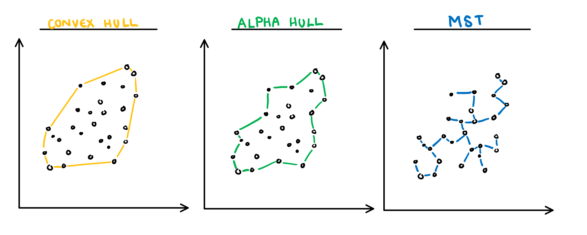
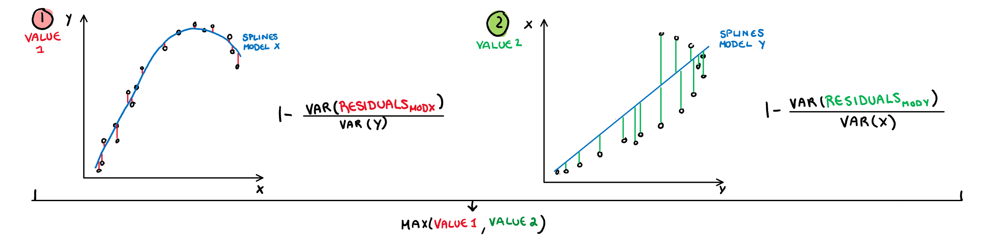
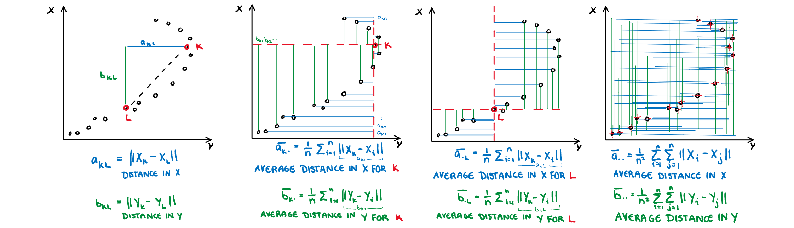

```{r, include = FALSE}
current_file <- knitr::current_input()
basename <- gsub(".Rmd$", "", current_file)
```

```{r, include = FALSE}
knitr::opts_chunk$set(
  fig.path = sprintf("images/%s/", basename),
  fig.width = 6,
  fig.height = 4,
  fig.align = "center",
  out.width = "100%",
  fig.retina = 3,
  echo = FALSE,
  warning = FALSE,
  message = FALSE,
  cache = FALSE
)
```

```{r}
library(tidyverse)
# remotes::install_github("ggobi/GGally")
library(GGally)
library(gt)
library(tourr)
library(mvtnorm)
library(forcats)
library(gridExtra)
library(cassowaryr)
library(geozoo)

theme_set(ggthemes::theme_gdocs(base_size = 14) +
            theme(plot.background = element_rect(fill = 'transparent', colour = NA), axis.line.y = element_line(color = "black", linetype = "solid"),
                  plot.title.position = "plot",
                  plot.title = element_text(size = 18),
                  panel.background  = element_rect(fill = 'transparent', colour = NA),
                  legend.background = element_rect(fill = 'transparent', colour = NA),
                  legend.key        = element_rect(fill = 'transparent', colour = NA)
                  ) )
```

```{r titleslide, child="assets/titleslide.Rmd"}
```

---
Read about the original book, and movie on [wikipedia](https://en.wikipedia.org/wiki/Flatland)

<center>
<iframe width="980" height="551" src="https://www.youtube.com/embed/C8oiwnNlyE4" frameborder="0" allow="accelerometer; autoplay; encrypted-media; gyroscope; picture-in-picture" allowfullscreen></iframe>
</center>

.footnote[Trailer for "FLATLAND 2: SPHERELAND"]
---
class: transition middle

# More than two continuous variables? 

# Use a scatterplot matrix

synonyms: splom, draughtsman plot

---
# .orange[Case study] .bg-orange.circle[1] Olive oils

.panelset[
.panel[.panel-name[data]
.scroll-800[
```{r readolive}
olive <- read_csv("http://ggobi.org/book/data/olive.csv") %>%
  rename(id = `...1`)
olive %>% gt()
```
]
]
.panel[.panel-name[description]

*Source*: Forina, M., Armanino, C., Lanteri, S. & Tiscornia, E. (1983), Classi- fication of Olive Oils from their Fatty Acid Composition, in Martens, H. and Russwurm Jr., H., eds, Food Research and Data Analysis, Applied Science Publishers, London, pp. 189–214. It was brought to our attention by Glover & Hopke (1992)

*Number of rows*: 572 ;
*Number of variables*: 10 <br>
*Description*: This data consists of the percentage composition of fatty acids found in the lipid fraction of Italian olive oils. The data arises from a study to determine the authenticity of an olive oil.

<table>
<tr> <td> region </td> <td> Three "super-classes" of Italy: North, South, and the island of Sardinia </td></tr>
<tr> <td> area</td> <td>  Umbria, East and West Liguria (North), North and South Apulia, Calabria, and Sicily (South), (inland and coastal Sardinia) </td></tr>
<tr> <td> palmitic, palmitoleic, stearic, oleic, linoleic, linolenic, arachidic, eicosenoic</td> <td>  fatty acids, % $\times$ 100</td></tr>
</table>

*Primary question*: How do we distinguish the oils from different regions and areas in Italy based on their combinations of the fatty acids?

]
.panel[.panel-name[R]
```{r ref.label="readolive", echo=TRUE, eval=FALSE}
```
]
]

---
# .orange[Case study] .bg-orange.circle[1] Olive oils

.panelset[
.panel[.panel-name[🖼️]

```{r olivepairs, fig.height=7, fig.width=7, out.width="48%"}
ggscatmat(olive, columns=7:11, color = "region") +
  scale_colour_brewer(palette="Set1")
```

]
.panel[.panel-name[learn]

.grid[
.item[


### Differences between groups

- region 1 (south) is separated from the other two using just one variable, eiscosenoic acid
- regions 2 (sardinia) and 3 (north) are separated from each other in a combination of variables: oleic, linoleic, linolenic, arachidic.
]
.item[
### General association between variables, and univariate distributions

- Strong negative association between some variables (oleic, linoleic and other vars)
- Some clustering of observations (linoleic, arachidic, eicosenoic)
- Outliers (linolenic, oleic)
- Discreteness in linolenic and arachidic for region 3 (only) suggesting different recording protocols by region

]]

]
.panel[.panel-name[R]
```{r ref.label="olivepairs", echo=TRUE, eval=FALSE}
```
]
]


---
# .orange[Case study] .bg-orange.circle[2] PISA

.panelset[
.panel[.panel-name[🖼️]
.grid[
.item[
<br>

The Programme for International Student Assessment (PISA) is a triennial survey conducted by the Organization for Economic Cooperation and Development (OECD) on assessment measuring 15-year-old student performances in reading, mathematics and science.

<br>
<br>
.nonash-blue2[Math scores for Australia for 2018.] (Only 6 or the 10 shown.)

]
.item[
```{r pisapairs, fig.height=10, fig.width=10, out.width="90%"}
pisa_oz <-readRDS(here::here("data/pisa2018_oz.rds"))
ggscatmat(pisa_oz, columns=6:11, alpha = 0.1) 
```
]
]
]
.panel[.panel-name[learn]

.grid[
.item[
<br>
<br>

Association is uniformly positive, linear and moderately strong. 

<br>
<br>

.monash-blue2[Compare to a simulated sample from a multivariate normal] `r emo::ji("point_right")`

<br>
<br>
.monash-orange2[Can you tell that it is synthetic data?]
]
.item[
```{r mvnorm, fig.height=10, fig.width=10, out.width="90%"}
vc <- matrix(rep(0.80,100), ncol=10)
diag(vc) <- rep(1, 10)
sim <- rmvnorm(7000, mean=rep(0, 10), sigma=vc) 
sim <-as_tibble(sim)
ggscatmat(sim, columns=1:6, alpha = 0.1) 
```
]
]

]
.panel[.panel-name[R]
```{r ref.label="pisapairs", echo=TRUE, eval=FALSE}
```
```{r ref.label="mvnorm", echo=TRUE, eval=FALSE}
```

]
]

---
class: informative middle
# Diversion

This is an example of fraudulent synthetic data, presented in a Lancet article in May 2020 claiming hydroxychloroquinine increased risk of death. 


.footnote[Note: This does not mean that I support the use of HCQ.]

---


.footnote[Ellis (2020) [Surgisphere data fraud fiasco ](https://docs.google.com/presentation/d/1Ls-SsFuFJsGBfvQIcQt7HcojkznaGQN-/edit#slide=id.p5)]

---
background-image: \url(images/week7/covid_HCQ.png)
background-size: 80%
background-position: 50% 5%

<div id="rectangle" style="width: 1250px; height: 5px; background-color: red; position: absolute; top: 410px; left: 0;"></div>

---
background-image: \url(images/week7/covid_HCQ.png)
background-size: 80%
background-position: 50% 5%

<br>
.think-box[*Another rather remarkable aspect is how beautifully uniform the aggregated data are across continents*]
--

<br> <br>
.think-box[*For example, smoking is almost between 9.4-10% in 6 continents. As they don’t tell us which countries are involved, hard to see how this matches known smoking prevalences. Antiviral use is 40.5, 40.4, 40.7, 40.2, 40.8, 38.4%. Remarkable! I didn’t realise that treatment was so well coordinated across the world. Diabetes and other co-morbidities don’t vary much either.*]

.footnote[The 28 May open letter to The Lancet
coordinated by James Watson]

---
class: transition middle
# Generalised pairs plot

If the types of variables are not both quantitative, there are some other choices of mapping

---
# .orange[Case study] .bg-orange.circle[3] Tips

.panelset[
.panel[.panel-name[🖼️]
```{r tips-pairs, fig.width=7, fig.height=7, out.width="40%"}
tips <- read_csv("http://ggobi.org/book/data/tips.csv") %>%
  mutate(day = factor(day, levels=c("Thu", "Fri", "Sat", "Sun")))
ggpairs(tips[, c(2,3,8,5,6)])
```
]
.panel[.panel-name[learn]
.grid[
.item[
- positive linear moderate relationship between tip and total
- size also has a weak positive linear association with tip and total 
- total bill from males slightly higher
- total bill are more variable for smoking parties
- total bill lower on Thursday, and increasing through Sunday
- total bill higher at night
]
.item[
- some outliers in tips on Saturday nights, paid by males, at night.
- more bills paid by males
- smaller number of female non-smokers paying bill
- pretty similar number of men and women paying bill at lunchtime, but more men in the evening
- no diners on Thu/Fri during the day!!
]
]
]
.panel[.panel-name[R]

```{r ref.label = "tips-pairs", echo=TRUE, eval=FALSE}
```

]
]
---
class: transition middle

# Scagnostics

Has your data got too many pairs of variables to scan easily?

---
background-image: \url(https://upload.wikimedia.org/wikipedia/commons/1/14/1980s_computer_worker%2C_Centers_for_Disease_Control.jpg)
background-size: cover

<center>  </center>

.footnote[Friedman and Stuetzle (2002) [John W. Tukey's work on interactive graphics](https://projecteuclid.org/download/pdf_1/euclid.aos/1043351250)]

---
background-image: \url(https://upload.wikimedia.org/wikipedia/commons/1/14/1980s_computer_worker%2C_Centers_for_Disease_Control.jpg)
background-size: cover

<br>
<br>
<br>
<br>

<center>  </center> 

.footnote[Friedman and Stuetzle (2002) [John W. Tukey's work on interactive graphics](https://projecteuclid.org/download/pdf_1/euclid.aos/1043351250)]

---
# Scagnostics

```{r generate data}
set.seed(0903)
df <- tibble(x=1:10, y=c(1:4,6,6:10), set="line") %>%
  bind_rows(tibble(x=rnorm(100), y=rnorm(100), set="norm"))
d <- as_tibble(sphere.hollow(p=2, n=100)$points) %>%
  rename(x = V1, y = V2) %>%
  mutate(set = "circle")
df <- df %>%
  bind_rows(d)
d <- flea %>%
  select(tars2, head) %>%
  mutate(head = jitter(head, factor=0.1)) %>%
  rename(x=tars2, y=head) %>%
  mutate(set = "stripes")
df <- df %>%
  bind_rows(d)
d <- flea %>%
  select(tars1, aede1) %>%
  mutate(tars1 = jitter(tars1, factor=0.1), 
         aede1 = jitter(aede1, factor=0.1)) %>%
  rename(x=tars1, y=aede1) %>%
  mutate(set = "clumps")
df <- df %>%
  bind_rows(d) %>%
  mutate(set = factor(set, 
      levels = c("line", "norm", "circle", "stripes", "clumps")))
```

```{r scagplots, fig.height=2, fig.width=2, include=FALSE}
df %>%
  filter(set == "line") %>%
  ggplot(aes(x, y)) +
    geom_point() +
    theme(axis.text = element_blank(),
          axis.title = element_blank())
df %>%
  filter(set == "norm") %>%
  ggplot(aes(x, y)) +
    geom_point() +
    theme(axis.text = element_blank(),
          axis.title = element_blank())
df %>%
  filter(set == "circle") %>%
  ggplot(aes(x, y)) +
    geom_point() +
    theme(axis.text = element_blank(),
          axis.title = element_blank())
df %>%
  filter(set == "stripes") %>%
  ggplot(aes(x, y)) +
    geom_point() +
    theme(axis.text = element_blank(),
          axis.title = element_blank())
df %>%
  filter(set == "clumps") %>%
  ggplot(aes(x, y)) +
    geom_point() +
    theme(axis.text = element_blank(),
          axis.title = element_blank())
```

```{r scagnostics}
s <- df %>%
  group_by(set) %>%
  summarise(calc_scags(x, y, 
    scags = c("outlying", "stringy", "striated",
              "clumpy", "sparse", 
              "monotonic", "dcor"))) %>%
  mutate(plot = "") %>%
  select(plot, set, outlying, stringy, striated,
         clumpy, sparse, monotonic, dcor)

```

```{r}
library(kableExtra)
s %>%
  kbl(booktabs = T, digits = 3) %>%
  kable_paper(full_width = F) %>%
  column_spec(1, image = spec_image(
    c("images/lecture-07A/scagplots-1.png",
      "images/lecture-07A/scagplots-2.png", 
      "images/lecture-07A/scagplots-3.png", 
      "images/lecture-07A/scagplots-4.png", 
      "images/lecture-07A/scagplots-5.png"), 
         250, 250))
```


---
# How are scagnostics calculated?

The building blocks are: convex hull, alpha hull, and minimal spanning tree

<center>

</center>

.footnote[Sketches made by Harriet Mason]
---

.pull-left[

**Convex:** Measure of how convex the shape of the data is. Computed as the ratio between the area of the alpha hull (A) and convex hull (C).  

$$s_{convex}=w\frac{area(A)}{area(C)}$$  


]
.pull-right[

**Skinny:** A measure of how "thin" the shape of the data is. It is calculated as the ratio between the area and perimeter of the alpha hull (A) with some normalisation such that 0 correspond to a perfect circle and values close to 1 indicate a skinny polygon. 

$$s_{skinny}= 1-\frac{\sqrt{4\pi area(A)}}{perimeter(A)}$$  


]

.footnote[Sketches made by Harriet Mason]


---

.pull-left[

**Outlying:** A measure of proportion and severity of outliers in dataset. Calculated by comparing the edge lengths of the outlying points in the MST with the length of the entire MST.  

$$s_{outlying}=\frac{length(M_{outliers})}{length(M)}$$  


]
.pull-right[

**Stringy:** This measure identifies a "stringy" shape with no branches, such as a thin line of data. It is calculated by comparing the number of vertices of degree two $(V^{(2)})$ with the total number of vertices $(V)$, dropping those of degree one $(V^{(1)})$.  

$$s_{stringy} = \frac{|V^{(2)}|}{|V|-|V^{(1)}|}$$  


]

.footnote[Sketches made by Harriet Mason]

---

.pull-left[

**Skewed:** A measure of skewness in the edge lengths of the MST (not in the distribution of the data). It is calculated as the ratio between the 40% IQR and the 80% IQR, adjusted for sample size dependence.  

$$s_{skewed} = 1-w(1-\frac{q_{90}-{q_{50}}}{q_{90}-q_{10}})$$  


]
.pull-right[

**Clumpy:** This measure is used to detect clustering and is calculated through an iterative process. First an edge J is selected and removed from the MST. From the two spanning trees that are created by this break, we select the largest edge from the smaller tree (K). The length of this edge (K) is compared to the removed edge (J) giving a clumpy measure for this edge. This process is repeated for every edge in the MST and the final clumpy measure is the maximum of this value over all edges.  

$$\max_{j}(1-\frac{\max_{k}(length(e_k))}{length(e_j)})$$ 


]

.footnote[Sketches made by Harriet Mason]

---

.pull-left[

**Striated:** This measure identifies features such as discreteness by finding parallel lines, or smooth algebraic functions. Calculated by counting the proportion of acute (0 to 40 degree) angles between the adjacent edges of vertices with only two edges.  

$$\frac1{|V|}\sum_{v \in V^{2}}I(cos\theta_{e(v,a)e(v,b)}<-0.75)$$  


]
.pull-right[

**Monotonic:** Checks if the data has an increasing or decreasing trend. Calculated as the Spearman correlation coefficient, i.e. the Pearson correlation between the ranks of x and y.  

$$s_{monotonic} = r^2_{spearman}$$


]

.footnote[Sketches made by Harriet Mason]

---

.pull-left[

**Splines:** Measures the functional non-linear dependence by fitting a penalised splines model on X using Y, and on Y using X. The variance of the residuals are scaled down by the axis so they are comparable, and finally the maximum is taken. Therefore the value will be closer to 1 if either relationship can be decently explained by a splines model.

$$s_{splines}=\max_{i\in x,y}[1-\frac{Var(Residuals_{model~i=.})}{Var(i)}]$$



]
.pull-right[

**Dcor:** A measure of non-linear dependence which is 0 if and only if the two variables are independent. Computed using an ANOVA like calculation on the pairwise distances between observations. 

$s_{dcor}= \sqrt{\frac{V(X,Y)}{V(X,X)V(Y,Y)}}$ 
where
$V(X,Y)=\frac{1}{n^2}\sum_{k=1}^n\sum_{l=1}^nA_{kl}B_{kl}$,
$A_{kl}=a_{kl}-\bar{a}_{k.}-\bar{a}_{.j}-\bar{a}_{..}$
$B_{kl}=b_{kl}-\bar{b}_{k.}-\bar{b}_{.j}-\bar{b}_{..}$



]

.footnote[Sketches made by Harriet Mason]

---
# Scagnostics from familiar measures

There are many more ways to numerically characterise association that can be used as scagnostics too:

- We used those available in the [vaast]() R package
- Slope, intercept, and error estimate from a simple linear model
- Correlation
- Principal component analysis: first eigenvalue
- Linear discriminant analysis: Between group SS to  within group SS
- Cluster metrics
- Also see 
    - tignostics for time series ([feasts](https://feasts.tidyverts.org) R package)
    - longnostics for longitudinal data ([brolgar](http://brolgar.njtierney.com) R package)

---
# Resources

- Friendly and Denis "Milestones in History of Thematic Cartography, Statistical Graphics and Data Visualisation" available at http://www.datavis.ca/milestones/
- Schloerke et al (2020). GGally: Extension to
  'ggplot2'. https://ggobi.github.io/ggally.
- Wilkinson, Anand, Grossmann (1994) Graph-Theoretic Scagnostics, http://papers.rgrossman.com/proc-094.pdf
- Grimm, K. (2016). Kennzahlenbasierte grafikauswahl (pp. III, 210) [Doctoral thesis]. Universität Augsburg.
- Hofmann et al (2020) binostics:
  Compute Scagnostics. R package version 0.1.2.
  https://CRAN.R-project.org/package=binostics
- O'Hara-Wild, Hyndman, Wang
  (2020). 
  https://CRAN.R-project.org/package=fabletools
- Tierney, Cook, Prvan (2020) 
  https://github.com/njtierney/brolgar

---

```{r endslide, child="assets/endslide.Rmd"}
```
