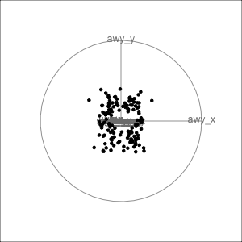

```{r, include = FALSE}
current_file <- knitr::current_input()
basename <- gsub(".Rmd$", "", current_file)
```
```{r, include = FALSE}
knitr::opts_chunk$set(
  fig.path = sprintf("images/%s/", basename),
  fig.width = 6,
  fig.height = 4,
  fig.align = "center",
  out.width = "100%",
  fig.retina = 3,
  echo = FALSE,
  warning = FALSE,
  message = FALSE,
  cache = FALSE
)
```

```{r}
library(tidyverse)
# remotes::install_github("ggobi/GGally")
library(GGally)
library(gt)
library(tourr)
library(mvtnorm)
library(forcats)
library(gridExtra)
library(plotly)
# remotes::install_github("allisonhorst/palmerpenguins")
library(palmerpenguins)
# remotes::install_github("ropenscilabs/ochRe")
library(ochRe)
library(datasauRus)
```

```{r titleslide, child="assets/titleslide.Rmd"}
```

---
class: transition

# This lecture

linked brushing between plots<br>
parallel rather than orthogonal axes<br>
tours (rotations) through high-dimensions

---
# .orange[Case study] .bg-orange.circle[4] Penguins

.panelset[
.panel[.panel-name[🖼️]

.flex[
.w-50[
Size measurements for adult foraging penguins near Palmer Station, Antarctica

- species: a factor denoting penguin species (Adélie, Chinstrap and Gentoo)
- bill_length_mm: a number denoting bill length (millimeters)
- bill_depth_mm: a number denoting bill depth (millimeters)
- flipper_length_mm: an integer denoting flipper length (millimeters)
- body_mass_g:an integer denoting body mass (grams)
]
.w-50[
```{r penguinsscat, fig.height=8, fig.width=8, out.width="80%"}
library(dplyr)
library(palmerpenguins)
penguins <- penguins %>% filter(!is.na(bill_length_mm)) %>%
rename(bl = bill_length_mm,
       bd = bill_depth_mm,
       fl = flipper_length_mm,
       bm = body_mass_g)

ggscatmat(penguins, columns=3:6, 
          col="species", alpha=0.5) + 
  scale_colour_ochre("", palette="nolan_ned") + 
  theme(aspect.ratio=1,
  legend.position="bottom")
```
]]
]
.panel[.panel-name[️R]

```{r ref.label="penguinsscat", eval=FALSE, echo=TRUE}
```

]
]
---
# Linking between plots

.flex[
.w-60[
```{r flealink, fig.width=8, fig.height=8, out.width="100%"}
highlight_key(penguins) %>%
  GGally::ggpairs(columns = 3:6) %>%
  ggplotly() %>%
  highlight("plotly_selected")
```
]

.w-40[
If you have interactive plots you can investigate whether

-  an outlier in one or two variables is one of the extremes in other variables $\longrightarrow$ then it is a multivariate outlier
- clusters of observations in one plot are concentrated in a cluster in other variables $\longrightarrow$ the data is multimodal in multivariate space, and there are likely sub-populations.
]
]
</div>
---

<center>
`r anicon::faa("wrench", size=3, animate="wrench", speed="slow", colour="#D93F00", anitype="hover")` Your turn, .monash-blue[cut and paste the code] into your R console, and `r anicon::nia("select", size=2, animate="ring", speed="slow", colour="#D93F00", anitype="hover")` regions of the resulting plot to examine where these points lie in other plots. 
</center>

<br>
<br>

.font_medium[
```{r eval=FALSE, echo=TRUE}
# Load the penguins data with code from previous slide
library(tidyverse) 
library(tourr)
library(plotly)
highlight_key(penguins) %>%
  GGally::ggpairs(aes(color = species), 
                  columns = 3:6) %>%
  ggplotly() %>%
  highlight("plotly_selected")
```
]

`r countdown::countdown(5, class="clock")`

---
class: transition middle
# History

---
background-image: \url(https://senate.universityofcalifornia.edu/_files/images/in-memoriam/Newton-Carol.jpg)
background-size: 20%
background-position: 95% 5%


.monash-purple2[First linked brushing across a set of scatterplots done by Carol Newton (1978) "Graphics from Alpha to Omega in Data Analysis" in Graphical Representation of Multivariate Data.]

---

<center>
<iframe width="896" height="504" src="https://www.youtube.com/embed/At-tPS-mFsE" frameborder="0" allow="accelerometer; autoplay; encrypted-media; gyroscope; picture-in-picture" allowfullscreen></iframe>
</center>

Brushing on a scatterplot matrix, Rick Becker (Becker and Cleveland, 1987 Brushing Scatterplots, Technometrics)
---
class: transition

# Parallel coordinate plots

Another way to display multivariate display

---
You can think about parallel coordinate plots like time series plots. Each variable is treated as a parallel axis. Observations are drawn as a line across the axes.

```{r housepcp, fig.width=12, fig.height=6, out.width="100%"}
# load the `txhousing` dataset
data(txhousing, package = "ggplot2")

# declare `city` as the SQL 'query by' column
tx <- highlight_key(txhousing, ~city)

# initiate a plotly object
base <- plot_ly(tx, color = I("black")) %>% 
  group_by(city)

# create a time series of median house price
base %>%
  group_by(city) %>%
  add_lines(x = ~date, y = ~median)
```

Median house price by date for a number of cities in Texas.  

---

.panelset[
.panel[.panel-name[learn]

What can you learn?

- lines that are parallel indicate positive linear association, possibly across many variables
- lines that cross indicate negative linear association
- lines that go up and down differently from any other lines indicate multivariate outliers
- lines that go up and down together, but differently from other lines indicate multivariate clustering

> You need to have an .monash-blue2[interactive] parallel coordinate plot for them to be effective for exploring data


]
.panel[.panel-name[️R]

```{r ref.label="housepcp", echo=TRUE, eval=FALSE}
```
]

]
---

<center>
`r anicon::faa("wrench", size=3, animate="wrench", speed="slow", colour="#D93F00", anitype="hover")` Your turn, .monash-blue[cut and paste the code] into your R console, and `r anicon::nia("click", size=2, animate="ring", speed="slow", colour="#D93F00", anitype="hover")` in the resulting plot to examine the line for an observation. 
</center>

.s500[

```{r eval=FALSE, echo=TRUE}
# Using the same penguins data subset as earlier in the slides
library(shiny)
library(plotly)
library(tidyverse)
ui <- fluidPage(
  plotlyOutput("parcoords"),
  verbatimTextOutput("data"))

server <- function(input, output, session) {
  penguins_numeric <- penguins[,3:6] %>%
    na.omit()
  
  output$parcoords <- renderPlotly({
    dims <- Map(function(x, y) {
      list(values = x, range = range(x), label = y)
    }, penguins_numeric, names(penguins_numeric), USE.NAMES = FALSE)
    plot_ly(type = 'parcoords', dimensions = dims, 
            source = "pcoords") %>% 
      layout(margin = list(r = 30)) %>%
      event_register("plotly_restyle")
  })
  
  # maintain a collection of selection ranges
  # since each parcoord dimension is allowed to have multiple 
  # selected ranges, this reactive values data structure is 
  # allowed 
  # list(
  #  var1 = list(c(min1, max1), c(min2, max2), ...),
  #  var2 = list(c(min1, max1)),
  #  ...
  # )
  ranges <- reactiveValues()
  observeEvent(event_data("plotly_restyle", source = "pcoords"),
  {
    d <- event_data("plotly_restyle", source = "pcoords")
    # what is the relevant dimension (i.e. variable)?
    dimension <- as.numeric(stringr::str_extract(names(d[[1]]),
                                                 "[0-9]+"))
    # If the restyle isn't related to a dimension, exit early.
    if (!length(dimension)) return()
    # careful of the indexing in JS (0) versus R (1)!
    dimension_name <- names(penguins_numeric)[[dimension + 1]]
    # a given dimension can have multiple selected ranges
    # these will come in as 3D arrays, but a list of vectors 
    # is nicer to work with
    info <- d[[1]][[1]]
    
    ranges[[dimension_name]] <- if (length(dim(info)) == 3) {
      lapply(seq_len(dim(info)[2]), function(i) info[,i,])
    } else {
      list(as.numeric(info))
    }
  })
  
  ## filter to the rows that match the selection ranges
  penguins_selected <- reactive({
    keep <- TRUE
    for (i in names(ranges)) {
      range_ <- ranges[[i]]
      keep_var <- FALSE
      for (j in seq_along(range_)) {
        rng <- range_[[j]]
        keep_var <- keep_var | dplyr::between(penguins[[i]], 
                                              min(rng), max(rng))
      }
      keep <- keep & keep_var
    }
    penguins[keep, ]
  })
  
  output$data <- renderPrint({
    tibble::as_tibble(penguins_selected())
  })
}

shinyApp(ui, server)
```

]

`r countdown::countdown(5, class="clock")`

---
class: transition

# Dynamic graphics: tours

Remember Tukey's PRIM-9?? This is the evolution of that, and allows us to look at all possible linear combination of variables.

---
# Touring between pairs of variables

```{r eval=FALSE}
lt <- save_history(as.matrix(datasaurus_dozen_wide), 
                   max = 13)
for (i in 1:13) {
  lt[,,i] <- 0
  lt[i*2-1,1,i] <- 1
  lt[i*2,2,i] <- 1
}
animate_xy(as.matrix(datasaurus_dozen_wide),
           planned_tour(lt), fps=10, 
           axes="bottomleft")
render_gif(as.matrix(datasaurus_dozen_wide),
           planned_tour(lt),  
           display_xy(), 
           "datasaurustour.gif", frames=100, width=300, height=300)
# animate_xy(as.matrix(datasaurus_dozen_wide), little_tour(), fps=10)
```
.flex[
.w-50[
Dinosaurus dozen in wide form as multivariate data.

Rotate one pair of variables into the other - special type of interpolation/animation called a *little tour*

<center>  </center>
]
.w-50[
 
]
]

---
# Tours of multivariate data

We look at .monash-orange2[combinations of variables], as well as the individual variables. The grand tour does this in an elegant way so that there's a chance of seeing all possible combinations of the variables, and it glues these together so that there is a smooth change from one to another. With an important note: that always when scatterplots (or higher dimensional combinations are shown) that the axes are always orthogonal.

Using combinations of variables, it can be possible to see .monash-blue2[separations between groups, outliers, linear and non-linear dependencies] that were not visible in the single variable plots.

<br><br><center>
.monash-orange2[3D plots aren't enough. You need tours to find unusual multiple variable relationsips.]
</center>

---
# Our first grand tour

.flex[
.w-50[

Here's the code

```{r runthis6, echo=TRUE, eval=FALSE}
clrs <- ochre_pal(
  palette="nolan_ned")(3)
col <- clrs[
  as.numeric(
    penguins$species)]
animate_xy(penguins[,3:6], #<<
           col=col,        #<<
           axes="off")     #<<
```
]

.w-50[

```{r eval=FALSE}
set.seed(20200622)
clrs <- ochre_pal(palette="nolan_ned")(3)
col <- clrs[as.numeric(penguins$species)]
render_gif(penguins[,3:6], grand_tour(), 
           display_xy(col=col, axes="bottomleft"), 
           "penguins2d.gif", frames=100, width=300, height=300)
```
<center>
 
</center>
]
]

---
# .orange[Case study] .bg-orange.circle[4] Penguins

What do you learn about this data?

- clusters `r emo::ji("white_check_mark")`
--

- outliers `r emo::ji("white_check_mark")`
--

- linear dependence `r emo::ji("white_check_mark")`
--

- elliptical clusters with slightly different shapes `r emo::ji("white_check_mark")`
--

- separated elliptical clusters with slightly different shapes `r emo::ji("white_check_mark")`
--

---
# What is a tour?

.flex[
.w-50[

A grand tour is by definition a movie of low-dimensional projections constructed in such a way that it comes arbitrarily close to showing all possible low-dimensional projections; in other words, a grand tour is a space-filling curve in the manifold of low-dimensional projections of high-dimensional data spaces.
]

.w-50[
${\mathbf x}_i \in R^p$, $i^{th}$ data vector

$F$ is a $p\times d$ orthonormal matrix, $F'F=I_d$, where $d$ is the projection dimension.

The projection of ${\mathbf x_i}$ onto $F$ is ${\mathbf y}_i=F'{\mathbf x}_i$.

Tour is indexed by time, $F(t)$, where $t\in [a, z]$. Starting and target frame denoted as $F_a = F(a), F_z=F(t)$.

The animation of the projected data is given by a path ${\mathbf y}_i(t)=F'(t){\mathbf x}_i$.

]
]
---

# Geodesic interpolation between planes

.flex[
.w-50[
Tour is indexed by time, $F(t)$, where $t\in [a, z]$. Starting and target frame denoted as $F_a = F(a), F_z=F(t)$.

The animation of the projected data is given by a path ${\mathbf y}_i(t)=F'(t){\mathbf x}_i$.

]
.w-50[


]
]

---
# Reading axes - interpretation

.flex[
.w-50[
<br>
<br>
Length and direction of axes relative to the  pattern of interest
]
.w-50[
 
]
]

---
# .orange[Case study] .bg-orange.circle[4] Penguins

.flex[
.w-50[
```{r runthis13, fig.width=4, fig.height=4, out.width="90%"}
ggplot(penguins, 
   aes(x=fl, 
       y=bd,
       colour=species,
       shape=species)) +
  geom_point(alpha=0.7, 
             size=2) +
  scale_colour_ochre(
    palette="nolan_ned") + 
  theme(aspect.ratio=1,
  legend.position="bottom")
```

Gentoo from others in contrast of fl, bd
]
.w-50[

```{r runthis14, fig.width=4, fig.height=4, out.width="90%"}
ggplot(penguins, 
   aes(x=bl, 
       y=bm,
       colour=species,
       shape=species)) +
  geom_point(alpha=0.7, 
             size=2) +
  scale_colour_ochre(
    palette="nolan_ned") + 
  theme(aspect.ratio=1,
  legend.position="bottom")
```

Chinstrap from others in contrast of bl, bm

]
]

---
class: inverse middle left

There may be multiple and different combinations of variables that reveal similar structure. `r emo::ji("frowning_face")` 

The tour can help to discover these, too. `r emo::ji("joy")` 

---
# Other tour types

- .orange[guided]: follows the optimisation path for a projection pursuit index.
- .orange[little]: interpolates between all variables. 
- .orange[local]: rocks back and forth from a given projection, so shows all possible projections within a radius.
- .orange[dependence]: two independent 1D tours
- .orange[frozen]: fixes some variable coefficients, others vary freely. 
- .orange[manual]: control coefficient of one variable, to examine the sensitivity of structure this variable. (In the .orange[spinifex] package)
- .orange[slice]: use a section instead of a projection.

---
# Guided tour 

.flex[
.w-50[
New target bases are chosen using a projection pursuit index function

$$\mathop{\text{maximize}}_{F} g(F'x) ~~~\text{ subject to }
F \text{ being orthonormal}$$
]
.w-50[

- `holes`: This is an inverse Gaussian filter, which is optimised when there is not much data in the center of the projection, i.e. a "hole" or donut shape in 2D.
- `central mass`: The opposite of holes, high density in the centre of the projection, and often "outliers" on the edges. 
- `LDA`/`PDA`: An index based on the linear discriminant dimension reduction (and penalised), optimised by projections where the named classes are most separated.
]
]


---
# .orange[Case study] .bg-orange.circle[4] Penguins

.panelset[
.panel[.panel-name[🖼️]
.flex[
.w-50[
Grand

<center>

</center>

Might accidentally see best separation

]

.w-50[

Guided, using LDA index

<center>

</center>

Moves to the best separation

]

]
]
.panel[.panel-name[R]
```{r eval=FALSE, echo=TRUE}
clrs <- ochre_pal(
  palette="nolan_ned")(3)
col <- clrs[
  as.numeric(
    penguins$species)]
set.seed(20200622)
render_gif(penguins[,3:6], guided_tour(lda_pp(penguins$species)), 
           display_xy(col=col, axes="bottomleft"), 
           "penguins2d_guided.gif", 
           frames=17, width=300, height=300, loop=FALSE)
```

```{r runthis15, eval=FALSE, echo=TRUE}
animate_xy(penguins[,3:6], grand_tour(),
           axes = "bottomleft", col=col)
animate_xy(penguins[,3:6], guided_tour(lda_pp(penguins$species)),
           axes = "bottomleft", col=col)
best_proj <- matrix(c(0.940, 0.058, -0.253, 0.767, 
                      -0.083, -0.393, -0.211, -0.504), ncol=2,
                    byrow=TRUE)
```
]
]

---
# Manual tour

<br>
<br>
Control the coefficient of one variable, reduce it to zero, then increase it to 1, maintaining orthonormality

---
# .orange[Case study] .bg-orange.circle[4] Penguins

.panelset[
.panel[.panel-name[🖼️]
.flex[
.w-50[
<br>
<br>

- start from best projection, given by projection pursuit
- `bl` contribution controlled
- if `bl` is removed from projection, Adelie and chinstrap are mixed
- `bl` is important for Adelie

]


.w-50[


]
]
]
.panel[.panel-name[R]
<br>

```{r eval=FALSE, echo=TRUE}
mtour1 <- manual_tour(basis = best_proj, manip_var = 3)
render_manual(penguins_s[,3:6], mtour1, 
              "penguins_manual_fl.gif", col=col, 
              dir = "images/manual1/")
mtour2 <- manual_tour(basis = best_proj, manip_var = 1)
render_manual(penguins_s[,3:6], mtour2, 
              "penguins_manual_bl.gif", col=col, 
              dir = "images/manual2")
```
]
]

---
# .orange[Case study] .bg-orange.circle[4] Penguins

.flex[
.w-50[

<br>
<br>
- start from best projection, given by projection pursuit
- `fl` contribution controlled
- cluster less separated when fl is fully contributing
- `fl` is important, in small amounts, for Gentoo

]


.w-50[


]
]
---
# Resources

- Wickham et al (2011). tourr: An R Package for Exploring
  Multivariate Data with Projections.
  http://www.jstatsoft.org/v40/i02/.
- Cook and Laa (2023) Interactively exploring high-dimensional data and models in R, https://dicook.github.io/mulgar_book/
- Sievert (2019) Interactive web-based data visualization with R, plotly, and shiny,  https://plotly-r.com
- Horst et al (2020 https://allisonhorst.github.io/palmerpenguins/
- Gorman KB, Williams TD, Fraser WR (2014) [Ecological Sexual Dimorphism and Environmental Variability within a Community of Antarctic Penguins (Genus Pygoscelis).](https://journals.plos.org/plosone/article?id=10.1371/journal.pone.0090081) PLoS ONE 9(3): e90081. doi:10.1371/journal.pone.0090081


---

```{r endslide, child="assets/endslide.Rmd"}
```
