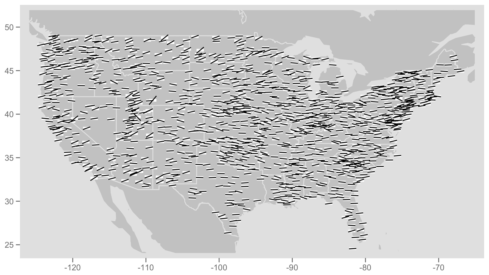
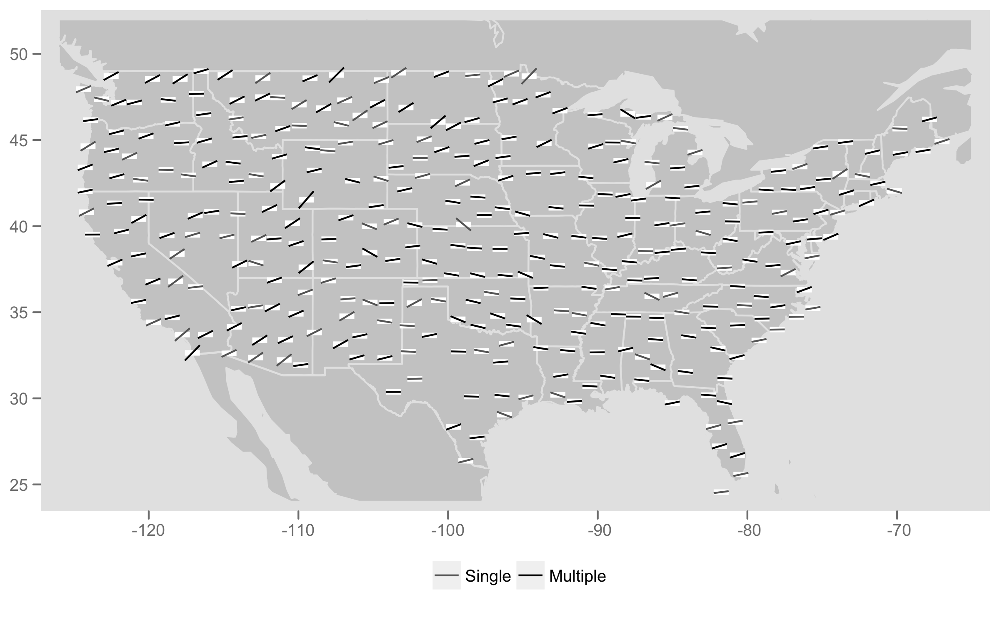
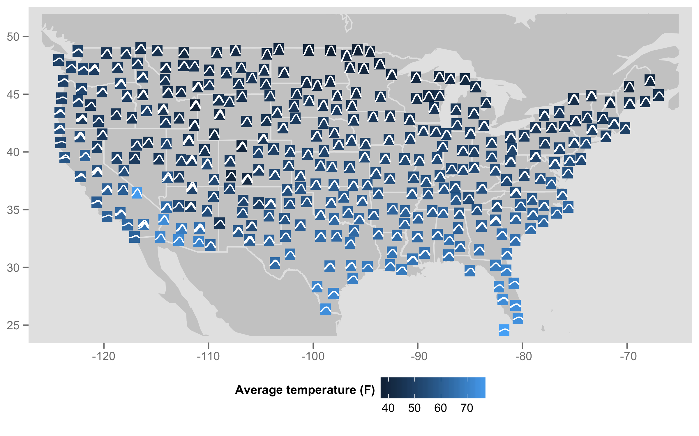

```{r, include = FALSE}
current_file <- knitr::current_input()
basename <- gsub(".Rmd$", "", current_file)
```
```{r setup, include = FALSE}
options(width = 200)
knitr::opts_chunk$set(
  fig.path = sprintf("images/%s/", basename),
  fig.width = 6,
  fig.height = 6,
  fig.align = "center",
  dev.args = list(bg = 'transparent'),
  out.width = "100%",
  fig.retina = 3,
  echo = FALSE,
  warning = FALSE,
  message = FALSE,
  cache = FALSE,
  cache.path = "cache/week10/"
)
```


```{r libraries}
library(tidyverse)
library(GGally)
library(ggthemes)
library(gt)
library(ggExtra)
library(cartogram)
library(broom)
library(patchwork)
library(maps)
library(DT)
library(tsibble)
library(cubble)
```

```{r settheme}
theme_set(ggthemes::theme_gdocs(base_size = 14) +
            theme(plot.background = element_rect(fill = 'transparent', colour = NA), axis.line.y = element_line(color = "black", linetype = "solid"),
                  plot.title.position = "plot",
                  plot.title = element_text(size = 18),
                  panel.background  = element_rect(fill = 'transparent', colour = NA),
                  legend.background = element_rect(fill = 'transparent', colour = NA),
                  legend.key        = element_rect(fill = 'transparent', colour = NA)
                  ) )
```

```{r titleslide, child="assets/titleslide.Rmd"}
```

```{css, echo = FALSE}
.gray80 {
  color: #505050!important;
  font-weight: 300;
}
.bg-gray80 {
  background-color: #DCDCDC!important;
}
```

---
background-image: \url(images/week10A/southwestrocks.jpg)
background-position: 20% 80%
class: middle center

# .monash-white[You show me continents, I see the islands,]

# .monash-white[You count the centuries, I blink my eyes]

<br>
<br>
<br>
<br>
<br>
<br>

.monash-white[[Björk](https://www.bjork.com)]

---

# Outline

### .monash-orange2[First part]

- Breaking up data by time, and by space
- Maps of space over time
- Exploring time over space with glyph maps

<br>

### .monash-orange2[Second part]

- Capturing spatial trend
- Bending the choropleth map 
- A flash back to the 1970s: Tukey's median polish 


---
# .orange[Case study] .bg-orange.circle[1] Temperature change in Americas

.panelset[
.panel[.panel-name[data]
6 years of monthly measurements of a 24x24 spatial grid from Central America collated by Paul Murrell, U. Auckland.

.s400[
```{r nasa}
data(nasa)
nasa %>% slice_head(n=20) %>% gt()
```
]
]
.panel[.panel-name[R]

```{r ref.label="nasa", echo=TRUE, eval=FALSE}
```

]
]

---
# Spatiotemporal object in R: cubble

.flex[
.w-45[
.s300.f5[
```{r echo=TRUE}
nasa_cb <- as_cubble(as_tibble(nasa), 
                     key=id, 
                     index=time, 
                     coords=c(long, lat))
nasa_cb
```
]


]
.w-5[
.white[space]
]
.w-45[
.s300.f5[
```{r echo=TRUE}
nasa_cb %>% face_temporal()
```
]

<br><br>
Like a `tibble` but can .monash-blue2[pivot back and forth between spatial and temporal] components.

]
]

---
# .orange[Case study] .bg-orange.circle[1] Temperature change in Americas

.flex[
.w-50[
.panelset[
.panel[.panel-name[plot]
```{r spatial, fig.width=6, fig.height=6, out.width="90%"}
nasa_cb %>% 
  ggplot() + 
  geom_point(aes(x=long, y=lat)) +
  geom_point(data=filter(nasa_cb, 
       x==5, y==20),
       aes(x=long, y=lat),
       colour="orange", size=4) +
  geom_point(data=filter(nasa_cb, 
       x==20, y==2),
       aes(x=long, y=lat),
       colour="turquoise", size=4)
```
]
.panel[.panel-name[R]
.f5[
```{r ref.label="spatial", echo=TRUE, eval=FALSE}
```
]
]
]

]

.w-50[
.panelset[
.panel[.panel-name[plot]

```{r temporal, fig.width=6, fig.height=2, out.width="90%"}
nasa_cb_f <- nasa_cb %>% 
  face_temporal() 
ggplot(nasa_cb_f) + 
  geom_line(aes(x=date, 
                 y=surftemp, 
                 group=id), alpha=0.2) +
  geom_line(data=filter(nasa_cb_f , 
       id=="5-20"),
       aes(x=date, 
                 y=surftemp, 
                 group=id),
       colour="orange", linewidth=2) +
  geom_line(data=filter(nasa_cb_f , 
       id=="20-2"),
       aes(x=date, 
                 y=surftemp, 
                 group=id),
       colour="turquoise", linewidth=2)
```
]
.panel[.panel-name[R]
.f5[
```{r ref.label="temporal", echo=TRUE, eval=FALSE}
```
]
]
]
]
]
---
# Pre-processing of time and space

<br>
<br>

<center>
.info-box[Think of .monash-orange2[time] and .monash-orange2[space] as .monash-orange2[ordered categorical variables].] 
</center>

<br>
<br>

- Time may need to be converted to categories. 
- Spatial variable *might* need to be discretised, or gridded.

<br>
<br>
For the nasa data, this is already done. Time is an integer from 1 to 72 (6 years of 12 months), as well as a date, and month and year. Space is a 24x24 grid of longitude and latitude, and also provided as an integer 1 to 24 in both x and y. 

---
# Slice in time and create a spatial map

.panelset[
.panel[.panel-name[plot]

```{r raster, fig.width=6, fig.height=6, out.width="40%"}
# Get the map
sth_america <- map_data("world") %>%
  filter(between(long, -115, -53), between(lat, -20.5, 41))

nasa_cb %>% face_temporal() %>%
  filter(month == 1, year == 1995) %>% 
  select(id, time, surftemp) %>%
  unfold(long, lat) %>%
  ggplot() + 
  geom_tile(aes(x=long, y=lat, fill=surftemp)) +
  geom_path(data=sth_america, 
            aes(x=long, y=lat, group=group), 
            colour="white", linewidth=1) +
  scale_fill_viridis_c("", option = "magma") +
  theme_map() +
  theme(legend.position = "bottom") +
  ggtitle("January 1995")
```
]
.panel[.panel-name[learn]

<br> <br>

In January 2005, temperatures are

- cool over land in the north 
- cool over the Andes in south america
- warm on the equator, and along the coastline

There are 12*6=72 maps to make!!

]
.panel[.panel-name[R]
.f5[
```{r ref.label="raster", echo=TRUE, eval=FALSE}
```
]
]
]

---
# Explore spatial trend over time

.panelset[
.panel[.panel-name[plot]
```{r space_time, fig.width=10, fig.height=6, out.width="75%"}
nasa_cb %>% face_temporal() %>%
  select(id, time, month, year, surftemp) %>%
  unfold(long, lat) %>%
  ggplot() + 
  geom_tile(aes(x=long, y=lat, fill=surftemp)) +
  facet_grid(year~month) +
  scale_fill_viridis_c("", option = "magma") +
  theme_map() +
  theme(legend.position = "bottom") 
```
]
.panel[.panel-name[learn]

<br><br>

- Exploring spatial trend over time is obtained by .monash-blue2[faceting the maps by time].

- Can you see El Nino in 1997? Can you see the summer vs winter in the different hemispheres?

]
.panel[.panel-name[R]
.f5[
```{r ref.label="space_time", echo=TRUE, eval=FALSE}
```
]
]

]
---
# glyphmap: time across space

.flex[
.w-50[
.panelset[
.panel[.panel-name[plot]

```{r time_space, fig.width=6, fig.height=6, out.width="90%"}
nasa_cb %>% face_temporal() %>%
  select(id, time, month, year, surftemp) %>%
  unfold(long, lat) %>%
  ggplot() +
    geom_polygon(data=sth_america, 
            aes(x=long, y=lat, group=group), 
            fill="#014221", alpha=0.2, colour="#ffffff") +
    cubble::geom_glyph_box(data=nasa, 
                           aes(x_major = long, 
                               x_minor = day,
                               y_major = lat, 
                               y_minor = surftemp), fill=NA) +
    cubble::geom_glyph(data=nasa, 
                       aes(x_major = long, 
                           x_minor = day,
                           y_major = lat, 
                           y_minor = surftemp)) +
    theme_map() 

```
]
.panel[.panel-name[learn]

<br><br>
.monash-blue2[Global scale]: temperature min/max across all spatial locations and time

- Different seasonality at different locations, particularly more north and more south. 

]
.panel[.panel-name[R]

.f5[
```{r ref.label="time_space", echo=TRUE, eval=FALSE}
```
]
]
]

]
.w-50[
.panelset[
.panel[.panel-name[plot]

```{r time_space2, fig.width=6, fig.height=6, out.width="90%"}
nasa_cb %>% face_temporal() %>%
  select(id, time, month, year, surftemp) %>%
  unfold(long, lat) %>%
  ggplot() +
    geom_polygon(data=sth_america, 
            aes(x=long, y=lat, group=group), 
            fill="#014221", alpha=0.2, colour="#ffffff") +
    cubble::geom_glyph_box(data=nasa, 
                           aes(x_major = long, 
                               x_minor = day,
                               y_major = lat, 
                               y_minor = surftemp), fill=NA) +
    cubble::geom_glyph(data=nasa, 
                       aes(x_major = long, 
                           x_minor = day,
                           y_major = lat, 
                           y_minor = surftemp), 
                       global_rescale = FALSE) +
    theme_map() 
```

]
.panel[.panel-name[learn]

<br><br>
.monash-blue2[Local scale]: min/max for each spatial location

- El Nino year in equatorial region may be visible.
- Notice also odd patterns on the west (Andes mountains) of South America.

]
.panel[.panel-name[R]

.f5[
```{r ref.label="time_space2", echo=TRUE, eval=FALSE}
```
]
]
]

]
]

---
# glyphmap: time across space

.flex[
.w-50[
.panelset[
.panel[.panel-name[plot]

```{r ref.label="time_space", fig.width=6, fig.height=6, out.width="90%", echo=FALSE, eval=TRUE}
```

]
.panel[.panel-name[learn]

<br><br>
.monash-blue2[Global scale]: temperature min/max across all spatial locations and time

- Different seasonality at different locations, particularly more north and more south. 


]
.panel[.panel-name[R]

.f5[
```{r ref.label="time_space", echo=TRUE, eval=FALSE}
```
]
]
]

]
.w-50[
.panelset[
.panel[.panel-name[plot]

```{r time_space3, fig.width=6, fig.height=6, out.width="90%"}
nasa_cb %>% face_temporal() %>%
  select(id, time, month, year, surftemp) %>%
  unfold(long, lat) %>%
  ggplot() +
    geom_polygon(data=sth_america, 
            aes(x=long, y=lat, group=group), 
            fill="#014221", alpha=0.2, colour="#ffffff") +
    cubble::geom_glyph_box(data=nasa, 
                           aes(x_major = long, 
                               x_minor = day,
                               y_major = lat, 
                               y_minor = surftemp), 
                           fill=NA) +
    cubble::geom_glyph(data=nasa, 
                       aes(x_major = long, 
                           x_minor = day,
                           y_major = lat, 
                           y_minor = surftemp), 
                       polar=TRUE) +
    theme_map() 
```
]
.panel[.panel-name[learn]

<br><br>
.monash-blue2[Polar coordinates]

- Seasonal pattern may be more visible.

]
.panel[.panel-name[R]

.f5[
```{r ref.label="time_space3", echo=TRUE, eval=FALSE}
```
]
]
]

]
]
---
# .orange[Case study] .bg-orange.circle[1] Temperature change in Americas

## Exploring El Nino

Slice space, and show the time series, and the pattern is very clear: The seasonal water temperature decrease doesn't happen in 1997, and water in this area stays unseasonably warm.

```{r over_time, fig.width=10, fig.height=4, out.width="100%"}
nasa_cb_elnino <- nasa_cb %>%
  filter(between(lat, -10, 5), 
        long < (-80))
nasa_cb_elnino_f <- nasa_cb_elnino %>%
  face_temporal()
p1 <- ggplot() + 
        geom_polygon(data = sth_america, 
                     aes(x=long, y=lat, group=group), 
                     fill = "grey90", colour = "white") + 
        geom_point(data = nasa_cb, 
                   aes(x=long, y=lat), size = 1) +
        geom_point(data = nasa_cb_elnino, 
                   aes(x=long, y=lat), 
                   colour = "red") +
          coord_map() +
          theme_map()
p2 <- ggplot() + 
          geom_line(data=nasa_cb_f, 
                    aes(x=date, 
                        y=surftemp, 
                        group=id), alpha=0.2) +
          geom_line(data = nasa_cb_elnino_f, 
                    aes(x=date, 
                        y=surftemp, 
                        group=id), 
                    colour = "red") +
          xlab("") + ylab("Surface temperature") +
          theme_bw() + theme(aspect.ratio = 0.5)
p1 + p2 + plot_layout(widths = c(1,2))
```

---

`r anicon::faa("wrench", animate="wrench", speed="slow", colour="#D93F00", anitype="hover")` Your turn using tsibbletalk

.s500.f5[
```{r eval=FALSE, echo=TRUE}
library(tsibble)
library(tsibbletalk)
library(lubridate)
nasa_shared <- nasa %>% 
  mutate(date = ymd(date)) %>%
  select(long, lat, date, surftemp, id) %>%
  as_tsibble(index=date, key=id) %>%
  as_shared_tsibble()
p1 <- nasa_shared %>%
  ggplot(aes(x = long, y = lat)) +
  geom_point(aes(group = id)) 
p2 <- nasa_shared %>%
  ggplot(aes(x = date, y = surftemp)) +
  geom_line(aes(group = id), alpha = 0.5) 
library(plotly)
subplot(
    ggplotly(p1, tooltip = "Region", width = 100),
    ggplotly(p2, tooltip = "Region", width = 900),
    nrows = 1, widths=c(0.4, 0.6)) %>%
  highlight(dynamic = TRUE)
```
]

---
background-image: url(images/week10A/space-time.jpg)
background-size: 60%
background-position: 95% 35%

.w-35[
# Thinking about spatiotemporal data

Space is a continuous variable, and in theory it fills out a square (or polygon). 

Often, though it is .monash-blue2[measured irregularly]. Sensor stations are sporadically placed. 

This affects making a density display of the measured variable. Strategy is to .monash-blue2[plot it at the resolution given], before trying to make a regular grid. 

]

---
background-image: url(images/week10A/usa-lin-legend.jpg)
background-size: 20%
background-position: 95% 80%

# Glyphmaps of irregular space data

Linear model fit to temperature recorded at historical weather stations across the USA ([USHCN](https://www.ncei.noaa.gov/products/land-based-station/us-historical-climatology-network))



---
background-image: url(images/week10A/usa-lin-collapse-legend.jpg)
background-size: 20%
background-position: 95% 80%

# Regularising

Measurements from nearby stations have been merged. Note, some [areas of the USA have been cooling](https://www.epa.gov/climate-indicators/climate-change-indicators-us-and-global-temperature). This is interesting!



---
background-image: url(images/week10A/usa-season-legend.jpg)
background-size: 20%
background-position: 95% 80%

# Seasonality

De-construct time into a seasonal component, and representing this on the map is reasonable also. 



---


# Resources and Acknowledgement

- [cubble](https://huizezhang-sherry.github.io/cubble): A Vector Spatio-Temporal Data Structure for Data Analysis
- [sf](https://r-spatial.github.io/sf/): Simple Features for R
- [Healy (2018) Data Visualization](https://socviz.co/maps.html#maps)
- [Perpinan Lamigueiro (2018) Displaying time series, spatial and space-time data with R](https://oscarperpinan.github.io/bookvis/)
- Wikle, Zammit-Mangion, Cressie (2018) [Spatio-Temporal Statistics with R](https://spacetimewithr.org)
- [Moraga, Paula. (2019). Geospatial Health Data](https://www.paulamoraga.com/book-geospatial/index.html)
- [Visualising spatial data using R](https://rspatialdata.github.io)

---

```{r endslide, child="assets/endslide.Rmd"}
```
