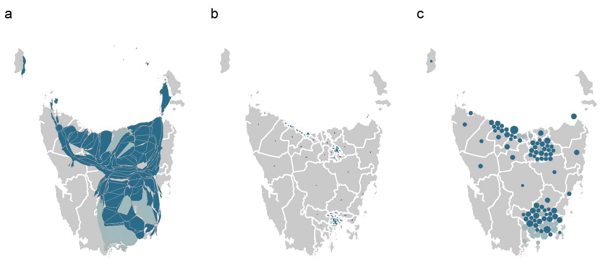

```{r, include = FALSE}
current_file <- knitr::current_input()
basename <- gsub(".Rmd$", "", current_file)
```
```{r setup, include = FALSE}
options(width = 200)
knitr::opts_chunk$set(
  fig.path = sprintf("images/%s/", basename),
  fig.width = 6,
  fig.height = 6,
  fig.align = "center",
  dev.args = list(bg = 'transparent'),
  out.width = "100%",
  fig.retina = 3,
  echo = FALSE,
  warning = FALSE,
  message = FALSE,
  cache = FALSE,
  cache.path = "cache/week10/"
)
```


```{r libraries}
library(tidyverse)
library(GGally)
library(ggthemes)
library(gt)
library(ggExtra)
library(cartogram)
library(maptools)
library(sf)
library(broom)
library(patchwork)
library(maps)
library(DT)
library(viridis)
library(cubble)
library(fabricerin)
```

```{r settheme}
theme_set(ggthemes::theme_gdocs(base_size = 14) +
            theme(plot.background = element_rect(fill = 'transparent', colour = NA), axis.line.y = element_line(color = "black", linetype = "solid"),
                  plot.title.position = "plot",
                  plot.title = element_text(size = 18),
                  panel.background  = element_rect(fill = 'transparent', colour = NA),
                  legend.background = element_rect(fill = 'transparent', colour = NA),
                  legend.key        = element_rect(fill = 'transparent', colour = NA)
                  ) )
```

```{r titleslide, child="assets/titleslide.Rmd"}
```

```{css, echo = FALSE}
.gray80 {
  color: #505050!important;
  font-weight: 300;
}
.bg-gray80 {
  background-color: #DCDCDC!important;
}
```


---
class: transition

# Spatial data

---
# Spatial components

.flex[
.w-50[
.info-box[Spatial data can be considered to have both .monash-orange2[trend] and .monash-orange2[error].]

.monash-blue2[Trend] purely on spatial coordinates: expect .monash-blue2[north-south] trend in latitude (position of sun during the year), and possibly .monash-blue2[east-west] in longitude (earth rotation). .monash-orange2[Trend might be more complicated], localised ecosystems, or related to other factors like elevation.

After trend is removed, the .monash-blue2[residuals (error)] are likely to have .monash-blue2[spatial dependence: closer sites are likely to have similar values].  
]
.w-50[

```{r toy-spatial, out.width = "80%"}
set.seed(25)
library(aws)
x <- 1:24
y <- 1:24
xy <- expand.grid(x, y)
d <- tibble(x=xy$Var1, y=xy$Var2) %>%
  mutate(v = x+2*y) 
e = matrix(rnorm(nrow(d)), ncol=length(x))
es <- as.vector(kernsm(e, h=2)@yhat)
d <- d %>%
  mutate(e = 10*es) %>%
  mutate(ve = v+e)
obs <- ggplot(d, aes(x, y, fill = ve)) +
  geom_tile() +
  scale_fill_viridis("") +
  theme(aspect.ratio = 1) +
  ggtitle("Observed") +
  theme(legend.position = "bottom", 
        legend.direction = "horizontal")
trend <- ggplot(d, aes(x, y, fill = v)) +
  geom_tile() +
  scale_fill_viridis("", option = "magma") +
  theme(aspect.ratio = 1) +
  ggtitle("Trend") +
  theme(legend.position = "bottom", 
        legend.direction = "horizontal")
err <- ggplot(d, aes(x, y, fill = e)) +
  geom_tile() +
  scale_fill_distiller("", palette = "PRGn") +
  theme(aspect.ratio = 1) +
  ggtitle("Residual") +
  theme(legend.position = "bottom", 
        legend.direction = "horizontal")
long <- ggplot(d, aes(x, y=ve)) +
  geom_point() +
  geom_smooth(se=F) +
  ylab("Var 1") +
  theme(aspect.ratio = 1)
lat <- ggplot(d, aes(y, y=ve)) +
  geom_point() +
  ylab("Var 1") +
  geom_smooth(se=F) +
  theme(aspect.ratio = 1)
obs
```

]
]
---
# Check trend in longitude and latitude

```{r out.width = "80%", fig.width = 10, fig.height = 5}
long + lat
```

There is a trend in both directions, but it is stronger in the y (north-south) direction.

---
# Trend + error

```{r out.width = "85%", fig.width = 12, fig.height = 6}
obs + trend + err
```

Observed have trend + error. Note the apparent clustering in residuals is strong .monash-blue2[spatial dependence]. 

---
class: transition middle

## A flash back to the 1970s: Tukey's median polish

This is a useful data scratching technique, particularly for spatial data, to remove complicated trends.

---
# Median polish technique

.pull-left[
```{r}
fabric_drawing(cid = "twoway", 
               cwidth = 500, 
               cheight = 500, 
               cfill = "whitesmoke", 
               drawingWidth = 3, 
               gumSize = 10)
fabric_text_add(cid = "twoway", textId = "txt1",
                text = " 10  8  6  4  2 ",
                left = 10, top = 10, 
                fontFamily = "Courier", fontSize = 18)
fabric_text_add(cid = "twoway", textId = "txt2",
                text = "  8  6  4  2  4",
                left = 10, top = 40, 
                fontFamily = "Courier", fontSize = 18)
fabric_text_add(cid = "twoway", textId = "txt3",
                text = "  6  4  2  4  6",
                left = 10, top = 70, 
                fontFamily = "Courier", fontSize = 18)
fabric_text_add(cid = "twoway", textId = "txt3",
                text = "  4  2  4  6  8",
                left = 10, top = 100, 
                fontFamily = "Courier", fontSize = 18)
fabric_text_add(cid = "twoway", textId = "txt3",
                text = "  2  4  6  8  10",
                left = 10, top = 130, 
                fontFamily = "Courier", fontSize = 18)
```
]
.pull-right[
.font_medium[
1. Compute row medians, and the median of the row medians,  called **row overall effect**.
2. Subtract each element in a row by its row median.
3. Subtract the row overall effect from each row median.
4. Do the same columns. Add the column overall effect to row overall effect.
5. Repeat 1-4 until negligible change occur with row or column medians.
]
]

---
# Median polish technique

.pull-left[


]

.pull-right[

.s500[
```{r echo=TRUE}
# check calculations
x <- matrix(c(10,  8,  6,  4,  2,
              8,  6,  4,  2,  4,
              6,  4,  2,  4,  6,
              4,  2,  4,  6,  8,
              2,  4,  6,  8,  10), 
            nrow=5, byrow=T)
medpolish(x, maxiter = 1)
```
]
]

---
# Median polish technique

.pull-left[

.s500[
```{r echo=TRUE}
medpolish(x, maxiter = 5)
```
]

]

.pull-right[

Median polish is effectively fitting a model of this form:

*overall effect + row effect + column effect*

which can be written as:

$$y_{ij} = \mu + \alpha_i + \beta_j + \varepsilon_{ij}$$
<br>
<br>

Nice explanation by [Manny Gimond](https://mgimond.github.io/tukeyedar/articles/polish.html)

]

---

# .orange[Case study] .bg-orange.circle[2] Soils

.panelset[
.panel[.panel-name[plot]

```{r med_polish, fig.width=10, fig.height=4, out.width="80%", results="hide"}
baker <- read_csv(here::here("data/baker.csv"))
p1 <- ggplot(baker, aes(x=X, y=Y, fill=Corn97BU)) +
  geom_tile() + 
  scale_fill_viridis_c("") +
  theme_map() +
  theme(legend.position = "none") 
baker_mat <- baker %>%
  select(X, Y, Corn97BU) %>%
  pivot_wider(names_from = "Y", values_from = Corn97BU) 
baker_mat <- as.matrix(baker_mat)
rownames(baker_mat) <- baker_mat[,1]
baker_mat <- baker_mat[,-1]

baker_mp <- medpolish(baker_mat[,-1], na.rm=TRUE)
baker_mp$residuals <- cbind(as.numeric(rownames(baker_mp$residuals)), baker_mp$residuals)
colnames(baker_mp$residuals)[1] <- "X"
baker_mp_res <- baker_mp$residuals %>%
  as_tibble() %>% 
  pivot_longer(cols=`48`:`336`, names_to = "Y", 
               values_to = "Corn97BU") %>%
  mutate(Y = as.numeric(Y))
p2 <- ggplot(baker_mp_res, aes(x=X, y=Y, fill=Corn97BU)) +
  geom_tile() + 
  scale_fill_viridis_c("", na.value="white") +
  theme_map() +
  theme(legend.position = "none") 

col_marg <- bind_rows(col=as.numeric(names(baker_mp$col)), 
                      Corn97BU = as.numeric(baker_mp$col))
row_marg <- bind_rows(row=as.numeric(names(baker_mp$row)), 
                      Corn97BU = as.numeric(baker_mp$row))
p3 <- ggplot(col_marg, aes(x = col, y = Corn97BU)) +
        xlab("") + ylab("") +
        geom_col() + theme_map() +
        coord_flip()
p4 <- ggplot(row_marg, aes(x = row, y = Corn97BU)) +
        geom_col() + theme_map() +
        xlab("") + ylab("") 
 
design <- "
##11#
22334
22334
22334"
p4 + p1 + p2 + p3 +
  plot_layout(design = design)
```

This is the Baker field data that we have seen before. The .monash-blue2[heatmap shows corn yield in a farm field] in Iowa. High values are yellow and low values are dark blue. 

The .monash-blue2[right-side heatmap shows the residuals] from median polish, and the row and column marginal effects. After a median polish, the values should look randomly distributed.

]

.panel[.panel-name[R]

.s500[
```{r ref.label="med_polish", echo=TRUE, eval=FALSE}
```
]

]
]

---
class: transition middle

## Spatial data needs maps

Maps provide a familiar framework for spatial coordinates.

For data analysis, you want fast to draw maps, not detailed maps.

The important information from maps can be delivered with polygons.

---
# Spatial polygon data


```{r}
world_map <- map_data("world")
world_map %>% 
  filter(region %in% c("Australia", "New Zealand")) %>% 
      DT::datatable(width=1150, height=100)
```


---
# Spatial polygon data

.panelset[
.panel[.panel-name[plot]

```{r mappolygon, out.width = "100%", fig.width=12, fig.height= 4}
oz <- world_map %>% 
  filter(region == "Australia") %>%
  filter(lat > -50)
m1 <- ggplot(oz, aes(x = long, y = lat)) + 
  geom_point(size=0.2) + #<<
  coord_map() +
  ggtitle("Points")
m2 <- ggplot(oz, aes(x = long, y = lat, 
               group = group)) + #<<
  geom_path() + #<<
  coord_map() +
  ggtitle("Path")
m3 <- ggplot(oz, aes(x = long, y = lat, 
               group = group)) + #<<
  geom_polygon(fill = "#607848", colour = "#184848") + #<<
  coord_map() +
  ggtitle("Filled polygon")
m1 + m2 + m3
```

Measured values (variables) associated with a spatial polygon. 
]
.panel[.panel-name[R]

.s500.f5[
```{r ref.label="mappolygon", eval=FALSE, echo=TRUE}
```
]

]
]

---
# `sf`: Simple spatial polygon objects in R

.s400.f5[
```{r sfobject, echo=TRUE}
library(sf)
nc <- st_read(system.file("shape/nc.shp", package="sf"))
nc %>% slice_head(n=5) 
```
]

<br>
Like the `cubble` object but more strictly a map object. Has a .monash-blue2[coordinate system] (projection), and bounding box. Supports .monash-blue2[technically accurate distance calculations] between coordinates (on a sphere).

---
# `sf`: Simple spatial polygon objects in R

.flex[
.w-40[
.s500.f5[
```{r sfgeometry, echo=TRUE}
nc_geom <- st_geometry(nc)
nc_geom[[1]] %>% flatten()
```
]
]
.w-10.white[
-
]
.w-50[
The geometry contains a list of spatial locations when connected in the right order can be used to draw the spatial polygon. 
]
]

---
class: transition middle

## Choropleth maps and cartograms and hexagon tiles

---
# .orange[Case study] .bg-orange.circle[3] Thyroid cancer in women
 

.panelset[
.panel[.panel-name[plot]

```{r setup-choro}
library(sf)
library(sugarbag)

invthm <- theme_map() + 
  theme(
    panel.background = element_rect(fill = "black", colour = NA), 
    plot.background = element_rect(fill = "black", colour = NA),
    legend.background = element_rect(fill = "transparent", colour = NA),
    legend.key = element_rect(fill = "transparent", colour = NA),
    text = element_text(colour = "white"),
    axis.text = element_blank()
  )

# function to allocate colours to regions
aus_colours <- function(sir_p50){
  value <- case_when(
    sir_p50 <  0.74 ~ "#33809d",
    sir_p50 >= 0.74 & sir_p50 < 0.98 ~ "#aec6c7",
    sir_p50 >= 0.98 & sir_p50 < 1.05 ~ "#fff4bc",
    sir_p50 >= 1.05 & sir_p50 < 1.45 ~ "#ff9a64",
    sir_p50 >= 1.45 ~ "#ff3500",
    TRUE ~ "#FFFFFF")
  return(value)
}
```

```{r thyroiddata}
sa2 <- strayr::read_absmap("sa22011") %>% 
  filter(!st_is_empty(geometry)) %>% 
  filter(!state_name_2011 == "Other Territories") %>% 
  filter(!sa2_name_2011 == "Lord Howe Island")
# sa2 <- sa2 %>% rmapshaper::ms_simplify(keep = 0.05, keep_shapes = TRUE) # Not necessary here
SIR <- read_csv(here::here("data/SIR Downloadable Data.csv")) %>% 
  filter(SA2_name %in% sa2$sa2_name_2011) %>% 
  dplyr::select(Cancer_name, SA2_name, Sex_name, p50) %>% 
  filter(Cancer_name == "Thyroid", Sex_name == "Females")
ERP <- read_csv(here::here("data/ERP.csv")) %>%
  filter(REGIONTYPE == "SA2", Time == 2011, Region %in% SIR$SA2_name) %>% 
  dplyr::select(Region, Value)
# Alternative maps
# Join with sa2 sf object
sa2thyroid_ERP <- SIR %>% 
  left_join(sa2, ., by = c("sa2_name_2011" = "SA2_name")) %>%
  left_join(., ERP %>% 
              dplyr::select(Region, 
              Population = Value), by = c("sa2_name_2011"= "Region")) %>% 
  filter(!st_is_empty(geometry))
sa2thyroid_ERP <- sa2thyroid_ERP %>% 
  #filter(!is.na(Population)) %>% 
  filter(!sa2_name_2011 == "Lord Howe Island") %>% 
  mutate(SIR = map_chr(p50, aus_colours)) %>% 
  st_as_sf() 
```

.flex[
.w-50[

A choropleth map is used to show a measured variable associated with a political or geographic region. Polygons for the region are filled with colour. 

The purpose is to examine the spatial distribution of a variable.

<br><br>

The choropleth map at right shows thyroid cancer incidence for females across Australia, measured at an SA2 level. Red indicates higher incidence.

]
.w-50[
```{r choro, fig.width = 10, fig.height = 8, out.width="100%"}
# Plot the choropleth
aus_ggchoro <- ggplot(sa2thyroid_ERP) + 
  geom_sf(aes(fill = SIR), size = 0.1) + 
  scale_fill_identity() + invthm
aus_ggchoro
```
]
]
]
.panel[.panel-name[learn]

<br>

Highest incidence appears in the area around Brisbane, and northern NSW. There may be some high spots near Sydney and Perth.

<br><br><br>

.info-box[The problem is that .monash-orange2[high density population areas may be very small geographically]. They can disappear in a choropleth map, which means that we get a biased sense of the spatial distribution of a variable.]

]
.panel[.panel-name[R]

.s500[

```{r ref.label="setup-choro", eval=FALSE, echo=TRUE}
```

```{r ref.label="thyroiddata", eval=FALSE, echo=TRUE}
```

```{r ref.label="choro", eval=FALSE, echo=TRUE}
```
]
]
]

---
# .orange[Case study] .bg-orange.circle[3] Thyroid cancer in women

.panelset[
.panel[.panel-name[plot]

.flex[
.w-50[

A hexagon tile map represents every spatial polygon with an equal sized hexagon. In dense areas these will be tesselated, but separated hexagons are placed at centroids of the remote spatial regions.

]
.w-50[
```{r hexagontilemap, fig.width = 10, fig.height = 8, out.width="100%"}
if (!file.exists(here::here("data/aus_hexmap.rda"))) {
  
## Create centroids set
centroids <- sa2 %>% 
  create_centroids(., "sa2_name_2011")
## Create hexagon grid
grid <- create_grid(centroids = centroids,
                    hex_size = 0.2,
                    buffer_dist = 5)
## Allocate polygon centroids to hexagon grid points
aus_hexmap <- allocate(
  centroids = centroids,
  hex_grid = grid,
  sf_id = "sa2_name_2011",
  ## same column used in create_centroids
  hex_size = 0.2,
  ## same size used in create_grid
  hex_filter = 10,
  focal_points = capital_cities,
  width = 35,
  verbose = FALSE
)
save(aus_hexmap, 
     file = here::here("data/aus_hexmap.rda")) 
}

load(here::here("data/aus_hexmap.rda"))

## Prepare to plot
fort_hex <- fortify_hexagon(data = aus_hexmap,
                            sf_id = "sa2_name_2011",
                            hex_size = 0.2) %>% 
            left_join(sa2thyroid_ERP %>% select(sa2_name_2011, SIR, p50))
fort_aus <- sa2thyroid_ERP %>%
  fortify_sfc()
## Make a plot
aus_hexmap_plot <- ggplot() +
  geom_polygon(aes(x = long,  y = lat,  group = interaction(sa2_name_2011, polygon)),
               fill = "black",  colour = "darkgrey",  size = 0.1, data = fort_aus) +
  geom_polygon(aes(x = long, y = lat, group = hex_id, fill = SIR), data = fort_hex) +
  scale_fill_identity() +
  invthm + coord_equal()
aus_hexmap_plot
```
]
]
]
.panel[.panel-name[learn]

<br>

High incidence can now be seen to accur in areas around Brisbane, northern NSW, Sydney and Perth, and even some locations in Melbourne.


]
.panel[.panel-name[R]

.s500[

```{r ref.label="hexagontilemap", eval=FALSE, echo=TRUE}
```
]]
]

---
background-image: url(images/week10A/sugarbagflow.png)
background-size: 60%

---
background-image: url(images/week10A/sugarbagprocess.png)
background-size: 80%

---
# Cartograms

A [cartogram](https://www.r-graph-gallery.com/cartogram.html) transforms the .monash-orange2[geographic shape to match the value of a statistic]. Its a useful exploratory technique for examining the spatial distribution of a measured variable. 

.panelset[
.panel[.panel-name[plot]

```{r cartogram, fig.width=10, fig.height=4, out.width="100%", results="hide"}
data(wrld_simpl)
afr_raw <- wrld_simpl[wrld_simpl$REGION==2,]
afr_sf = st_as_sf(afr_raw)
afr <- st_transform(afr_sf, crs = 23038)
# epsg:3395 means mercator projection

p1 <- ggplot() +
  geom_sf(data = afr, 
               aes(fill = POP2005), 
          size=0, alpha=0.9) +
  scale_fill_viridis_c() +
  theme_map() +
  ggtitle("Choropleth map")

afr_cartogram <- cartogram_cont(afr, "POP2005", itermax=10)

p2 <- ggplot() +
  geom_sf(data = afr_cartogram, 
               aes(fill = POP2005), 
          size=0, alpha=0.9) +
  scale_fill_viridis_c() +
  theme_map() +
  ggtitle("Cartogram")

afr_dorling <- cartogram_dorling(afr, "POP2005")
p3 <- ggplot() +
  geom_sf(data = afr_dorling, 
               aes(fill = POP2005), 
          size=0, alpha=0.9) +
  scale_fill_viridis_c() +
  theme_map() +
  ggtitle("Dorling cartogram")
lemon::grid_arrange_shared_legend(p1, p2, p3, ncol=3)
```
]
.panel[.panel-name[R]

.s400[
```{r ref.label="cartogram", echo=TRUE, eval=FALSE}
```
]

]
]

---


```{r cartodata}
datatable(afr, width = "100%", options = list(scrollX = TRUE))
```
---

<center>

</center>

Three different cartogram displays for Tasmania: (a) contiguous cartogram, (b) non-contiguous cartogram and (c) Dorling cartogram. 

.info-box[The .monash-orange2[cartogram algorithm] can dramatically .monash-orange2[alter the geography], so that it is no longer recognisable. In the case of the whole of .monash-orange2[Australia, it simply does not converge].]

---
class: center middle

`r anicon::faa("wrench", animate="wrench", speed="slow", colour="#D93F00", anitype="hover", size=3)` .monash-orange2[Your turn! Point your browser to Michael Gastner's cartogram web site:]

<br>
<br>


[https://go-cart.io/cartogram](https://go-cart.io/cartogram)

---


# Resources and Acknowledgement

- [Wickham et al (2012) Glyph-maps for Visually Exploring Temporal Patterns in Climate Data and Models](https://vita.had.co.nz/papers/glyph-maps.html)
- [sf](https://r-spatial.github.io/sf/): Simple Features for R
- Hexmaps with [sugarbag](https://srkobakian.github.io/sugarbag/) and [documentation](https://journal.r-project.org/articles/RJ-2023-021/)
- Making [cartograms](https://www.r-graph-gallery.com/cartogram.html) in R
- [Gastner et al (2018) Fast flow-based algorithm for creating density-equalizing map projections](https://www.pnas.org/content/115/10/E2156)
- Median polish on two way tables from Tukey, J. W. (1977). Exploratory Data Analysis, Reading Massachusetts: Addison-Wesley, see [Manny Gimond's explanation](https://mgimond.github.io/tukeyedar/articles/polish.html).

---

```{r endslide, child="assets/endslide.Rmd"}
```
