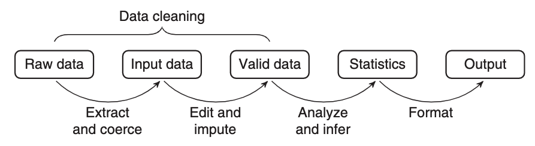
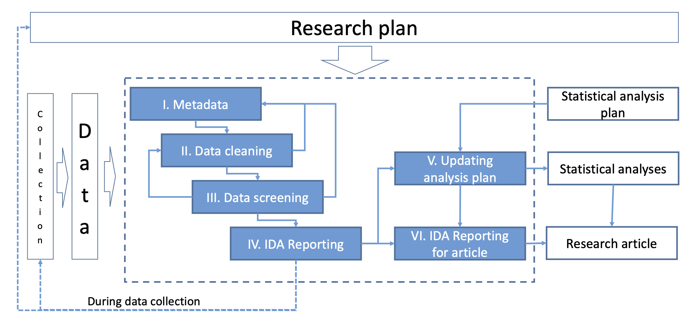
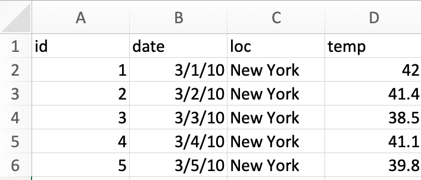

```{r, include = FALSE}
current_file <- knitr::current_input()
basename <- gsub(".Rmd$", "", current_file)
```

```{r, include = FALSE}
library(tidyverse)
library(colorspace)
options(width = 200)
knitr::opts_chunk$set(
  fig.path = sprintf("images/%s/", basename),
  fig.width = 6,
  fig.height = 4,
  fig.align = "center",
  #out.width = "100%",
  fig.retina = 3,
  echo = FALSE,
  warning = FALSE,
  message = FALSE,
  cache = FALSE,
  cache.path = "cache/"
)
theme_set(ggthemes::theme_gdocs(base_size = 18) +
            theme(plot.background = element_blank(), axis.line.y = element_line(color = "black", linetype = "solid")
                  ) )
```


```{r titleslide, child="assets/titleslide.Rmd"}
```

---


# Initial Data Analysis, and Confirmatory Analysis

.flex[
.w-50[
.info-box.w-100[
Prior to conducting a confirmatory data analysis, it is important to conduct an _initial data analysis_. 
]

<br>

* .monash-blue2[Confirmatory data analysis] is focused on statistical inference and includes procedures for:
  * hypothesis testing, 
  * predictive modelling,
  * parameter estimation including uncertainty,
  * model selection. 
]
--

.w-50[
.w-80[
* .monash-orange2[Initial data analysis] includes:
  * describing the data and collection procedures
  * scrutinise data for errors, outliers, missing observations
  * check assumptions needed for confirmatory data analysis hold
] 

.info-box.w-80[Initial data analysis is related to exploratory data analysis in the sense that it is primarily conducted graphically, and tends to rely on subjective assessment.] 
]
]

---


# Taxonomies are useful but rarely perfect


<br><br>
.w-80[
* Some people would be practicing IDA without realising that it is IDA.
* Sometimes a different name is used to describe the same process, such as Chatfield (1985) referring to IDA also as **_"initial examination of data"_** and Cox & Snell (1981) as **_"preliminary data anlysis"_**.
* Some people inadvertently confuse EDA with IDA. IDA should be practised without compromising the confirmatory data analysis.

]


.footnote.f5[
Chatfield (1985) The Initial Examination of Data. *Journal of the Royal Statistical Society. Series A (General)* **148** <Br>
Cox & Snell (1981) Applied Statistics. *London: Chapman and Hall.*
]

--


---

# What is IDA?

.info-box[
The .monash-blue[**main objective for IDA**] is to intercept any problems in the data that might adversely affect the confirmatory data analysis. 
]
--

.w-60[
* **_IDA differs from the main (confirmatory) analysis_** (i.e. usually fitting the model, conducting significance tests, making inferences or predictions). 
{{content}}
]
--


* **_IDA is often unreported_** in the data analysis reports or scientific papers, for various reasons. It might not have been done, or it may have been conducted but there was no space in the paper to report on it. 
{{content}}
--


* The role of **_the main (confirmatory) analysis is to answer the intended question(s) that the data were collected for_**.

---

# Where IDA fits

.blockquote[
... a **statistical value chain** is constructed by defining a number of meaningful intermediate data products, for which a chosen set of quality attributes are well described ...

.pull-right[&mdash; van der Loo & de Jonge (2018)]
]

.center[

]

.footnote.f4[
Data scientists in government perspective
]

---
# Where IDA fits


.center[

]

Huebner et al (2018)'s six steps of IDA: (1) Metadata setup, (2) .monash-orange2[Data cleaning], (3) .monash-orange2[Data screening], (4) Initial  reporting, (5) Refining and updating the analysis plan, (6) Reporting IDA in documentation.

.footnote.f4[
Health and medical research perspective
]
---

class: middle

.w-70[

# Next we'll see some _illustrative .blue[examples]_  and _.orange[cases]_.

<Br>

* Note: that there are a variety of ways to do IDA & EDA and different procedures might produce the same decision or conclusion. You don't need to prescribe to what we show you, but following the principles described is important.

]


---

# .circle.bg-black.white[1] Data Screening .f4[Part 1/3]

* Aside from checking the _data structure_ or _data quality_, it's important to check how the data are understood by the computer, i.e. checking for _data type_ is also important. E.g.,
    * Was the date read in as character?
    * Was a factor read in as numeric?
* Also important for making inference is to know whether the data supports making broader conclusions. How was the data collected? Is it clear what the population of interest is, and that the data is a representative sample?

---

class: font_smaller

# .blue[Example] .circle.bg-blue.white[1] Checking the data type .f4[Part 1/2]

.grid[
.item[
`lecture3-example.xlsx`

<center>

</center>

]
.item.pl2[

```{r, echo = TRUE}
library(readxl)
library(here)
df <- read_excel(here("data/lecture3-example.xlsx"))
df
```


Any issues here?

]
]

---


# .blue[Example] .circle.bg-blue.white[1] Checking the data type .f4[Part 2/2]

.grid[
.item[
```{r, echo = TRUE}
library(lubridate)
df %>% 
  mutate(id = as.factor(id),
         day = day(date),
         month = month(date),
         year = year(date)) %>% 
  select(-date)
```

]
.item[
* `id` is now a `factor` instead of `integer`
* `day`, `month` and `year` are now extracted from the `date`
* Is it okay now?

{{content}}

]
]

--

* In the United States, it's common to use the date format MM/DD/YYYY <a class="font_small black" href="https://twitter.com/statsgen/status/1257959369448161281">(gasps)</a>  while the rest of the world commonly use DD/MM/YYYY or YYYY/MM/DD.
{{content}}
--


* It's highly probable that the dates are 1st-5th March and not 3rd of Jan-May.
{{content}}
--


* You can validate this with other variables, say the temperature [here](https://www.wunderground.com/history/monthly/us/ny/new-york-city/KLGA/date/2010-3).


---


# .blue[Example] .circle.bg-blue.white[1] Checking the data type with R .f4[Part 1/3]


* You can robustify your workflow by ensuring you have a check for the expected data type in your code.

.f4[
```{r, echo = TRUE}
xlsx_df <- read_excel(here("data/lecture3-example.xlsx"),
                 col_types = c("text", "date", "text", "numeric")) %>% 
  mutate(id = as.factor(id), 
         date = as.character(date),
         date = as.Date(date, format = "%Y-%d-%m"))
```
]

* `read_csv` has a broader support for `col_types`

.f4[
```{r, echo = TRUE}
csv_df <- read_csv(here("data/lecture3-example.csv"),
                 col_types = cols(
                      id = col_factor(),
                      date = col_date(format = "%m/%d/%y"),
                      loc = col_character(),
                      temp = col_double()))
```
]

* The checks (or coercions) ensure that even if the data are updated, you can have some confidence that any data type error will be picked up before further analysis.


---


# .blue[Example] .circle.bg-blue.white[1] Checking the data type with R .f4[Part 2/3]


You can have a quick glimpse of the data type with:

.f4[
```{r, echo = TRUE}
dplyr::glimpse(xlsx_df)
dplyr::glimpse(csv_df)
```
]

---


# .blue[Example] .circle.bg-blue.white[1] Checking the data type with R .f4[Part 3/3]

You can also visualise the data type with:

.grid[.item.br[
```{r, echo = TRUE}
library(visdat)
vis_dat(xlsx_df)
```

]
.item[
```{r, echo = TRUE}
library(inspectdf)
inspect_types(xlsx_df) %>% 
  show_plot()
```

]
]


---

# .circle.bg-black.white[2] Data Cleaning .f4[Part 2/3]

.w-70[
* Data quality checks should be one of the first steps in the data analysis to **_assess any problems with the data_**.
{{content}}
]
--


* This is sometimes referred to as **_data sniffing_** or **_data scrutinizing_**.
{{content}}
--


* These include using common or domain knowledge to check if the recorded data have sensible values. 
{{content}}
--
E.g. 
  * Are positive values, e.g. height and weight, recorded as positive values with a plausible range?
{{content}}
--

  * If the data are counts, do the recorded values contain non-integer values?
{{content}}
--

  * For compositional data, do the values add up to 100% (or 1)? If not is that a measurement error or due to rounding? Or is another variable missing?
{{content}}
--

  * Does the data contain only positives, ie disease occurrences, or warranty claims? If so, what would the no report group look like? 
  
---

# .circle.bg-black.white[2] Data Cleaning .f4[Part 2/3]

.w-70[
* In addition, numerical or graphical summaries may reveal that there is unwanted structure in the data. E.g.,
    * Does the treatment group have different demographic characteristics to the control group? 
    * Does the distribution of the data imply violations of assumptions for the main analysis?
{{content}}
]
--
* *Data scrutinizing* is a process that you get better at with practice and have familiarity with the domain area. 
{{content}}

    
    


---


# .blue[Example] .circle.bg-blue.white[2] Checking the data quality

.grid[
.item.f4[
```{r, echo = TRUE}
df2 <- read_csv(here("data/lecture3-example2.csv"),
    col_types = cols(id = col_factor(),
                     date = col_date(format = "%m/%d/%y"),
                     loc = col_character(),
                     temp = col_double()))
df2
```


]
.item[
* Numerical or graphical summaries or even just eye-balling the data helps to uncover some data quality issues.
* Any issues here?
{{content}}

]
]

--
<br><br>
* There's a missing value in `loc`.
* Temperature is in Farenheit for New York but Celsius in Melbourne (you can validate this again using external sources).

---
# .orange[Case study] .circle.bg-orange.white[1] World development indicators .f4[Part 1/3]

.flex[
.w-70[
```{r fig.width=8, fig.height=6, out.width="80%"}
raw_dat <- read_csv(here::here("data/world-development-indicators.csv"), na = "..",
  n_max = 11935)

country_code_df <- raw_dat %>%
  distinct(`Country Name`, `Country Code`) %>%
  rename_all(janitor::make_clean_names) %>%
  left_join(
    countrycode::codelist %>% select(iso3c, region, continent),
    by = c("country_code" = "iso3c")
  ) %>%
  arrange(continent, region) %>%
  mutate(country_code = fct_infreq(country_code))
# series_code_df <- raw_dat %>%
#   distinct(`Series Name`, `Series Code`) %>%
#   rename_all(janitor::make_clean_names) %>%
#   mutate(series_code = janitor::make_clean_names)
wdi <- raw_dat %>%
  gather(key = "Year", value = "value", `1969 [YR1969]`:last_col()) %>%
  rename_all(janitor::make_clean_names) %>%
  separate(year, into = c("year", "year_string"), sep = " ") %>%
  mutate(year = as.integer(year)) %>%
  select(-contains("name"), -year_string) %>%
  spread(key = series_code, value = value) %>%
  mutate(
    country_code = factor(country_code, levels = country_code_df$country_code)
  ) %>%
  rename_all(janitor::make_clean_names)

wdi2017 <- wdi %>% filter(year == 2017)

library(visdat)
vis_dat(wdi2017)
```
]
.w-30[
<br><br>
- What are the data types?
- How are missings distributed?
- Which variables have insufficient values to analyse further?
]
]

.footnote[World Development Indicators (WDI), sourced from the [World Bank Group (2019)](https://databank.worldbank.org/source/world-development-indicators/)]

---
# .orange[Case study] .circle.bg-orange.white[1] World development indicators .f4[Part 2/3]

.flex[
.w-50[
```{r fig.width=8, fig.height=8, out.width="80%"}
library(naniar)
ggplot(wdi2017, 
       aes(x=en_pop_dnst, y=sp_urb_grow)) + 
  geom_miss_point(size=4, alpha=0.6) + #<<
  scale_color_discrete_qualitative() +
  theme(aspect.ratio=1)
```
]
.w-50[
<br>
<br>

`en_pop_dnst` = Population density (people per sq. km of land area)

`sp_urb_grow` = Urban population growth (annual %)

<br><br>

- How are missings distributed?
- Is there a relationship between population density and urban growth?

is there a better way to plot this to see relationship?
]
]

---
# .orange[Case study] .circle.bg-orange.white[1] World development indicators .f4[Part 3/3]

.flex[
.w-50[
```{r fig.width=8, fig.height=8, out.width="80%"}
library(naniar)
ggplot(wdi2017, 
       aes(x=en_pop_dnst, y=sp_urb_grow)) + 
  geom_miss_point(size=4, alpha=0.6) + #<<
  scale_color_discrete_qualitative() +
  scale_x_log10() +
  theme(aspect.ratio=1)
```
]
.w-50[

<br>
<br>

`en_pop_dnst` = Population density (people per sq. km of land area)

`sp_urb_grow` = Urban population growth (annual %)

<br><br>
- Is there a relationship between population density and urban growth?
]
]

---

class: transition 


# Sanity check your data

---


# .orange[Case study] .circle.bg-orange.white[2] Employment Data in Australia .f4[Part 1/3]

Below is the data from ABS that shows the total number of people employed in a given month from February 1976 to December 2019 using the original time series.

<br>

```{r, cache = T, fig.height = 3.7, fig.width = 7}
library(readabs)
# lfs_1 <- read_abs("6202.0", tables = 1)  %>% 
#  separate_series()
employed <- read_abs(series_id = "A84423085A") %>% 
  mutate(month = lubridate::month(date),
         year = factor(lubridate::year(date))) %>% 
  filter(year != "2020") %>% 
  select(date, month, year, value) 
# Employed total ;  Persons ; original
# read_abs(series_id = "A84423043C") # seasonally adjusted
# A84423127L # trend
#glimpse(employed)
```


```{r, echo = TRUE}
glimpse(employed)
```

.footnote.f4[
Australian Bureau of Statistics, 2020, Labour force, Australia, Table 01. Labour force status by Sex, Australia - Trend, Seasonally adjusted and Original, viewed `r Sys.Date()`, [<i class="fas  fa-link"></i>](https://www.abs.gov.au/AUSSTATS/abs@.nsf/DetailsPage/6202.0Jul%202020?OpenDocument)
]

---

# .orange[Case study] .circle.bg-orange.white[2]  Employment Data in Australia .f4[Part 2/3]

Do you notice anything?

```{r, fig.height = 6, fig.width = 12}
employed  %>% 
  ggplot(aes(month, value, color = year)) + 
  geom_line() + 
  ylab("employed ('000)") +
  scale_x_continuous("month", breaks=seq(1, 12, 1)) +
  ggtitle("1978 Feb - 2019 Dec") + 
  scale_color_discrete_qualitative() 
```


--

Why do you think the number of people employed is going up each year?

???

* Australian population is **25.39 million** in 2019
* 1.5% annual increase in population
* Vic population is 6.681 million (Sep 2020) - 26%
* NSW population is 8.166 (Sep 2020) - 32%


---

# .orange[Case study] .circle.bg-orange.white[2]  Employment Data in Australia .f4[Part 3/3]

.grid[.item[
```{r, fig.height = 7.5, fig.width = 6}
df3 <- employed  %>% 
  dplyr::filter(as.numeric(as.character(year)) > 2008) %>% 
  mutate(month = factor(month)) 
ggplot(df3, aes(month, value, group = year)) + 
  geom_line() + 
  ylab("employed ('000)") +
  geom_text(data = filter(df3, month==12) %>% 
              mutate(month = ifelse(year %in% c(2011, 2013), 14, month)), 
            aes(label = year), hjust = -0.4, size = 5) +
  ggtitle("2009 Jan - 2019 Dec") +
  coord_cartesian(clip = 'off') + 
  theme(plot.margin = unit(c(1,4,1,1), "lines")) 
  
```

]
.item[

{{content}}

]
]

--


* There's a suspicious change in August numbers from 2014.

```{r}
df3 %>% 
  filter(month %in% 8:9) %>% 
  pivot_wider(year, names_from = month) %>% 
  mutate(diff = `9` - `8`) %>% 
  ggplot(aes(year, diff)) + 
  geom_point() + 
  geom_line(group = 1) +
  guides(x = guide_axis(n.dodge = 2)) + 
  labs(y = "Difference (Sep - Aug)")
```

* A potential explanation for this is that there was a _change in the survey from 2014_. 


<div class="footnote">
Also see https://robjhyndman.com/hyndsight/abs-seasonal-adjustment-2/
</div>


---

class: transition


# Check if the _data collection_ method has been consistent

---

# .blue[Example] .circle.bg-blue.white[3] Experimental layout and data .f4[Part 1/2]

```{r, eval = FALSE}
# to generate data that looks like it's non-randomised
rothamsted.brussels %>% 
  arrange(trt) %>% 
  mutate(row = rep(1:6, each = 8),
         col = rep(1:8, times = 6)) %>% 
  write_csv("data/lecture3-example3.csv")
```


`lecture3-example3.csv`
.f4[
```{r, echo = TRUE}
df3 <- read_csv(here::here("data/lecture3-example3.csv"),
                col_types = cols(
                  row = col_factor(),
                  col = col_factor(),
                  yield = col_double(),
                  trt = col_factor(),
                  block = col_factor()))
```
.overflow-scroll.h5[
```{r, echo = TRUE, render = knitr::normal_print}
skimr::skim(df3)
```
]
]


---


# .blue[Example] .circle.bg-blue.white[3] Experimental layout and data .f4[Part 2/2]


.grid[
.item[
```{r}
ggplot(df3, aes(col, row, fill = trt)) + 
  geom_tile(color = "black", size = 1) + 
  coord_equal() +
  scale_fill_discrete_qualitative()

ggplot(df3, aes(col, row, fill = yield)) + 
  geom_tile(color = "black", size = 1) + 
  coord_equal() +
  scale_fill_continuous_sequential(palette = "Greens 3")
```

]
.item[


* The experiment tests the effects of 9 fertilizer treatments on the yield of brussel sprouts on a field laid out in a rectangular array of 6 rows and 8 columns.  

```{r, fig.width = 8, fig.height = 3}
df3 %>% 
  mutate(trt = fct_reorder(trt, yield)) %>% 
  ggplot(aes(trt, yield)) + 
  geom_point(size = 4, alpha = 1 / 2) + 
  guides(x = guide_axis(n.dodge = 2))
```

* High sulphur and high manure seems to be the best for the yield of brussel sprouts.
* Any issues here?

]
]


---

# Take away messages

.flex[
.w-70.f2[


<ul class="fa-ul">
{{content}}
</ul>


]
]

--

  <li><span class="fa-li"><i class="fas fa-paper-plane"></i></span> <ul>
<li> Check if experimental layout given in the data and the description match </li>
<li> In particular, have a check with a plot to see if treatments are <em>randomised</em>. </li>
</ul>

{{content}}


---
class: transition

# Validators

---

# .orange[Case study] .circle.bg-orange.white[3]  Dutch supermarket revenue and cost .f4[Part 1/3]

* Data contains the revenue and cost (in Euros) for 60 supermarkets 
* Data has been anonymised and distorted

```{r}
data("SBS2000", package = "validate")
dplyr::glimpse(SBS2000)
```

---

# .orange[Case study] .circle.bg-orange.white[3]  Dutch supermarket revenue and cost .f4[Part 2/3]

* Checking for completeness of records

```{r, echo = TRUE}
library(validate)
rules <- validator(
          is_complete(id),
          is_complete(id, turnover),
          is_complete(id, turnover, profit))
out <- confront(SBS2000, rules)
summary(out)
```

---

# .orange[Case study] .circle.bg-orange.white[3]  Dutch supermarket revenue and cost .f4[Part 3/3]

* Sanity check derived variables

```{r, echo = TRUE}
library(validate)
rules <- validator(
    total.rev - profit == total.costs,
    turnover + other.rev == total.rev,
    profit <= 0.6 * total.rev
)
out <- confront(SBS2000, rules)
summary(out)
```


---

# Take away messages

.flex[
.w-70.f2[


<ul class="fa-ul">
{{content}}
</ul>


]
]

--

  <li><span class="fa-li"><i class="fas fa-paper-plane"></i></span>Check your data:
  <ul>
  <li>by validating the variable types</li>
  <li>with independent or external sources</li>
  <li>by checking the data quality</li>
  </ul>
</li>

{{content}}

--
  <li><span class="fa-li"><i class="fas fa-paper-plane"></i></span>Check if the data collection method has been consistent</li>
{{content}}

--
  <li><span class="fa-li"><i class="fas fa-paper-plane"></i></span>Check if experimental layout given in the data and the description match</li>
{{content}}

--
  <li><span class="fa-li"><i class="fas fa-paper-plane"></i></span>Consider if or how data were derived</li>


---
class: middle center

# Why?

<br><br>
.blockquote.w-80["The first thing to do with data is to look at them.... usually means tabulating and plotting the data in many different ways to ‘see what’s going on’. With the wide availability of computer packages and graphics nowadays there is no excuse for ducking the labour of this preliminary phase, and it may save some .monash-red2[red faces] later.]

.footnote[Crowder, M. J. & Hand, D. J.  (1990) "Analysis of Repeated Measures" https://doi.org/10.1201/9781315137421]

---
# Further reading

- Huebner et al (2018) [A Contemporary Conceptual Framework for Initial Data Analysis](https://muse.jhu.edu/article/793379/pdf)
- Huebner et al (2020) [Hidden analyses](https://bmcmedresmethodol.biomedcentral.com/articles/10.1186/s12874-020-00942-y)
- Chatfield (1985) The Initial Examination of Data. *Journal of the Royal Statistical Society. Series A (General)* **148** <Br>
- Cox & Snell (1981) Applied Statistics. *London: Chapman and Hall.*
- van der Loo and de Jonge (2018). Statistical Data Cleaning with Applications in R. John Wiley and Sons Ltd.
- Hyndman (2014) [Explaining the ABS unemployment fluctuations](https://robjhyndman.com/hyndsight/abs-seasonal-adjustment-2/)

---

```{r endslide, child="assets/endslide.Rmd"}
```

<br><br>Lecture materials originally developed by Dr Emi Tanaka
