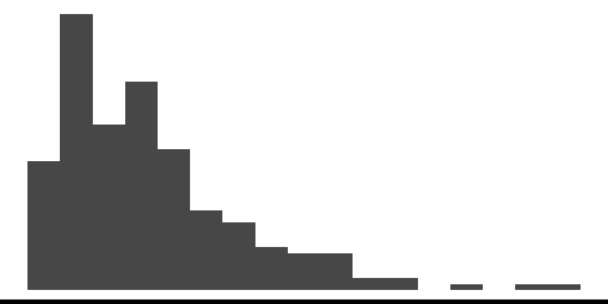
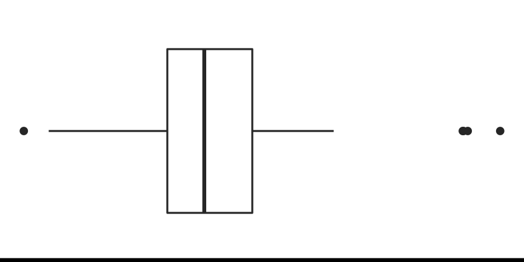
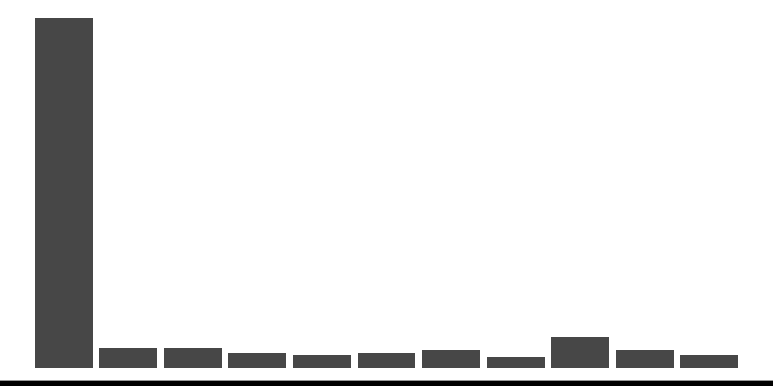
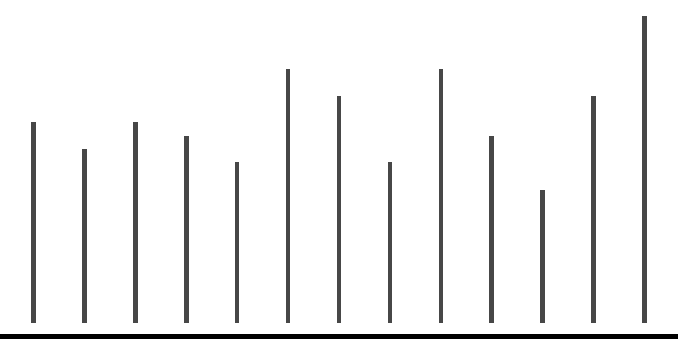

```{r, include = FALSE}
current_file <- knitr::current_input()
basename <- gsub(".Rmd$", "", current_file)
```

```{r setup, include = FALSE}
set.seed(1)
library(tidyverse)
library(ggtext)
library(colorspace)
library(patchwork)
options(width = 200)
knitr::opts_chunk$set(
  fig.path = "images/week5A/",
  fig.width = 6,
  fig.height = 3.5,
  fig.align = "center",
  dev.args = list(bg = "transparent"),
  fig.retina = 4,
  echo = FALSE,
  warning = FALSE,
  message = FALSE,
  cache = TRUE,
  cache.path = "cache/week5A/"
)
theme_set(ggthemes::theme_gdocs(base_size = 12) +
  theme(
    plot.background = element_rect(fill = "transparent", colour = NA),
    axis.line.y = element_line(color = "black", linetype = "solid"),
    panel.border = element_rect(fill = "transparent", colour = "black"), 
    plot.title.position = "plot",
    plot.title = element_text(size = 18),
    panel.background = element_rect(fill = "transparent", colour = NA),
    legend.background = element_rect(fill = "transparent", colour = NA),
    legend.key = element_rect(fill = "transparent", colour = NA)
  ))
```

```{r DT-options, include = FALSE}
toggle_select <- DT::JS(
  "table.on('click.dt', 'tbody tr', function() {",
  "$(this).toggleClass('selected');",
  "})"
)
table_options <- function(scrollY, title, csv) {
  list(
    dom = "Bft",
    pageLength = -1,
    searching = TRUE,
    scrollX = TRUE,
    scrollY = scrollY,
    buttons = list(
      list(
        extend = "copy",
        filename = title
      ),
      list(
        extend = "csv",
        filename = csv
      )
    )
  )
}
```
```{r recode-party-names}
recode_party_names <- c(
  "Australian Labor Party (Northern Territory) Branch" = "Australian Labor Party",
  "Labor" = "Australian Labor Party",
  "The Greens (Vic)" = "The Greens",
  "The Greens (Wa)" = "The Greens",
  "Katter's Australian Party (KAP)" = "Katter's Australian Party",
  "Country Liberals (Nt)" = "Country Liberals (NT)"
)
```


```{r titleslide, child="assets/titleslide.Rmd"}
```

---

class: transition middle

# Continuous variables

This lecture is partly based on Chapter 3 of

Unwin (2015) Graphical Data Analysis with R

---

# Possible features of a single continuous variable

```{r plots, include = FALSE, fig.width = 4, fig.height = 2}
some_df <- tibble(id = 1:200) %>%
  mutate(
    x1 = rexp(n()),
    p1 = rbinom(n(), 1, 0.98),
    x2 = p1 * rnorm(n()) + (1 - p1) * runif(n(), 4, 5),
    p2 = rbinom(n(), 1, 0.6),
    x3 = p2 * rnorm(n()) + (1 - p2) * rnorm(n(), 8, 2),
    x4 = p2 * runif(n(), 1, 3) + (1 - p2) * runif(n(), 4, 10),
    x5 = sample(0:10, size = n(), replace = TRUE, prob = c(0.6, rep(0.04, each = 10))),
    x6 = sample(18:30, size = n(), replace = TRUE),
    p3 = rbinom(n(), 1, 0.98),
    x7 = p3 * rnorm(n()) + (1 - p3) * runif(n(), -10, -3)
  )

ggplot(some_df, aes(x1)) +
  geom_histogram(binwidth = 0.3) +
  theme_void() +
  theme(axis.line.x = element_line(color = "black", size = 2))

ggplot(some_df, aes(x2, "")) +
  geom_boxplot(binwidth = 0.3) +
  theme_void() +
  theme(axis.line.x = element_line(color = "black", size = 2))

ggplot(some_df, aes(x3)) +
  geom_density() +
  theme_void() +
  theme(axis.line.x = element_line(color = "black", size = 2))

ggplot(some_df, aes(x4, y = 1)) +
  geom_point() +
  theme_void() +
  theme(axis.line.x = element_line(color = "black", size = 2))

ggplot(some_df, aes(x5)) +
  geom_bar() +
  theme_void() +
  theme(axis.line.x = element_line(color = "black", size = 2))

ggplot(some_df, aes(x6)) +
  geom_histogram(binwidth = 0.1) +
  theme_void() +
  theme(axis.line.x = element_line(color = "black", size = 2))

ggplot(some_df, aes(x7)) +
  geom_dotplot() +
  theme_void() +
  annotate("rect", xmin = -Inf, xmax = sort(some_df$x7)[3] + 0.5, ymin = 0, ymax = Inf, fill = "red", alpha = 0.3) +
  theme(axis.line.x = element_line(color = "black", size = 2))
```
```{r feature-table}
tribble(
  ~Feature, ~Example, ~Description,
  "Asymmetry", '', "The distribution is not symmetrical.",
  "Outliers", '', "Some observations are that are far from the rest.",
  "Multimodality", '', 'There are more than one "peak" in the observations.',
  "Gaps", '', "Some continuous interval that are contained within the range but no observations exists.",
  "Heaping", '', "Some values occur unexpectedly often.",
  "Discretized", '', "Only certain values are found, e.g. due to rounding.",
  "Implausible", '', "Values outside of plausible or likely range."
) %>%
  knitr::kable(escape = FALSE) %>%
  kableExtra::kable_classic()
```

---

# Numerical features of a single continuous variables

```{r example-plot, fig.height = 1.3}
ggplot(some_df, aes(x1)) +
  geom_histogram(binwidth = 0.2, fill = "pink", color = "black") +
  theme_void() +
  theme(axis.line.x = element_line(color = "black", size = 2))
```


* A measure of .monash-blue[**_central tendency_**], e.g. mean, median and mode
--

* A measure of .monash-blue[**_dispersion_**] (also called variability or spread), e.g. variance, standard deviation and interquartile range
--

* There are other measures, e.g. .monash-blue[**_skewness_**] and .monash-blue[**_kurtosis_**] that measures "tailedness", but these are not as common as the measures of first two
--

* The mean is also the _first moment_ and variance, skewness and kurtosis are _second, third, and fourth central moments_ 
--


**Significance tests** or **hypothesis tests**

* Testing for $H_0: \mu = \mu_0$ vs. $H_1: \mu \neq \mu_0$ (often $\mu_0 = 0$)
* The $t$-test is commonly used if the underlying data are believed to be normally distributed


---

# .orange[Case study] .circle.bg-orange.white[1] 2019 Australian Federal Election .f4[Part 1/8]

.flex[
.w-70[
**Context**

* There are 151 seats in the House of Representative for the 2019 Australian federal election
* The major parties in Australia are:
  * the .monash-blue[**Coalition**], comprising of the:
     * **Liberal**, 
     * **Liberal National** <span class="f6">(Qld)</span>, 
     * **National**, and 
     * **Country Liberal** <span class="f6">(NT)</span> parties, and
  * the Australian .monash-blue[**Labor**] party 
* The .green[**Greens**] party is a small but notable party  
  
]
.w-30.center[


]
]

---

# .orange[Case study] .circle.bg-orange.white[1] 2019 Australian Federal Election .f4[Part 2/8]

.f5[<i class="fas fa-database"></i> https://results.aec.gov.au/24310/Website/Downloads/HouseFirstPrefsByCandidateByVoteTypeDownload-24310.csv]

```{r aus-election-data}
df1 <- read_csv(here::here("data/HouseFirstPrefsByCandidateByVoteTypeDownload-24310.csv"),
  skip = 1,
  col_types = cols(
    .default = col_character(),
    OrdinaryVotes = col_double(),
    AbsentVotes = col_double(),
    ProvisionalVotes = col_double(),
    PrePollVotes = col_double(),
    PostalVotes = col_double(),
    TotalVotes = col_double(),
    Swing = col_double()
  )
)
```


```{r aus-election-table}
df1 %>%
  DT::datatable(
    rownames = FALSE,
    escape = FALSE,
    width = "1150px",
    options = table_options(
      scrollY = "380px",
      title = "Australian Federal Election 2019",
      csv = "aus-election-2019"
    ),
    extensions = "Buttons",
    elementId = "tab1A",
    callback = toggle_select
  ) %>%
  DT::formatRound(c("OrdinaryVotes", "AbsentVotes", "ProvisionalVotes", "PrePollVotes", "PostalVotes", "TotalVotes"), digits = 0) %>%
  DT::formatRound("Swing", digits = 2)
```
  
  
.footnote.f5[
Data source: Australian Electoral Commission. (2019). Federal Elections
(website), accessed August 2021. URL: https://results.aec.gov.au/
]

---

# .orange[Case study] .circle.bg-orange.white[1] 2019 Australian Federal Election .f4[Part 3/8]

.question-box[
What is the number of the seats won in the House of Representatives by parties?
]

--

.panelset[
.panel[.panel-name[📊]
.flex[
.w-50[

```{r aus-election-data1}
tdf1 <- df1 %>%
  filter(Elected == "Y") %>%
  mutate(
    PartyNm = str_to_title(PartyNm),
    PartyNm = recode(PartyNm, !!!recode_party_names)
  ) %>%
  count(PartyNm, sort = TRUE) %>%
  slice(2:4, 1, 8, 6, 7, 5)
```

```{r aus-election-table1}
data.frame(PartyNm = "Coalition", n = sum(tdf1$n[1:3])) %>%
  rbind(tdf1) %>%
  knitr::kable(col.names = c("Party", "# of seats")) %>%
  kableExtra::add_indent(2:4) %>%
  kableExtra::row_spec(2:4, color = "#C8C8C8") %>%
  kableExtra::kable_classic(
    full_width = FALSE,
    font_size = 20
  )
```


]
.w-50[


**What does this table tell you?**

{{content}}

]
]]
.panel[.panel-name[data]
.scroll-sign[
.f5.s400[
```{r aus-election-data, echo = TRUE, eval = FALSE}
```
```{r aus-election-data-skim, echo = TRUE, render = knitr::normal_print}
skimr::skim(df1)
```
```{r recode-party-names, echo = TRUE}
```
```{r aus-election-data1, echo = TRUE, eval = FALSE}
```
]

]]
.panel[.panel-name[R]
.f5[
<i class="fas fa-pencil-alt"></i> Note: `tidyverse` is expected to be loaded already.
```{r aus-election-table1, echo = TRUE, eval = FALSE}
```
]]]


--

* The Coalition won the government
* Labor and Coalition hold majority of the seats in the House of Representatives (lower house)
* Parties such as The Greens, Centre Alliance and Katter's Australian Party (KAP) won _only_ a single seat

{{content}}

--

Only? {{content}}
--
Wait... **Did the parties compete in all electoral districts?**

---

# .orange[Case study] .circle.bg-orange.white[1] 2019 Australian Federal Election .f4[Part 4/8]


.panelset[
.panel[.panel-name[📊]
.flex[
.w-50[

```{r aus-election-data2}
tdf2 <- df1 %>%
  mutate(
    PartyNm = str_to_title(PartyNm),
    PartyNm = recode(PartyNm, !!!recode_party_names)
  ) %>%
  count(PartyNm, sort = TRUE)
```

```{r aus-election-table2}
tdf2 %>%
  DT::datatable(
    rownames = FALSE,
    escape = FALSE,
    width = "500px",
    options = table_options(
      scrollY = "400px",
      title = "Australian Federal Election 2019 - Party Distribution",
      csv = "aus-election-2019-party-dist"
    ),
    elementId = "tab1B",
    colnames = c("Party", "# of electorates"),
    callback = toggle_select
  )
```


]
.w-50[


**What do you notice from this table?**

{{content}}

]
]]
.panel[.panel-name[data]
.f5[
```{r, ref.label = c("aus-election-data2"), echo = TRUE, eval = FALSE}
```
]]
.panel[.panel-name[R]
.f5[
You can omit `table_options` and `toggle_select` or have a look at the source Rmd to find out what it is

```{r aus-election-table2, echo = TRUE, eval = FALSE}
```
]]]

--

* The Greens are represented in every electoral districts
* United Australia Party is the only other non-major party to be represented in every electoral district
* KAP is represented in 7 electoral districts 
* Centre Alliance is only represented in 3 electoral districts!

{{content}}

--

Let's have a closer look at the Greens party...

---

# .orange[Case study] .circle.bg-orange.white[1] 2019 Australian Federal Election .f4[Part 5/8]

.panelset[
.panel[.panel-name[📊]
.flex[
.w-70[

```{r aus-election-data3}
tdf3 <- df1 %>%
  group_by(DivisionID) %>%
  summarise(
    DivisionNm = unique(DivisionNm),
    State = unique(StateAb),
    votes_GRN = TotalVotes[which(PartyAb == "GRN")],
    votes_total = sum(TotalVotes)
  ) %>%
  mutate(perc_GRN = votes_GRN / votes_total * 100)
```

```{r aus-election-plot1, fig.width = 10}
tdf3 %>%
  ggplot(aes(perc_GRN)) +
  geom_histogram(color = "white", fill = "#00843D") +
  labs(
    x = "Percentage of first preference votes per division",
    y = "Count",
    title = "First preference votes for the Greens party"
  )
```
]
.w-30[


**What does this graph tell you?**

{{content}}

]
]]
.panel[.panel-name[data]
.scroll-sign[
.f5.s500[
```{r aus-election-data3, echo = TRUE, eval = FALSE}
```
```{r aus-election-data3-skim, echo = TRUE, render = knitr::normal_print}
skimr::skim(tdf3)
```

]]]
.panel[.panel-name[R]
.f5[
```{r aus-election-plot1, echo = TRUE, eval = FALSE}
```
]
]]


???

* Australia uses full-preference instant-runoff voting in single member seats
* Following the full allocation of preferences, it is possible to derive a two-party-preferred figure, where the votes have been allocated between the two main candidates in the election. 
* In Australia, this is usually between the candidates from the Coalition parties and the Australian Labor Party.

--

<ul>
<li>Majority of the country does not have first preference for the Greens</li>
<li>Some constituents are slightly more supportive than the others</li>
</ul>

{{content}}

--

**What further questions does it raise?**

---

# Formulating questions for EDA vs making observations from a plot

.flex[
.w-50[

* BEFORE plotting or making summaries think .monash-blue[**broad (open-ended) questions**] that promotes discussion and divergent thinking
* Questions with simple answers (i.e. yes or no) less helpful in encouraging exploration
* For example,


.center[
<div class="question-box w-80 tl">
What is the distribution of the first preference vote percentages for the Labor party across Australia? Is it evenly spread across electorates or are there clusters of popularity?
</div>

]


]
.w-50[

{{content}}

]

]

--

* AFTER plotting or making summaries think <text style="color: #006DAE;"> **was this what you expected, are there any surprises**</text>. Detail what you learn, and how you should follow up on these observations.

```{r aus-election-plot1}
```

<div class="question-box w-80 tl">
Is the outlying observation the electoral district that won the seat?
</div>

{{content}}

---
# Visual inference

.flex[

.item.w-50[

Typical plot description:


```{r eval=FALSE, echo=TRUE}
ggplot(data, aes(x=var1)) +
  geom_histogram()
```

<br><br>
*Is the distribution consistent with a sample from a particular statistical distribution?*

]
.item.w-50[

Potential simulation methods from specific distributions

```{r eval=FALSE, echo=TRUE}
# Symmetric, unimodal, bell-shaped
null_dist("var1", "norm")
null_dist("var1", "cauchy")
null_dist("var1", "t")

# Skewed right
null_dist("var1", "exp")
null_dist("var1", "chisq")
null_dist("var1", "gamma")

# Constant 
null_dist("var1", "uniform")

```
]
]

---
# Lineup of Greens first preference percentages

.panelset[
.panel[.panel-name[📊]
```{r votes-lineup, fig.width=10, fig.height=4, out.width="100%"}
library(nullabor)
set.seed(241)
ggplot(lineup(null_dist("perc_GRN", "exp"), tdf3, n=10),
       aes(x=perc_GRN)) +
  geom_histogram(color = "white", fill = "#00843D", bins = 30) +
  facet_wrap(~.sample, ncol=5, scales="free") +
  theme(axis.text = element_blank(),
        axis.title = element_blank(),
        panel.grid.major = element_blank())
```
]
.panel[.panel-name[R]
.f5[
```{r ref.label="votes-lineup", eval=FALSE, echo=TRUE}
```
]
]
]

---

# .orange[Case study] .circle.bg-orange.white[1] 2019 Australian Federal Election .f4[Part 6/8]

.panelset[
.panel[.panel-name[📊]
.flex[
.w-50[
```{r aus-election-table3}
tdf3 %>%
  group_by(State) %>%
  summarise(
    mean = mean(perc_GRN),
    median = median(perc_GRN),
    sd = sd(perc_GRN),
    iqr = IQR(perc_GRN),
    skewness = moments::skewness(perc_GRN),
    kurtosis = moments::kurtosis(perc_GRN)
  ) %>%
  arrange(desc(mean)) %>%
  rbind(data.frame(
    State = "National",
    mean = mean(tdf3$perc_GRN),
    median = median(tdf3$perc_GRN),
    sd = sd(tdf3$perc_GRN),
    iqr = IQR(tdf3$perc_GRN),
    skewness = moments::skewness(tdf3$perc_GRN),
    kurtosis = moments::kurtosis(tdf3$perc_GRN)
  )) %>%
  knitr::kable(col.names = c("State", "Mean", "Median", "SD", "IQR", "Skewness", "Kurtosis"), digits = 3) %>%
  kableExtra::kable_classic() %>%
  kableExtra::add_header_above(c(" ", "% of first preference for the Greens" = 4, " " = 2)) %>%
  kableExtra::row_spec(9, extra_css = "border-top: 2px solid black;")
```
]
.w-50.pl3[


{{content}}
]]]
.panel[.panel-name[data]
.f5[
```{r, ref.label = c("aus-election-data3"), echo = TRUE, eval = FALSE}
```
]]
.panel[.panel-name[R]
.f5[
```{r, ref.label = c("aus-election-table3"), echo = TRUE, eval = FALSE}
```
]]]

--

* Why are the means and the medians different?

* How are the standard deviations and the interquartile ranges similar or different?

* Are there some other numerical statistics we should show?


---

# Robust measure of central tendency

.flex[
.w-40[
* <span style="color:#D81B60">**Mean**</span> is a non-robust measure of location. 
* <span style="color:#1E88E5">**Median**</span>  is the 50% quantile of the observations
* <span style="color:#FFC107">**Trimmed mean**</span>  is the sample mean after discarding observations at the tails. 
* <span style="color:#004D40">**Winsorized mean**</span>  is the sample mean after replacing observations at the tails with the minimum or maximum of the observations that remain.


]
.w-60[

```{r robust-mean, fig.height = 3.5, fig.width = 4, fig.show='hide'}
set.seed(1)
df_list <- imap(c("rnorm(100)", "rt(50, 20)", "rexp(40)", "runif(150, 0, 1)", "rexp(100, 2)", "p <- rbinom(200, 1, 0.5) ; p * rgamma(200, 3) + (1 - p) * rnorm(200, 8, 1)"), ~ {
  data.frame(id = .y, x = eval(parse(text = .x)))
})
iwalk(df_list, ~ {
  g <- ggplot(.x, aes(x)) +
    geom_histogram(color = "white", bins=15) +
    geom_vline(
      xintercept = mean(.x$x),
      color = "#D81B60", size = 1.3
    ) +
    geom_vline(
      xintercept = median(.x$x),
      color = "#1E88E5", size = 1.3
    ) +
    geom_vline(
      xintercept = mean(.x$x, trim = 0.2),
      color = "#FFC107", size = 1.3
    ) +
    geom_vline(
      xintercept = psych::winsor.mean(.x$x, trim = 0.2),
      color = "#004D40", size = 1.3
    ) +
    theme_void() +
    scale_y_continuous(expand = c(0, 0)) +
    ggtitle(.y) +
    theme(
      plot.title = element_text(face = "bold", size = 30),
      axis.line.x = element_line(color = "black"),
      axis.text.x = element_text(color = "black"),
      axis.ticks.length.x = unit(1, "mm")
    )
  print(g)
})
```

```{r robust-plots, results = "asis", cache = FALSE}
cat(sprintf("", 1:length(df_list)))
```
```{r central-measure-table}
df_list %>%
  bind_rows() %>%
  group_by(id) %>%
  summarise(
    mean = mean(x),
    median = median(x),
    trimmed = mean(x, trim = 0.2),
    winsor = psych::winsor.mean(x, trim = 0.2)
  ) %>%
  knitr::kable(col.names = c("Plot", "Mean", "Median", "Trimmed Mean<sup>*</sup>", "Winsorized Mean<sup>*</sup>"), digits = 3, escape = FALSE) %>%
  kableExtra::kable_classic(font_size = 12, full_width = FALSE) %>%
  kableExtra::column_spec(2, color = "#D81B60") %>%
  kableExtra::column_spec(3, color = "#1E88E5") %>%
  kableExtra::column_spec(4, color = "#FFC107") %>%
  kableExtra::column_spec(5, color = "#004D40")
```

.f5[
<sup>*</sup> Both trimmed and Winsorized mean trimmed 20% of the tails. ]
]
]


---

# Robust measure of dispersion

.flex[
.w-50[
* <span style="color:#648FFF">**Standard deviation**</span> or its square, **variance**, is a popular choice of measure of dispersion but is not robust to outliers
* Standard deviation for sample $x_1, ..., x_n$ is 

$$\sqrt{\sum_{i=1}^n \frac{(x_i - \bar{x})^2}{n - 1}}$$

* <span style="color:#785EF0">**Interquartile range**</span> difference between 1st and 3rd quartile, more robust measure of spread
* <span style="color:#FE6100">**Median absolute deviance**</span> (MAD) is even more robust 

$$\text{median}(|x_i - \text{median}(x_i)|)$$

]
.w-50.pl3[
```{r robust-plots, results = "asis", cache = FALSE}
```
```{r central-dispersion-table}
df_list %>%
  bind_rows() %>%
  group_by(id) %>%
  summarise(
    sd = sd(x),
    iqr = IQR(x),
    mad = mad(x),
    skew = moments::skewness(x),
    kurtosis = moments::kurtosis(x)
  ) %>%
  knitr::kable(col.names = c("Plot", "SD", "IQR", "MAD", "Skewness", "Kurtosis"), digits = 3, escape = FALSE) %>%
  kableExtra::kable_classic(font_size = 12, full_width = FALSE) %>%
  kableExtra::column_spec(2, color = "#648FFF") %>%
  kableExtra::column_spec(3, color = "#785EF0") %>%
  kableExtra::column_spec(4, color = "#FE6100") %>%
  kableExtra::add_header_above(c("", "Measure of dispersion" = 3, " " = 2))
```
]]


---

# .orange[Case study] .circle.bg-orange.white[1] 2019 Australian Federal Election .f4[Part 7/8]

.panelset[
.panel[.panel-name[📊]
.flex[
.w-50[

```{r aus-election-plot2, fig.height = 7}
tdf3 %>%
  mutate(State = fct_reorder(State, perc_GRN)) %>%
  ggplot(aes(perc_GRN, State)) +
  geom_boxplot(varwidth = TRUE) +
  labs(
    x = "Percentage of first preference votes per division",
    y = "State",
    title = "First preference votes for the Greens party"
  )
```


]
.w-50[

**We should plot the data!**

* The width of the boxplot is proportional to the number of electoral districts in the corresponding state (which is roughly proportional to the population)


]
]]
.panel[.panel-name[data]
.f5[
```{r aus-election-data3, echo = TRUE, eval = FALSE}
```
]]
.panel[.panel-name[R]
.f5[
```{r aus-election-plot2, echo = TRUE, eval = FALSE}
```
]]]

---

# Outliers

.info-box.w-60[
**Outliers** are *observations* that are significantly different from the majority.
]

<br>

.flex[
.w-50[
* Outliers can _**occur by chance in almost all distributions**_, but could be indicative of:
  * a measurement error, 
  * a different population, or 
  * an issue with the sampling process.


]
.w-50[
```{r aus-election-plot2}
```

]
]

---


# Closer look at the _boxplot_


```{r annotated-boxplot, fig.height = 3}
fn <- quantile(mtcars$wt, c(0, 0.25, 0.5, 0.75, 1), type = 7)
iqr <- fn[4] - fn[2]
ggplot(mtcars, aes(wt, "")) +
  geom_boxplot(
    size = 1.4, width = 0.2, outlier.color = "#006DAE",
    outlier.size = 3, outlier.fill = "#006DAE"
  ) +
  geom_dotplot(binwidth = 0.1, fill = "gray") +
  annotate("line", x = fn[c(2, 4)], y = 1.3, size = 1.3, color = "#C8008F") +
  annotate("segment",
    x = fn[c(2, 4, 3)], xend = fn[c(2, 4, 3)],
    y = c(1.25, 1.25, 0.75), yend = c(1.35, 1.35, 0.9), size = 1.3, color = "#C8008F"
  ) +
  annotate("text", x = c(mean(fn[c(2, 4)]), fn[3]), y = c(1.4, 0.7), label = c("IQR", "median"), size = 10, color = "#C8008F") +
  # some reason vline didn't work
  annotate("segment", x = c(fn[4] + 1.5 * iqr, fn[2] - 1.5 * iqr), xend = c(fn[4] + 1.5 * iqr, fn[2] - 1.5 * iqr), y = -Inf, yend = Inf, linetype = "dashed") +
  theme_void()
```


* Observations that are outside the range of lower to upper fence (1.5 times the box length) are referred at times as .monash-blue[outliers]
* Plotting boxplots for data from a skewed distribution will almost always show these "outliers" but these are not necessary outliers
* Some definitions of outliers assume a symmetrical population distribution (e.g. in boxplots or observations a certain standard deviations away from the mean) and these definitions are ill-suited for asymmetrical distributions

--

.center[
**But are there some things we .red[*cannot*] see from boxplots?**

]


---

# .orange[Case study] .circle.bg-orange.white[1] 2019 Australian Federal Election .f4[Part 8/8]

.panelset[
.panel[.panel-name[📊]
.flex[
.w-50[

```{r aus-election-2019-plot3, fig.height = 7}
tdf3 %>%
  mutate(State = fct_reorder(State, perc_GRN)) %>%
  ggplot(aes(perc_GRN, State)) +
  ggbeeswarm::geom_quasirandom(groupOnX = FALSE, varwidth = TRUE) +
  labs(
    x = "Percentage of first preference votes per division",
    y = "State",
    title = "First preference votes for the Greens party"
  )
```


]
.w-50[

{{content}}


]
]]
.panel[.panel-name[data]
.f5[
```{r aus-election-data3, echo = TRUE, eval = FALSE}
```
]]
.panel[.panel-name[R]
.f5[
```{r aus-election-2019-plot3, echo = TRUE, eval = FALSE}
```
]]]


--

**Now what do you notice from this graph that you didn't notice before?**

{{content}}

--

* There are only two electoral districts in NT!
* And only 3 and 5 electoral districts in ACT and TAS, respectively!

{{content}}

--

* We have _not_ computed the number of electoral districts for each state so far!

{{content}}

--

<div class="info-box">
<i class="fas fa-book-reader"></i> Both numerical and graphical summaries can either <i>reveal</i> and/or <i>hide</i> aspects of the data
</div>


---

class: transition 

# Transformations


---

# .orange[Case study] .bg-orange.circle.white[2] Melbourne Housing Prices .f4[Part 1/5]

.flex[
.w-50[
```{r melb-house-data}
df2 <- read_csv(here::here("data/MELBOURNE_HOUSE_PRICES_LESS.csv"),
  col_types = cols(
    .default = col_character(),
    Rooms = col_double(),
    Price = col_double(),
    Date = col_date(format = "%d/%m/%Y"),
    Propertycount = col_double(),
    Distance = col_double()
  )
)
```


```{r melb-house-data-dispplay}
df2 %>%
  head(20) %>%
  select(Suburb, Rooms, Type, Price, Date) %>%
  mutate(
    Price = scales::comma(Price),
    Type = fct_recode(Type,
      "Home" = "h",
      "Townhouse" = "t",
      "Unit" = "u"
    )
  ) %>%
  knitr::kable(
    col.names = c("Suburb", "Rooms", "Type", "Price ($)", "Date"),
    align = "lrlr"
  ) %>%
  kableExtra::kable_classic(font_size = 12)
```

]
.w-50.pl3[

* This data was scrapped each week from domain.com.au from `r min(df2$Date)` to `r max(df2$Date)`
* In total there are **`r scales::comma(nrow(df2))`** observations 
* All variables shown .f5[(there are more variables not shown here)], except price, have complete records
* The are **`r scales::comma(sum(!is.na(df2$Price)))`** property prices across Melbourne (roughly `r scales::percent(sum(is.na(df2$Price))/ nrow(df2))` missing)

{{content}}

]]


.footnote.f5[
Data source: Tony Pio (2018) Melbourne Housing Market, Version 27. Retrieved August 2021 from https://www.kaggle.com/anthonypino/melbourne-housing-market.
]

--

**How would you explore this data first?**

`r countdown::countdown(1)`


---

# .orange[Case study] .bg-orange.circle.white[2] Melbourne Housing Prices .f4[Part 2/5]

.panelset[
.panel[.panel-name[📊]
.flex[
.w-50[
Observations arranged by Suburb and Date:
```{r melb-house-plot-miss, fig.height = 7}
df2 %>%
  select(Suburb, Rooms, Type, Price, Date) %>%
  arrange(Suburb, Date) %>%
  visdat::vis_miss()
```
]
.w-50[

Comparing distribution of room number for observations with missing and non-missing price records:

```{r melb-house-plot-room-miss, fig.width = 8}
df2 %>%
  mutate(miss = ifelse(is.na(Price), "Missing", "Recorded")) %>%
  count(Rooms, miss) %>%
  group_by(miss) %>%
  mutate(perc = n / sum(n) * 100) %>%
  ggplot(aes(as.factor(Rooms), perc, fill = miss)) +
  geom_col(position = "dodge") +
  scale_fill_viridis_d(begin=0.3, end=0.7) +
  labs(x = "Rooms", y = "Percentage", fill = "Price")
```

{{content}}

]]]
.panel[.panel-name[data]
.scroll-sign[
.f5.s400[
```{r, ref.label = c("melb-house-data"), echo = TRUE, eval = FALSE}
```
```{r melb-house-data-skim, echo = TRUE, render = knitr::normal_print}
skimr::skim(df2)
```

]]]
.panel[.panel-name[R]
.f5[
```{r, ref.label = c("melb-house-plot-miss", "melb-house-plot-room-miss"), echo = TRUE, eval = FALSE}
```
]]
.panel[.panel-name[lineup]
```{r melb-house-lineup, fig.width=8, fig.height=4, out.width="80%"}
library(nullabor)
df2_d <- df2 %>%
  mutate(miss = ifelse(is.na(Price), "Missing", "Recorded")) %>%
  select(Rooms, miss)
df2_l <- lineup(null_permute("miss"), df2_d, n=10, pos=7) 
df2_l_agg <- df2_l %>%
  group_by(.sample) %>%
  count(Rooms, miss) %>%
  ungroup() %>%
  group_by(miss) %>%
  mutate(perc = n / sum(n) * 100) %>%
  mutate(Rooms = as.factor(Rooms))
ggplot(df2_l_agg, aes(x=Rooms, y=perc, fill = miss)) +
  geom_col(position = "dodge") +
  scale_fill_viridis_d(begin=0.3, end=0.7) +
  facet_wrap(~.sample, ncol=5) +
  theme(legend.position = "none", 
        axis.text = element_blank(),
        axis.title = element_blank(),
        panel.grid.major.x = element_blank())
```
]
.panel[.panel-name[R]
.f5[
```{r, ref.label = "melb-house-lineup", echo = TRUE, eval = FALSE}
```
]]]

--

* Seems to be okay nothing very notable - but check with a <text style="color: #D93F00;"> lineup </text> 
* What next?

---

# .orange[Case study] .bg-orange.circle.white[2] Melbourne Housing Prices .f4[Part 3/5]

.panelset[
.panel[.panel-name[📊]
.flex[
.w-50[
```{r melb-house-price-plot1}
df2 %>%
  ggplot(aes(Price / 1e6)) +
  geom_histogram(color = "white") +
  labs(
    x = "Price ($1,000,000)",
    y = "Count"
  )
```
]
.w-50[

**What can we say from this plot?**

{{content}}

]]]
.panel[.panel-name[data]
.f5[
```{r, ref.label = c("melb-house-data"), echo = TRUE, eval = FALSE}
```
]]
.panel[.panel-name[R]
.f5[
```{r, ref.label = c("melb-house-price-plot1"), echo = TRUE, eval = FALSE}
```
]]]

--

* The housing prices are right-skewed
{{content}}

--

* There appears to be a lot of outlying housing prices (how can we tell?)


---

# .orange[Case study] .bg-orange.circle.white[2] Melbourne Housing Prices .f4[Part 4/5]

.panelset[
.panel[.panel-name[📊]
.flex[
.w-50[
```{r melb-house-price-plot2}
df2 %>%
  ggplot(aes(Price / 1e6)) +
  geom_histogram(color = "white") +
  labs(
    x = "Price ($1,000,000)",
    y = "Count"
  ) +
  scale_x_log10()
```
]
.w-50[


{{content}}

]]]
.panel[.panel-name[data]
.f5[
```{r, ref.label = c("melb-house-data"), echo = TRUE, eval = FALSE}
```
]]
.panel[.panel-name[R]
.f5[
```{r, ref.label = c("melb-house-price-plot2"), echo = TRUE, eval = FALSE}
```
]]]

--

* The x-axis has been $\log_{10}$-transformed in this plot

{{content}}
--

* The plot appears more symmetrical now
{{content}}
--

* What is a measure of central tendancy here?

<span class='f4'>With no transformation:</span>
```{r melb-house-stats}
df2 %>%
  filter(!is.na(Price)) %>%
  summarise(
    Mean = scales::dollar(mean(Price)),
    Median = scales::dollar(median(Price)),
    `Trimmed Mean` = scales::dollar(mean(Price, trim = 0.2)),
    `Winsorised Mean` = scales::dollar(psych::winsor.mean(Price))
  ) %>%
  knitr::kable(align = "r") %>%
  kableExtra::kable_classic()
```

<span class='f4'>With log transformation (and back transformed to original scale):</span>
```{r melb-house-stats-tranformed}
df2 %>%
  filter(!is.na(Price)) %>%
  mutate(lPrice = log10(Price)) %>%
  summarise(
    Mean = scales::dollar(10^mean(lPrice)),
    Median = scales::dollar(10^median(lPrice)),
    `Trimmed Mean` = scales::dollar(10^mean(lPrice, trim = 0.2)),
    `Winsorised Mean` = scales::dollar(10^psych::winsor.mean(lPrice))
  ) %>%
  knitr::kable(align = "r") %>%
  kableExtra::kable_classic()
```

---

class: transition 

# Multi-modality

---

# .orange[Case study] .bg-orange.circle.white[2] Melbourne Housing Prices .f4[Part 5/5]

.panelset[
.panel[.panel-name[📊]
.flex[
.w-50[
```{r melb-house-by-room, fig.height = 7}
df2 %>%
  ggplot(aes(x=as.factor(Rooms), y=Price / 1e6, )) +
  ggbeeswarm::geom_quasirandom(varwidth=TRUE, alpha=0.3) +
  scale_y_log10() +
  labs(y = "Price ($1,000,000)", x = "# of Rooms")
```
]
.w-50[

{{content}}

]]]
.panel[.panel-name[data]
.f5.s500[
```{r, ref.label = c("melb-house-data"), echo = TRUE, eval = FALSE}
```
]]
.panel[.panel-name[R]
.f5[
```{r, ref.label = c("melb-house-by-room"), echo = TRUE, eval = FALSE}
```
]]]

--

* You can see that drawing separate univariate plots for each room number show that higher number of rooms generally are pricier
* You could not see this, however, when the data are combined

```{r melb-house-price-plot2}
```

---

class: transition 

# Bins and Bandwidths: More details


---


# .orange[Case study] .circle.bg-orange.white[3] Boston housing data .f4[Part 1/4]


```{r boston-data, include = FALSE}
data(bostonc, package = "DAAG")
df3 <- read_tsv(I(bostonc[10:length(bostonc)]))
skimr::skim(df3)
```

```{r boston-data-longer, include = FALSE}
df3long <- df3 %>%
  pivot_longer(MEDV:LSTAT,
    names_to = "var",
    values_to = "value"
  ) %>%
  filter(!var %in% c("CHAS", "B", "ZN"))
skimr::skim(df3long)
```


.panelset[
.panel[.panel-name[📊]
.grid[
.item[
```{r boston-plot1, fig.width = 6.4}
ggplot(df3, aes(MEDV)) +
  geom_histogram(binwidth = 1, color = "black", fill = "#008A25") +
  labs(x = "Median housing value (US$1000)", y = "Frequency")

```

]
.item[

{{content}}


]
]
]
.panel[.panel-name[data]
.h300.f4.scroll-sign[
```{r boston-data, echo = TRUE, render = knitr::normal_print}
```
]]
.panel[.panel-name[R]
.f5[
```{r, ref.label = c("boston-plot1"), echo = TRUE, eval = FALSE}
```

]]
]

.footnote.f6[
Harrison, David, and Daniel L. Rubinfeld (1978) Hedonic Housing Prices and the Demand for Clean Air, *Journal of Environmental Economics and Management* **5** 81-102. Original data.<br>
Gilley, O.W. and R. Kelley Pace (1996) On the Harrison and Rubinfeld Data. *Journal of Environmental Economics and Management* **31** 403-405. Provided corrections and examined censoring.<br>
Maindonald, John H. and Braun, W. John (2020). DAAG: Data Analysis and Graphics Data and Functions. R package version 1.24
]

--

* There is a large frequency in the final bin.
* There is a decline in observations in the $40-49K range as well as dip in observations around $26K and $34K.
--

* The histogram is using a bin width of 1 unit and is **left-open** (or **right-closed**): (4.5, 5.5], (5.5, 6.5] ... (49.5, 50.5], so that 5.5 is in the smaller bin, where as right-open would place it in the larger bin.
* Occasionally, whether it is **left-** or **right-open** can make a difference. Or, you might also **set the breaks** controlling the min value where binning starts.


---

# .orange[Case study] .circle.bg-orange.white[3] Boston housing data .f4[Part 2/4]


.panelset[
.panel[.panel-name[📊]
.grid[
.item[
```{r boston-plot2, fig.height = 6}
library(patchwork)
library(lvplot)
library(ggbeeswarm)
h1 <- ggplot(df3, aes(MEDV, y = "")) +
  geom_boxplot(fill = "#008A25") +
  labs(x = "Median housing value (US$1000)", y = "") +
  theme(axis.line.y = element_blank())

h2 <- ggplot(df3, aes(y=MEDV, x = 1)) +
  geom_lv(aes(fill = after_stat(LV))) +
  scale_fill_brewer() +
  xlim(c(0.4, 1.6)) + 
  labs(y = "Median housing value (US$1000)", x = "") +
  theme(axis.line.x = element_blank(),
        axis.text.y = element_blank()) +
  coord_flip()

h3 <- ggplot(df3, aes(y=MEDV, x = "")) +
  geom_quasirandom() +
  labs(y = "Median housing value (US$1000)", x = "") +
  theme(axis.line.x = element_blank()) +
  coord_flip()

h4 <- ggplot(df3, aes(MEDV)) +
  geom_density() +
  geom_rug() +
  labs(x = "Median housing value (US$1000)", y = "") +
  theme(axis.line.y = element_blank())

(h1 + h3)/(h2 + h4)
```
]
.item[

* Density plots depend on the **bandwidth** (binwidth) chosen and more than often do not estimate well at boundary cases
* There are various way to present features of the data using a plot and what works for one person, may not be as straightforward for another
* Be prepared to do multiple plots!

]
]
]
.panel[.panel-name[data]
.h300.f4.scroll-sign[
```{r boston-data, echo = TRUE, render = knitr::normal_print}
```
]]
.panel[.panel-name[R]
.f4[
```{r, ref.label = "boston-plot2", echo = TRUE, eval = FALSE}
```
]
]
]

---

# .orange[Case study] .circle.bg-orange.white[3] Boston housing data .f4[Part 3/4]


.panelset[
.panel[.panel-name[📊]
.grid[
.item[
```{r boston-plot5, fig.height = 2}
ggplot(df3, aes(PTRATIO)) +
  geom_histogram(fill = "#9651A0", color = "black", binwidth = 0.2) +
  labs(
    x = "Pupil-teacher ratio by town", y = "",
    title = "Bin width = 0.2, Left-open"
  )
```
```{r boston-plot6, fig.height = 2}
ggplot(df3, aes(PTRATIO)) +
  geom_histogram(fill = "#9651A0", color = "black", binwidth = 0.5) +
  labs(
    x = "Pupil-teacher ratio by town", y = "",
    title = "Bin width = 0.5, Left-open"
  )
```
```{r boston-plot7, fig.height = 2}
ggplot(df3, aes(PTRATIO)) +
  geom_histogram(fill = "#9651A0", color = "black", bins = 30) +
  labs(
    x = "Pupil-teacher ratio by town", y = "",
    title = "Bin number = 30, Left-open"
  )
```


]
.item[

```{r boston-plot8, fig.height = 2}
ggplot(df3, aes(PTRATIO)) +
  geom_histogram(fill = "#9651A0", color = "black", binwidth = 0.2, closed = "left") +
  labs(
    x = "Pupil-teacher ratio by town", y = "",
    title = "Bin width = 0.2, Right-open"
  )
```
```{r boston-plot9, fig.height = 2}
ggplot(df3, aes(PTRATIO)) +
  geom_histogram(fill = "#9651A0", color = "black", binwidth = 0.5, closed = "left") +
  labs(
    x = "Pupil-teacher ratio by town", y = "",
    title = "Bin width = 0.5, Right-open"
  )
```
```{r boston-plot10, fig.height = 2}
ggplot(df3, aes(PTRATIO)) +
  geom_histogram(
    fill = "#9651A0", color = "black",
    bins = 30, closed = "left"
  ) +
  labs(
    x = "Pupil-teacher ratio by town", y = "",
    title = "Bin number = 30, Right-open"
  )
```


]
]
]
.panel[.panel-name[data]
.h300.f4.scroll-sign[
```{r boston-data, echo = TRUE, render = knitr::normal_print}
```
]]
.panel[.panel-name[R]
.f4.scroll-sign[.s500[
```{r, ref.label = paste0("boston-plot", 5:10), echo = TRUE, eval = FALSE}
```
]]]
]

---

# .orange[Case study] .circle.bg-orange.white[3] Boston housing data .f4[Part 4/4]


.panelset[
.panel[.panel-name[📊]
.grid[
.item[
```{r boston-plotx, fig.height = 6, fig.width = 8}
ggplot(df3long, aes(value)) +
  geom_histogram(color = "white") +
  facet_wrap(~var, scale = "free") +
  labs(x = "", y = "") +
  theme(axis.text = element_text(size = 12))
```

]
.item.f4[

* CRIM: per capita crime rate by town 
* INDUS: proportion of non-retail business acres per town
* NOX: nitrogen oxides concentration (parts per 10 million)
* RM: average number of room per dwelling
* AGE: proportion of owner-occupied units built prior to 1940
* DIS: weighted mean of distances to 5 Boston employment centres
* RAD: index of accessibility to radial highways
* TAX: full-value property tax rate per $10K
* PTRATIO: pupil-teacher ratio by town 
* LSTAT: lower status of the population (%)
* MEDV: median value of owner-occupied homes in $1000s

]
]
]
.panel[.panel-name[data]
.h300.f4.scroll-sign[
```{r boston-data-longer, echo = TRUE, render = knitr::normal_print}
```
]]
.panel[.panel-name[R]
.f4[
```{r, ref.label = c("boston-plotx"), echo = TRUE, eval = FALSE}
```
]
]
]


---


# .orange[Case study] .circle.bg-orange.white[4] Hidalgo stamps thickness 

```{r hidalgo-data, include = FALSE}
load(here::here("data/Hidalgo1872.rda"))
skimr::skim(Hidalgo1872)
```


.panelset[
.panel[.panel-name[📊]
```{r hidalgo-plot, fig.height = 4, fig.width = 8}
ggplot(Hidalgo1872, aes(thickness)) +
  geom_histogram(binwidth = 0.001, aes(y = stat(density)), fill="grey80") +
  labs(x = "Thickness (0.001 mm)", y = "Density") +
  geom_density(color = "#E16A86", size = 2) +
  geom_density(color = "#00AD9A", size = 2, bw = "SJ")

```

* A stamp collector, Walton von Winkle, bought several collections of Mexican stamps from 1872-1874 and measured the thickness of all of them.
* The different **bandwidth** for the density plot suggest either that there are two or seven modes.

]
.panel[.panel-name[data]
.h300.f4.scroll-sign[
```{r hidalgo-data, echo = TRUE, render = knitr::normal_print}
```
]]
.panel[.panel-name[R]
.f4[
```{r, ref.label = c("hidalgo-plot"), echo = TRUE, eval = FALSE}
```
]
]
]


---

class: transition 


# Focus

---

# .orange[Case study] .circle.bg-orange.white[5] Movie length

```{r movies-data, include = FALSE}
data(movies, package = "ggplot2movies")
skimr::skim(movies)
```


.panelset[
.panel[.panel-name[📊]
.grid[
.item[
```{r movies-plot1}
ggplot(movies, aes(length)) +
  geom_histogram(color = "white") +
  labs(x = "Length of movie (minutes)", y = "Frequency")

```
```{r movies-plot2, fig.width = 5.3}
ggplot(movies, aes(length)) +
  geom_histogram(color = "white") +
  labs(x = "Length of movie (minutes)", y = "Frequency") +
  scale_x_log10()

```

]
.item[

{{content}}
]
]


]
.panel[.panel-name[data]
.h300.f4.scroll-sign[
```{r movies-data, echo = TRUE, render = knitr::normal_print}
```
]]
.panel[.panel-name[R]
.f4[
```{r, ref.label = paste0("movies-plot", 1:3), echo = TRUE, eval = FALSE}
```
]
]
]

--

* Upon further exploration, you can find the two movies that are well over 16 hours long are `r knitr::combine_words(paste0('"<i>', str_replace(pull(filter(movies, length > 1000), title), ", The", ""), '</i>"'))`

{{content}}
--

* We can restrict our attention to films under 3 hours:

```{r movies-plot3, fig.width = 9}
movies %>%
  filter(length < 180) %>%
  ggplot(aes(length)) +
  geom_histogram(binwidth = 1, fill = "#795549", color = "black") +
  labs(x = "Length of movie (minutes)", y = "Frequency")

```

{{content}}

--

* Notice that there is a peak at particular times. Why do you think so?


---

# Take away messages

.flex[
.w-70.f2[


<ul class="fa-ul">
{{content}}
</ul>


]
]

--


<li><span class="fa-li"><i class="fas fa-paper-plane"></i></span>Numerical and graphical summaries can reveal, but also hide, aspects of data</li>
{{content}}
--

<li><span class="fa-li"><i class="fas fa-paper-plane"></i></span><b>Do many numerical and graphical summaries of the data!</b></li>

---
# Resources and Acknowledgement

- Slides originally written by Emi Tanaka and constructed with [`xaringan`](https://github.com/yihui/xaringan), [remark.js](https://remarkjs.com), [`knitr`](http://yihui.name/knitr), and [R Markdown](https://rmarkdown.rstudio.com).


---

```{r endslide, child="assets/endslide.Rmd"}
```
