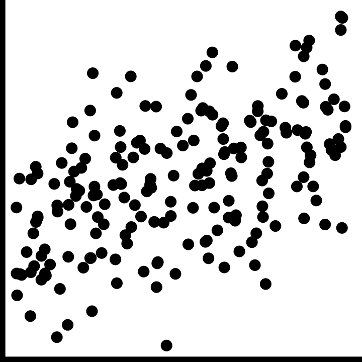
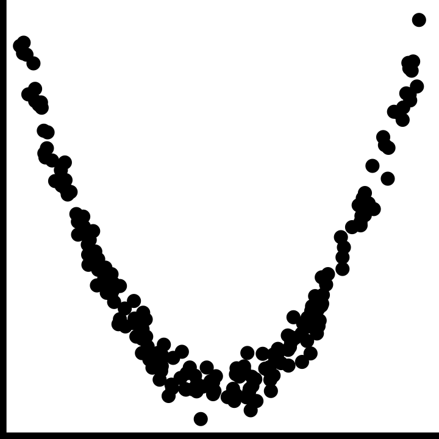
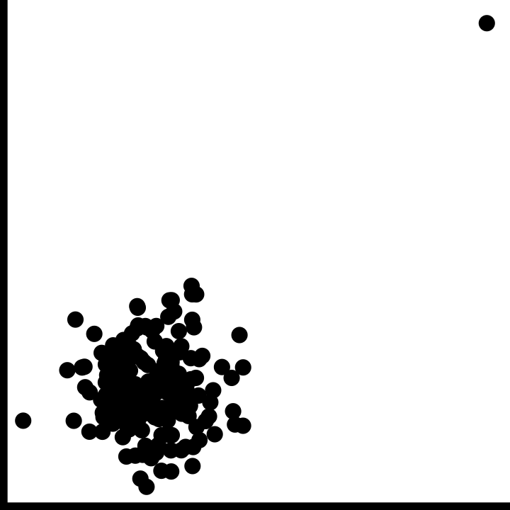

```{r, include = FALSE}
current_file <- knitr::current_input()
basename <- gsub(".Rmd$", "", current_file)
```

```{r, include = FALSE}
knitr::opts_chunk$set(
  fig.path = sprintf("images/%s/", basename),
  fig.width = 6,
  fig.height = 4,
  fig.align = "center",
  out.width = "100%",
  fig.retina = 5,
  echo = FALSE,
  warning = FALSE,
  message = FALSE,
  cache = FALSE
)
```

```{r}
library(tidyverse)
library(ggplot2movies)
library(gt)
library(forcats)
library(gridExtra)
library(ggthemes)
library(mvtnorm)
library(ggExtra)
library(housingData)
library(nullabor)
theme_set(ggthemes::theme_gdocs(base_size = 14) +
  theme(
    plot.background = element_rect(fill = "transparent", colour = NA), axis.line.y = element_line(color = "black", linetype = "solid"),
    plot.title.position = "plot",
    plot.title = element_text(size = 18),
    panel.background = element_rect(fill = "transparent", colour = NA),
    legend.background = element_rect(fill = "transparent", colour = NA),
    legend.key = element_rect(fill = "transparent", colour = NA)
  ))
```

```{r titleslide, child="assets/titleslide.Rmd"}
```


---
class: transition

# Numerical measures of association

---
# Correlation

- Correlation between variables $x_1$ and $x_2$, with $n$ observations in each.

$$r = \frac{\sum_{i=1}^n (x_{i1}-\bar{x}_1)(x_{i2}-\bar{x}_2)}{\sqrt{\sum_{i=1}^n(x_{i1}-\bar{x}_1)^2\sum_{i=1}^n(x_{i2}-\bar{x}_2)^2}} = \frac{\mbox{covariance}(x_1, x_2)}{(n-1)s_{x_1}s_{x_2}}$$
- Test for statistical significance, whether population correlation could be 0 based on observed $r$, using a $t_{n-2}$ distribution:

$$t=\frac{r}{\sqrt{1-r^2}}\sqrt{n-2}$$
---

.flex[
.item[
```{r}
set.seed(45)
d1 <- tibble(x = runif(200) - 0.5) %>%
  mutate(y = 2 * x + rnorm(200))
d1_p <- ggplot(d1, aes(x = x, y = y)) +
  geom_point() +
  theme(aspect.ratio = 1)
d1_p
```
]

.item[
```{r echo=TRUE}
cor(d1$x, d1$y)
```

```{r echo=TRUE, highlight.output = c(5)}
cor.test(d1$x, d1$y)
```
]
]

---

.flex[
.item[
```{r}
d2 <- tibble(x = runif(200) - 0.5) %>%
  mutate(y = x^2 + rnorm(200) * 0.01)
d2_p <- ggplot(d2, aes(x = x, y = y)) +
  geom_point() +
  theme(aspect.ratio = 1)
d2_p
```
]

.item[
```{r echo=TRUE}
cor(d2$x, d2$y)
```

```{r echo=TRUE, highlight.output = c(5)}
cor.test(d2$x, d2$y)
```
]
]

---

.flex[
.w-30[
```{r}
d3 <- tibble(x = c(rnorm(200), 10)) %>%
  mutate(y = c(rnorm(200), 10))
d3_p <- ggplot(d3, aes(x = x, y = y)) +
  geom_point() +
  theme(aspect.ratio = 1)
d3_p
```
]

.w-30[
All observations

```{r echo=FALSE, highlight.output = c(2,3,9,10)}
cor.test(d3$x, d3$y)[c(4, 1, 3)]
```
]

.w-5.white[
gap
]

.w-30[
Without outlier

```{r echo=FALSE, highlight.output = c(2,3,9,10)}
cor.test(d3$x[1:200], d3$y[1:200])[c(4, 1, 3)]
```
]
]


---
# Perceiving correlation

.panelset[
.panel[.panel-name[🖼️]

.monash-orange2[Let's play a game:] Guess the correlation!

<br>
```{r simcor, fig.width=10, fig.height=5, out.width="70%"}
set.seed(7777)
vc <- matrix(c(1, 0, 0, 1), ncol = 2, byrow = T)
d <- as_tibble(rmvnorm(500, sigma = vc))
p1 <- ggplot(d, aes(x = V1, y = V2)) +
  geom_point() +
  theme_void() +
  theme(
    aspect.ratio = 1,
    plot.background = element_rect(fill = "gray90")
  )
vc <- matrix(c(1, 0.4, 0.4, 1), ncol = 2, byrow = T)
d <- as_tibble(rmvnorm(500, sigma = vc))
p2 <- ggplot(d, aes(x = V1, y = V2)) +
  geom_point() +
  theme_void() +
  theme(
    aspect.ratio = 1,
    plot.background = element_rect(fill = "gray90")
  )
vc <- matrix(c(1, 0.6, 0.6, 1), ncol = 2, byrow = T)
d <- as_tibble(rmvnorm(500, sigma = vc))
p3 <- ggplot(d, aes(x = V1, y = V2)) +
  geom_point() +
  theme_void() +
  theme(
    aspect.ratio = 1,
    plot.background = element_rect(fill = "gray90")
  )
vc <- matrix(c(1, 0.8, 0.8, 1), ncol = 2, byrow = T)
d <- as_tibble(rmvnorm(500, sigma = vc))
p4 <- ggplot(d, aes(x = V1, y = V2)) +
  geom_point() +
  theme_void() +
  theme(
    aspect.ratio = 1,
    plot.background = element_rect(fill = "gray90")
  )
vc <- matrix(c(1, -0.2, -0.2, 1), ncol = 2, byrow = T)
d <- as_tibble(rmvnorm(500, sigma = vc))
p5 <- ggplot(d, aes(x = V1, y = V2)) +
  geom_point() +
  theme_void() +
  theme(
    aspect.ratio = 1,
    plot.background = element_rect(fill = "gray90")
  )
vc <- matrix(c(1, -0.5, -0.5, 1), ncol = 2, byrow = T)
d <- as_tibble(rmvnorm(500, sigma = vc))
p6 <- ggplot(d, aes(x = V1, y = V2)) +
  geom_point() +
  theme_void() +
  theme(
    aspect.ratio = 1,
    plot.background = element_rect(fill = "gray90")
  )
vc <- matrix(c(1, -0.7, -0.7, 1), ncol = 2, byrow = T)
d <- as_tibble(rmvnorm(500, sigma = vc))
p7 <- ggplot(d, aes(x = V1, y = V2)) +
  geom_point() +
  theme_void() +
  theme(
    aspect.ratio = 1,
    plot.background = element_rect(fill = "gray90")
  )
vc <- matrix(c(1, -0.9, -0.9, 1), ncol = 2, byrow = T)
d <- as_tibble(rmvnorm(500, sigma = vc))
p8 <- ggplot(d, aes(x = V1, y = V2)) +
  geom_point() +
  theme_void() +
  theme(
    aspect.ratio = 1,
    plot.background = element_rect(fill = "gray90")
  )
grid.arrange(p1, p2, p3, p4, p5, p6, p7, p8, ncol = 4)
```
]
.panel[.panel-name[answers]

```{r fig.width = 4, fig.height = 2, out.width="40%"}
a1 <- ggplot() +
  geom_text(aes(x = 0, y = 0, label = "r = 0.0")) +
  theme_void() +
  theme(
    aspect.ratio = 1,
    plot.background = element_rect(fill = "gray90")
  )
a2 <- ggplot() +
  geom_text(aes(x = 0, y = 0, label = "r = 0.4")) +
  theme_void() +
  theme(
    aspect.ratio = 1,
    plot.background = element_rect(fill = "gray90")
  )
a3 <- ggplot() +
  geom_text(aes(x = 0, y = 0, label = "r = 0.6")) +
  theme_void() +
  theme(
    aspect.ratio = 1,
    plot.background = element_rect(fill = "gray90")
  )
a4 <- ggplot() +
  geom_text(aes(x = 0, y = 0, label = "r = 0.8")) +
  theme_void() +
  theme(
    aspect.ratio = 1,
    plot.background = element_rect(fill = "gray90")
  )
a5 <- ggplot() +
  geom_text(aes(x = 0, y = 0, label = "r = -0.2")) +
  theme_void() +
  theme(
    aspect.ratio = 1,
    plot.background = element_rect(fill = "gray90")
  )
a6 <- ggplot() +
  geom_text(aes(x = 0, y = 0, label = "r = -0.5")) +
  theme_void() +
  theme(
    aspect.ratio = 1,
    plot.background = element_rect(fill = "gray90")
  )
a7 <- ggplot() +
  geom_text(aes(x = 0, y = 0, label = "r = -0.7")) +
  theme_void() +
  theme(
    aspect.ratio = 1,
    plot.background = element_rect(fill = "gray90")
  )
a8 <- ggplot() +
  geom_text(aes(x = 0, y = 0, label = "r = -0.9")) +
  theme_void() +
  theme(
    aspect.ratio = 1,
    plot.background = element_rect(fill = "gray90")
  )
grid.arrange(a1, a2, a3, a4, a5, a6, a7, a8, ncol = 4)
```

<br>
<br>

Generally, people don't do very well at this task. Typically people under-estimate $r$ from scatterplots, particularly when it is around 0.4-0.7. The variation in a scatterplot perceptually doesn't vary is not linearly with $r$.

When someone says .monash-blue2[*correlation is 0.5* it sounds impressive]. BUT when someone shows you a .monash-blue2[scatterplot of data that has correlation 0.5], you will say that's a .monash-blue2[weak relationship.]
]
.panel[.panel-name[R]
.s400[
```{r ref.label="simcor", echo=TRUE, eval=FALSE}
```
]
.scroll-sign[
<br>
]
]
]

---
# Robust correlation measures 1/2

- Spearman (based on ranks)
    - Sort each variable, and return rank (of actual value)
    - Compute correlation between ranks of each variable

.pull-left[
```{r}
set.seed(60)
df <- tibble(
  x = c(round(rnorm(5), 1), 10),
  y = c(round(rnorm(5), 1), 10)
) %>%
  mutate(xr = rank(x), yr = rank(y))
df
```
].pull-right[
```{r echo=TRUE}
cor(df$x, df$y)
cor(df$xr, df$yr)
cor(df$x, df$y, method = "spearman")
```

]

---
# Robust correlation measures 2/2

- Kendall $\tau$ (based on comparing pairs of observations)
    - Sort each variable, and return rank (of actual value)
    - For all pairs of observations $(x_i, y_i), (x_j, y_j)$, determine  if **concordant**, $x_i < x_j, y_i < y_j$ or $x_i > x_j, y_i > y_j$, or **discordant**, $x_i < x_j, y_i > y_j$ or $x_i > x_j, y_i < y_j$.

$$\tau = \frac{n_c-n_d}{\frac12 n(n-1)}$$

.pull-left[
```{r out.width="70%"}
ggplot(df, aes(x = x, y = y)) +
  annotate("rect",
    xmin = -2, xmax = df$x[2],
    ymin = -2, ymax = df$y[2],
    fill = "red", alpha = 0.5, colour = NA
  ) +
  annotate("rect",
    xmin = df$x[2], xmax = 11,
    ymin = df$y[2], ymax = 11,
    fill = "red", alpha = 0.5, colour = NA
  ) +
  annotate("text", x = 3, y = 10, label = "concordant", colour = "red") +
  annotate("text", x = 5, y = -1.5, label = "disconcordant") +
  geom_point() +
  annotate("point", x = df$x[2], y = df$y[2], color = "red") +
  theme(aspect.ratio = 1)
```
]
.pull-right[
```{r echo=TRUE}
cor(df$x, df$y)
cor(df$x, df$y, method = "kendall")
```

]

---
# Comparison of correlation measures

```{r diffscatter, fig.height=2, fig.width=2, include=FALSE}
d1_p +
  theme_void() +
  theme(
    legend.position = "none", aspect.ratio = 1,
    axis.line.x = element_line(color = "black", size = 2),
    axis.line.y = element_line(color = "black", size = 2)
  )
d2_p +
  theme_void() +
  theme(
    legend.position = "none", aspect.ratio = 1,
    axis.line.x = element_line(color = "black", size = 2),
    axis.line.y = element_line(color = "black", size = 2)
  )
d3_p +
  theme_void() +
  theme(
    legend.position = "none", aspect.ratio = 1,
    axis.line.x = element_line(color = "black", size = 2),
    axis.line.y = element_line(color = "black", size = 2)
  )
```

```{r corr-table}
tribble(
  ~sample, ~corr, ~spearman, ~kendall,
  '',
  cor(d1$x, d1$y),
  cor(d1$x, d1$y, method = "spearman"),
  cor(d1$x, d1$y, method = "kendall"),
  '',
  cor(d2$x, d2$y),
  cor(d2$x, d2$y, method = "spearman"),
  cor(d2$x, d2$y, method = "kendall"),
  '',
  cor(d3$x, d3$y),
  cor(d3$x, d3$y, method = "spearman"),
  cor(d3$x, d3$y, method = "kendall")
) %>%
  knitr::kable(escape = FALSE, digits = 3) %>%
  kableExtra::kable_styling(full_width = FALSE) %>%
  kableExtra::kable_classic()
```

---
class: transition middle

# Scatterplot case studies

---
#  .orange[Case study] .bg-orange.circle[2] Movies

.panelset[
.panel[.panel-name[🖼️]
.flex[
.w-50[
```{r movies, fig.width=6, fig.height=6, out.width="80%"}
ggplot(movies, aes(x = votes, y = rating)) +
  geom_point() +
  scale_y_continuous("rating", breaks = seq(0, 10, 2))
```
]
.w-50[
- `votes`: Number of IMDB users who rated this movie
- `rating`: Average IMDB user rating

<br>
<br>
Describe the relationship between rating and votes. 
]
]
]
.panel[.panel-name[learn]
.grid[
.item[
- Odd pattern, almost looks like an "r"
- No films with lots of votes and low rating
- No film with lots of votes has rating close to maximum possible: **barrier?**
- Films with very high ratings only have a few votes
- Generally, rating appears to increase as votes increases (its hard to really read this with so few points though)
- A few films with really large number of votes: **outliers?** or just **skewness?**
- Films with few votes have ratings that span the range of the scale.
]
.item[
Would you say this is positive, linear, moderate?

Or positive, non-linear, and moderate? Or weak?

In some sense, these descriptions are meaningless, here.

<br>
What about causation? association? outliers?  clusters? gaps? barrier? conditional relationships?

<br>

.monash-blue2[These descriptive help to describe relationships generally, but it is important to convert them into the context of the (variables in the) data.]

.monash-orange2[BUT, BUT there is a skewness in votes that needs fixing before assessing the relationship.]
]
]
]
.panel[.panel-name[R]

```{r ref.label="movies", echo=TRUE, eval=FALSE}
```
]
]

`r countdown::countdown(1, class="clock")`

---
#  .orange[Case study] .bg-orange.circle[2] Movies

.panelset[
.panel[.panel-name[🖼️]
.flex[
.w-50[
```{r logmovies, fig.width=6, fig.height=6, out.width="80%"}
ggplot(movies, aes(x = votes, y = rating)) +
  geom_point(alpha = 0.1) +
  geom_smooth(se = F, colour = "orange", size = 2) +
  scale_x_log10() +
  scale_y_continuous("rating", breaks = seq(0, 10, 2))
```
]
.w-50[
<br>
<br>
<br>
<br>
`r emo::ji("thinking")` Something funny happens, right at 1000 votes
<br>
<br>

Some positive association between two variables only for large number of votes.
]
]
]
.panel[.panel-name[R]

```{r ref.label="logmovies", echo=TRUE, eval=FALSE}
```

*Note*: Used .monash-orange2[transparency] (because there is a lot of data) and a .monash-orange2[loess smooth] (because I am interested in assessing the trend between votes and rating).

<br>

Correlation between .monash-blue2[raw variables] is `r round(cor(movies$votes, movies$rating), 2)` <br> and between .monash-blue2[transformed] `log(votes)`and `rating` is `r round(cor(log10(movies$votes), movies$rating), 2)`. Which more accurately reflects the relationship?

]
]

---
#  .orange[Case study] .bg-orange.circle[3] Cars

.panelset[
.panel[.panel-name[🖼️]
.flex[
.w-50[
```{r cars, fig.width=6, fig.height=6, out.width="80%"}
data(mtcars)
ggplot(mtcars, aes(x = hp, y = mpg)) +
  geom_point() +
  geom_smooth(colour = "forestgreen", se = F)
```
]
.w-50[
- `mpg`: Miles/(US) gallon
- `hp`: Gross horsepower

<br>
<br>
Describe the relationship between horsepower and mpg. 
]
]
]
.panel[.panel-name[learn]

<br>
<br>

- negative: as horsepower increases fuel efficiency is worse
- nonlinear: for lower horse power the decrease in efficieny is more
- strong: very little variation between cars, looks fundamentally like a physics problem
- outlier: one car with high horse power has unusually high efficiency

]
.panel[.panel-name[R]

```{r ref.label="cars", echo=TRUE, eval=FALSE}
```
]
]

---
#  .orange[Case study] .bg-orange.circle[3] Cars

.panelset[
.panel[.panel-name[🖼️]
.flex[
.w-50[
```{r logcars, fig.width=6, fig.height=6, out.width="80%"}
ggplot(mtcars, aes(x = hp, y = mpg)) +
  geom_point() +
  scale_y_log10("log mpg") + #<<
  geom_smooth(method = "lm", colour = "forestgreen", se = F) +
  geom_smooth(data = filter(mtcars, hp < 300), method = "lm", colour = "orangered", se = F, lty = 2)
```
]
.w-50[
- `mpg`: Miles/(US) gallon
- `hp`: Gross horsepower

<br>
<br>
Log transforming `mpg` linearised the relationship between horsepower and mpg. 

<br>
<br>

.monash-green2[Need to also remove the outlier, because it is a little influential (swinging the line towards it).]
]
]
]
.panel[.panel-name[R]

```{r ref.label="logcars", echo=TRUE, eval=FALSE}
```


Correlation between .monash-blue2[raw variables] is `r round(cor(mtcars$hp, mtcars$mpg), 2)` <br> and between .monash-blue2[transformed] `log(mpg)` and `hp` is `r round(cor(log10(mtcars$hp), mtcars$mpg), 2)`. Which more accurately reflects the relationship?

]
]
---
class: transition middle

# Transformations

for skewness, heteroskedasticity and linearising relationships, and to emphasize association

---
# Circle of transformations for linearising

.grid[
.item[ 
```{r circleoftrans, fig.width=5, fig.height=5, out.width="80%"}
x <- c(seq(-0.95, -0.1, 0.025), seq(0.1, 0.95, 0.025))
x <- c(x, x)
d <- tibble(x,
  y = sqrt(1 - x^2),
  q = c(
    rep("4", 35),
    rep("1", 35),
    rep("3", 35),
    rep("2", 35)
  )
)
d$y[71:140] <- -d$y[71:140]
ggplot(d, aes(x = x, y = y, colour = q, group = q)) +
  geom_line(size = 2) +
  annotate("text",
    x = c(0.5, 0.5, -0.5, -0.5),
    y = c(0.5, -0.5, -0.5, 0.5),
    label = c(
      "x up, y up", "x up, y down",
      "x down, y down", "x down, y up"
    ),
    size = 5
  ) +
  geom_vline(xintercept = 0) +
  geom_hline(yintercept = 0) +
  annotate("text", x = 0, y = 0, label = "(0,0)", size = 10) +
  theme_void() +
  theme(aspect.ratio = 1, legend.position = "none")
```
]
.item[
Remember the power ladder: 

-1, 0, 1/3, 1/2, .monash-orange2[1], 2, 3, 4 

<br>

1.Look at the shape of the relationship. 
2.Imagine this to be a number plane, and depending on which quadrant the shape falls in, you either transform $x$ or $y$, up or down the ladder: `+,+` both up; `+,-` x up, y down; `-,-` both down;  `-,+` x down, y up
    
<br>

If there is heteroskedasticity, try transforming $y$, may or may not help

]
]

---
class: transition middle

# Scatterplot case studies

---
#  .orange[Case study] .bg-orange.circle[4] Soils


.flex[
.w-50[
```{r baker, fig.width=5, fig.height=5, out.width="80%"}
baker <- read_csv("../data/baker.csv")
p <- ggplot(baker, aes(x = B, y = Corn97BU)) +
  geom_point() +
  xlab("Boron (ppm)") +
  ylab("Corn Yield (bushells)")
ggMarginal(p, type = "density")
```

]
.w-50[
Interplay between skewness and association

Data is from a soil chemical analysis of a farm field in Iowa. Is there a relationship between Yield and Boron?

<br>
You can get a marginal plot of each variable added to the scatterplot using `ggMarginal`. This is useful for assessing the skewness in each variable. 

<br>
Boron is right-skewed Yield is left-skewed. With skewed distributions in marginal variables it is .monash-orange2[hard] to assess the relationship between the two. Make a transformation to fix, first.
]
]
---
#  .orange[Case study] .bg-orange.circle[4] Soils

.flex[
.w-50[
```{r transfbaker, fig.width=5, fig.height=5, out.width="80%"}
p <- ggplot(
  baker,
  aes(x = B, y = Corn97BU^2)
) + #<<
  geom_point() +
  xlab("log Boron (ppm)") +
  ylab("Corn Yield^2 (bushells)") +
  scale_x_log10() #<<
ggMarginal(p, type = "density") #<<
```
]
.w-50[

<br>
<br>

```{r ref.label="transfbaker", echo=TRUE, eval=FALSE}
```

]
]

---
#  .orange[Case study] .bg-orange.circle[4] Soils


.flex[
.w-50[
```{r bakeriron, fig.width=5, fig.height=5, out.width="80%"}
p <- ggplot(
  baker,
  aes(x = Fe, y = Corn97BU^2)
) +
  geom_density2d(colour = "orange") +
  geom_point() +
  xlab("Iron (ppm)") + #<<
  ylab("Corn Yield^2 (bushells)")
ggMarginal(p, type = "density")
```
]
.w-50[

<br>
Lurking variable?

<br>
<br>

```{r ref.label="bakeriron", echo=TRUE, eval=FALSE}
```

]
]

---
#  .orange[Case study] .bg-orange.circle[4] Soils

.flex[
.w-40[
```{r bakerironca, fig.width=5, fig.height=5, out.width="100%"}
ggplot(baker, aes(
  x = Fe, y = Corn97BU^2,
  colour = ifelse(Ca > 5200, #<<
    "high", "low"
  )
)) + #<<
  geom_point() +
  xlab("Iron (ppm)") +
  ylab("Corn Yield^2 (bushells)") +
  scale_colour_brewer("", palette = "Dark2") +
  theme(
    aspect.ratio = 1,
    legend.position = "bottom",
    legend.direction = "horizontal"
  )
```
]
.w-60[

Colour high calcium (>5200ppm) calcium values

.f5[
```{r ref.label="bakerironca", echo=TRUE, eval=FALSE}
```
]

If calcium levels in the soil are high, yield is consistently high. If calcium levels are low, then there is a positive relationship between yield and iron, with higher iron leading to higher yields.


]
]
---
#  .orange[Case study] .bg-orange.circle[5] COVID-19


.panelset[
.panel[.panel-name[🖼️]

```{r prepdata, eval=FALSE}
# Read data
nyt_county <- read_csv("https://raw.githubusercontent.com/nytimes/covid-19-data/master/us-counties.csv")

# Add centroid lat/long
geoCounty_new <- geoCounty %>%
  as_tibble() %>%
  mutate(
    fips = as.character(fips),
    county = as.character(county),
    state = as.character(state)
  ) %>%
  select(fips, lon, lat)
nyt_county_total <- nyt_county %>%
  group_by(fips) %>%
  filter(date == max(date)) %>%
  left_join(geoCounty_new, by = c("fips" = "fips"))

save(nyt_county_total, file = "../data/nyt_covid.rda")
```

```{r usacovid, fig.width = 10, fig.height = 6.7, out.width="60%"}
load("../data/nyt_covid.rda")
usa <- map_data("state")
ggplot() +
  geom_polygon(
    data = usa,
    aes(x = long, y = lat, group = group),
    fill = "grey90", colour = "white"
  ) +
  geom_point(
    data = nyt_county_total,
    aes(x = lon, y = lat, size = cases),
    colour = "red", shape = 1
  ) +
  geom_point(
    data = nyt_county_total,
    aes(x = lon, y = lat, size = cases),
    colour = "red", fill = "red", alpha = 0.1, shape = 16
  ) +
  scale_size("", range = c(1, 30)) +
  theme_map() +
  theme(legend.position = "none")
```


]
.panel[.panel-name[info]

<br><br><br>
Bubble plots, size of point is mapped to another variable.

This bubble plot here shows total count of COVID-19 incidence (as of Aug 30, 2020) for every county in the USA, inspired by the [New York Times coverage](https://www.nytimes.com/news-event/coronavirus).

]
.panel[.panel-name[R]

```{r ref.label="usacovid", echo=TRUE, eval=FALSE}
```
]
]

---
# Scales matter

.grid[
.item[
<br>
<br>

```{r ref.label="usacovid", eval=TRUE, fig.width = 10, fig.height = 6.7, out.width="70%"}
```

]
.item[
<br>
<br>
Where has COVID-19 hit the hardest?
<br>

Where are there more people?
<br>
<br>
<br>

This plot tells you NOTHING except where the population centres are in the USA. To understand relative incidence/risk, report COVID numbers relative the population. For example,  .monash-orange2[number of cases per 100,000 people].
]
]

---
class: transition middle

# Beyond quantitative variables

---
# When variables are not quantitative

> What do you do if the variables are not continuous/quantitative?

The type of variable determines the choice of mapping.

- Continuous and categorical $\longrightarrow$ side-by-side boxplots, side-by-side density plots
- Both categorical $\longrightarrow$ faceted bar charts, stacked bar charts, mosaic plots, double decker plots

<br> <br>

> We'll see more examples soon.
---
class: transition middle

# Paradoxes

---
# Simpsons paradox

There is an additional variable, which if used for conditioning, changes the association between the variables, you have a .monash-orange2[paradox] `r emo::ji("upside_down_face")`.

```{r generate_more_data}
set.seed(2222)
df <- tibble(x = c(rnorm(500) * 0.2, runif(300) + 1)) %>%
  mutate(
    y1 = c(
      -2 * x[1:500] + rnorm(500),
      3 * x[501:800] + rexp(300)
    ),
    y2 = c(rep("A", 500), rep("B", 300))
  )
```

.grid[
.item[
```{r scat, fig.width=3, fig.height=3, out.width="70%"}
ggplot(df, aes(x = x, y = y1)) +
  geom_point(alpha = 0.5) +
  xlab("") +
  ylab("") +
  annotate("text", x = 0, y = 8, label = paste0("r = ", round(cor(df$x, df$y1), 2))) +
  theme_minimal()
```

]
.item[
```{r scatcol, fig.width=3, fig.height=3, out.width="70%"}
ggplot(df, aes(x = x, y = y1, colour = y2)) +
  geom_point(alpha = 0.5) +
  xlab("") +
  ylab("") +
  scale_colour_brewer("", palette = "Dark2") +
  annotate("text", x = 0, y = 8, label = paste0("r = ", round(cor(df$x[df$y2 == "A"], df$y1[df$y2 == "A"]), 2)), colour = "forestgreen") +
  annotate("text", x = 1.5, y = 0, label = paste0("r = ", round(cor(df$x[df$y2 == "B"], df$y1[df$y2 == "B"]), 2)), colour = "orangered") +
  theme_minimal() +
  theme(legend.position = "none")
```

]

]


---
# Simpsons paradox: famous example

<br>
```{r berkeley, fig.width=10, fig.height=4, out.width="90%"}
ucba <- as_tibble(UCBAdmissions)
a <- ggplot(ucba, aes(Dept)) +
  geom_bar(aes(weight = n))
b <- ggplot(ucba, aes(Admit)) +
  geom_bar(aes(weight = n)) +
  facet_wrap(~Gender)
grid.arrange(a, b, ncol = 2)
```

Did Berkeley .monash-orange2[discriminate] against female applicants?

.footnote[Example from Unwin (2015)]

---
# Simpsons paradox: famous example

```{r berkeleydd, fig.width=10, fig.height=4, out.width="100%"}
library(vcd)
ucba <- ucba %>%
  mutate(
    Admit = factor(Admit,
      levels = c("Rejected", "Admitted")
    ),
    Gender = factor(Gender,
      levels = c("Male", "Female"),
      labels = c("M", "F")
    )
  )
doubledecker(xtabs(n ~ Dept + Gender + Admit, data = ucba),
  gp = gpar(fill = c("grey90", "orangered"))
)
```

Based on separately examining each department, there is .monash-orange2[no evidence of discrimination] against female applicants.

.footnote[Example from Unwin (2015)]

---
class: transition middle

# Is what you see really association?

---
# Checking association with visual inference

.panelset[
.panel[.panel-name[Soils]

```{r soils-lineup, fig.width=10, fig.height=7, out.width="60%"}
ggplot(
  lineup(null_permute("Corn97BU"), baker, n = 12),
  aes(x = B, y = Corn97BU)
) +
  geom_point() +
  facet_wrap(~.sample, ncol = 4)
```

]
.panel[.panel-name[R]
```{r ref.label="soils-lineup", echo=TRUE, eval=FALSE}
```

11 of the panels have had the association broken by permuting one variable. .monash-blue2[There is no association] in these data sets, and hence plots. Does the data plot stand out as being different from the null (no association) plots?

]
.panel[.panel-name[Olympics]

```{r oly-lineup, fig.width=10, fig.height=7, out.width="60%"}
data(oly12, package = "VGAMdata")
oly12_sub <- oly12 %>%
  filter(Sport %in% c(
    "Swimming", "Archery",
    "Hockey", "Tennis"
  )) %>%
  filter(Sex == "F") %>%
  mutate(Sport = fct_drop(Sport), Sex = fct_drop(Sex))

ggplot(
  lineup(null_permute("Sport"), oly12_sub, n = 12),
  aes(x = Height, y = Weight, colour = Sport)
) +
  geom_smooth(method = "lm", se = FALSE) +
  scale_colour_brewer("", palette = "Dark2") +
  facet_wrap(~.sample, ncol = 4) +
  theme(legend.position = "none")
```

]
.panel[.panel-name[R]

.f5[
```{r ref.label="oly-lineup", echo=TRUE, eval=FALSE}
```
]

11 of the panels have had the association broken by permuting the Sport label. .monash-blue2[There is no difference in the association between weight and height across sports] in these data sets, and hence plots. Does the data plot stand out as being different from the null (no association difference between sports) plots?

]
]

---
# Resources

- Friendly and Denis "Milestones in History of Thematic Cartography, Statistical Graphics and Data Visualisation" available at http://www.datavis.ca/milestones/
- Unwin (2015) [Graphical Data Analysis with R](http://www.gradaanwr.net)
- Graphics using [ggplot2](https://ggplot2.tidyverse.org)
- Wilke (2019) Fundamentals of Data Visualization https://clauswilke.com/dataviz/


---

```{r endslide, child="assets/endslide.Rmd"}
```
